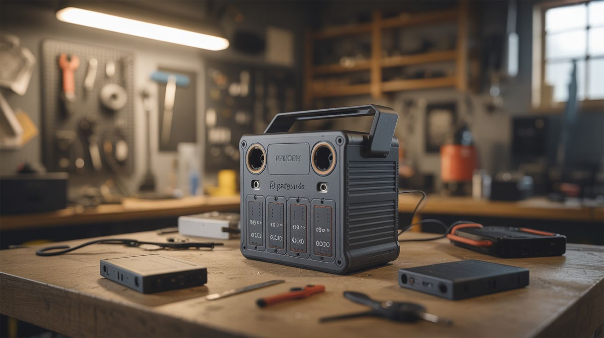

# #206 — Drone LiPo Powerwall

  

> Harvest lithium polymer cells from dead drone battery packs, test them individually, and assemble a portable power station with real capacity.

## Ratings

     

## 🧪 What Is It?

Drone LiPo packs are often declared "dead" when a single cell drops below minimum voltage, the balance connector fails, or the pack puffs slightly. Inside, most of the individual cells are still perfectly good. A 4S 5000mAh Phantom battery contains four 3.7V cells in series — if three cells are healthy and one is dead, that's 75% of the capacity sitting in a recycling bin.

This build opens drone battery packs, tests each cell individually, discards genuinely dead cells, and assembles the healthy ones into a new battery pack configured for portable power. Wire cells in parallel for capacity (more amp-hours) or in series for voltage (12V for car accessories, 19V for laptop charging). Add a proper battery management system (BMS) and you've got a portable power station built entirely from salvaged cells.

The economics are compelling: used drone batteries sell for $5-$15 on eBay as "for parts" listings, and each one yields 50-200Wh of usable cell capacity. Five dead Phantom batteries can produce a 500Wh power station — comparable to commercial units that sell for $300-$500.

<strong>🧰 Ingredients</strong>

- [ ] Dead drone LiPo packs x5-10 — from DJI Phantom, Mavic, Inspire, or racing drones *(source: eBay "for parts" listings, local drone groups, ~$5-$15 each)*
- [ ] Battery management system (BMS) — matched to your target configuration (3S, 4S, etc.) *(electronics supplier, ~$5-$10)*
- [ ] Nickel strip — for spot welding cell connections *(electronics supplier, ~$5)*
- [ ] Spot welder or soldering iron — for connecting cells *(existing tool or build #027)*
- [ ] XT60 connectors — for charge and discharge ports *(electronics supplier, ~$3)*
- [ ] Voltage tester / cell checker — per-cell voltage meter *(electronics supplier, ~$5)*
- [ ] Fireproof LiPo bag — for storage and charging *(online, ~$5)*
- [ ] Enclosure — plastic project box or 3D-printed case *(hardware store or 3D printer)*
- [ ] DC-DC converter — for regulated 5V USB or 12V output *(electronics supplier, ~$3-$5)*

## 🔨 Build Steps

1. **Open the battery packs carefully.** Use a plastic pry tool — never a metal screwdriver — to crack open the hard-shell cases of DJI-style batteries. Inside you'll find individual pouch cells wrapped in Kapton tape, a small BMS/protection PCB, and a connector. Disconnect the cells from the original BMS. For racing LiPo packs in heat-shrink, carefully cut the wrap with a hobby knife, avoiding puncturing the cells.
2. **Test every cell individually.** Measure each cell's voltage with a multimeter. Healthy LiPo cells read between 3.0V and 4.2V. Cells below 2.5V are likely damaged and should be recycled, not reused. Cells between 2.5V and 3.0V may be recoverable — charge them at a very low rate (0.1C) on a balance charger and see if they hold voltage.
3. **Capacity test the good cells.** Fully charge each healthy cell to 4.2V, then discharge at 1A while measuring total amp-hours delivered. Group cells with similar capacity together — mismatched cells in the same pack cause imbalance and premature wear. Cells within 10% of each other's capacity can be grouped.
4. **Design your pack configuration.** Decide on the target voltage and capacity. For USB power banks: 1S (3.7V nominal) with a 5V boost converter. For 12V applications: 3S (11.1V nominal). For laptop charging: 5S (18.5V nominal). Wire cells in parallel first (for capacity), then connect parallel groups in series (for voltage).
5. **Assemble the pack.** Spot weld or solder nickel strips between cell terminals. Spot welding is strongly preferred — soldering applies heat directly to the cell, which can damage internal chemistry. If you must solder, use a hot iron, work fast (under 2 seconds per joint), and let the cell cool between joints.
6. **Install the BMS.** Connect the BMS board to the pack. The BMS handles cell balancing (equalizing voltage across series cells), overcharge protection, over-discharge protection, and short circuit protection. Match the BMS to your series count (3S BMS for a 3S pack). Verify all connections before powering on.
7. **Add output connectors.** Wire XT60 connectors for charge and discharge ports. Add a DC-DC converter module for regulated output — a USB module for 5V, or a buck/boost converter for 12V. Add an on/off switch and optionally a voltage display module so you can see remaining charge.
8. **Test and commission.** Fully charge the pack through the BMS. Verify that all cells reach 4.2V simultaneously (the BMS should balance them). Discharge under load and verify rated capacity. Monitor cell temperatures during the first few charge/discharge cycles — any cell that gets hot is suspect and should be removed.

## ⚠️ Safety Notes

- Lithium polymer cells can catch fire or explode if punctured, short-circuited, or overcharged. Work on a non-flammable surface. Keep a bucket of sand or a Class D fire extinguisher nearby. Never use water on a lithium battery fire.
- When opening battery packs, the cells may be at different voltages. Shorting two cells together with a metal tool can cause immediate, violent sparking and fire. Use plastic tools and work on one cell at a time. Tape exposed terminals immediately after disconnecting.
- Always charge through the BMS in a fireproof LiPo bag, especially for the first few cycles. Never leave the pack charging unattended until you've verified the BMS is functioning correctly and all cells are balanced.

## 🔗 See Also

- [Drone Motor Wind Turbine](204-drone-motor-wind-turbine.md) — charge this powerwall with wind energy from drone motors
- [DIY Powerwall](../power-and-energy/052-diy-powerwall.md) — larger-scale powerwall from laptop 18650 cells

**References:**
- [Appliance Teardown Guide](../../reference/appliance-teardown-guide.md)
- [Technical Glossary](../../reference/glossary.md)
