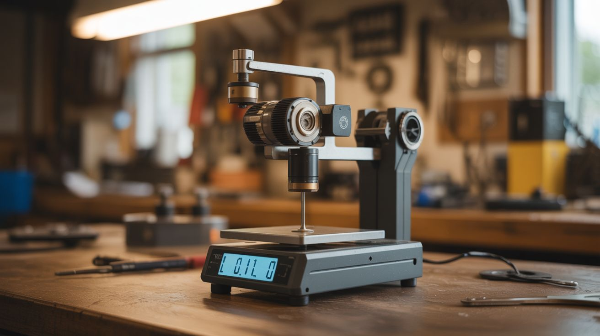

# #207 — Precision Digital Scale

  

> A gimbal motor's hall-effect sensors measure the torque needed to hold a weight against gravity — giving you a lab-grade 0.01g digital scale from salvaged parts.

## Ratings

     

## 🧪 What Is It?

Brushless gimbal motors contain hall-effect sensors that detect the rotor's magnetic position. When you apply an external force (like hanging a weight from the motor shaft), the motor driver must increase current to hold position. The amount of current required is directly proportional to the applied torque, which is directly proportional to the weight. By precisely measuring the motor current at a known moment arm (distance from the shaft center to where the weight hangs), you can calculate weight with remarkable precision.

This is the same principle used in electromagnetic force restoration (EMFR) balances — the technology behind laboratory analytical balances that cost $500-$5000 and measure to 0.001g. The drone gimbal motor version won't hit 0.001g, but 0.01g (10mg) resolution is achievable with careful calibration. That's precise enough for reloading ammunition, measuring spice recipes, weighing jewelry, or any application where a $20 kitchen scale isn't precise enough.

The key insight is that the motor's torque constant (Kt) relates current to torque in a fixed, linear ratio. Measure current, know Kt, know the moment arm, and you know the weight. An Arduino with a high-resolution current sense amplifier (INA219) does the math.

<strong>🧰 Ingredients</strong>

- [ ] Brushless gimbal motor x1 — with hall-effect sensors intact *(source: crashed drone gimbal — free)*
- [ ] Arduino Nano *(electronics supplier, ~$5)*
- [ ] INA219 current sensor module — high-resolution bidirectional current/power monitor *(electronics supplier, ~$3)*
- [ ] L6234 or similar 3-phase brushless motor driver *(electronics supplier, ~$5)*
- [ ] OLED display — 128x64 I2C *(electronics supplier, ~$4)*
- [ ] Weighing platform — small pan or dish attached to a lever arm on the motor shaft *(salvaged or 3D printed)*
- [ ] Known calibration weights — or coins (a US nickel weighs exactly 5.000g) *(pocket change)*
- [ ] Stable base — heavy block of wood or metal to prevent tipping *(workshop scrap)*
- [ ] 5V regulated power supply *(USB charger or salvaged)*

## 🔨 Build Steps

1. **Mount the motor horizontally.** Fix the gimbal motor to a heavy base with its shaft horizontal. The shaft will act as the balance fulcrum. The motor must be absolutely rigid — any flex in the mount introduces error. Use bolts through the motor's mounting holes into a block of aluminum or hardwood.
2. **Build the weighing arm.** Attach a rigid, lightweight lever arm to the motor shaft. One end holds the weighing pan, the other acts as a counterweight. A thin aluminum rod or carbon fiber tube works well. The arm length (moment arm) determines the force-to-weight conversion — a longer arm gives more sensitivity but less maximum capacity. Start with 50-80mm.
3. **Install the current sensor.** Wire the INA219 module in series with one of the motor phase power lines. The INA219 measures current flowing through a precision shunt resistor with 12-bit resolution (up to 0.1mA precision). Connect the INA219 to the Arduino via I2C.
4. **Wire the motor driver.** Connect the Arduino to the L6234 driver, and the driver to the motor phases. Program the Arduino to hold the motor shaft at a fixed horizontal position using the hall-effect sensor feedback. When weight is applied to the pan, the motor draws more current to maintain position — the INA219 measures this change.
5. **Program the firmware.** Write an Arduino sketch that: (1) holds the motor at a reference position, (2) reads the current from the INA219, (3) subtracts the baseline current (unloaded), (4) multiplies by the torque constant and divides by the moment arm and gravity to convert to grams, (5) displays the result on the OLED. Oversample and average 100+ readings to reduce noise.
6. **Calibrate with known weights.** Place a US nickel (5.000g) on the pan. Adjust the conversion factor in firmware until the display reads 5.00g. Add a second nickel — it should read 10.00g. Test linearity across the full range using coins of known weight (US penny = 2.500g, US dime = 2.268g, US quarter = 5.670g).
7. **Add tare and unit functions.** Program a tare button that zeros the display with the current load. Add a unit toggle for grams, ounces, grains, and carats. Store the calibration factor in EEPROM so it persists across power cycles.
8. **Enclose and refine.** Build a windshield around the weighing pan — even slight air currents affect readings at the 0.01g level. A transparent plastic box with a hinged door (like a real analytical balance) works. Add rubber feet to the base for vibration isolation.

## ⚠️ Safety Notes

- This is a low-voltage, low-hazard build. The only risk is the motor unexpectedly spinning if the firmware crashes or the hall sensor connection is lost. Keep fingers away from the shaft and lever arm when initially testing.
- The INA219 shunt resistor can get warm under high current draw. Ensure adequate airflow, though at the low currents involved in holding a gimbal motor, this is rarely an issue.

## 🔗 See Also

- [Gimbal Motor Star Tracker](203-gimbal-motor-star-tracker.md) — precision positioning application using the same motor type
- [Camera Gimbal Stabilizer](201-camera-gimbal-stabilizer.md) — the original application of these motors' precision control

**References:**
- [Appliance Teardown Guide](../../docs/reference/appliance-teardown-guide.md)
- [Technical Glossary](../../docs/reference/glossary.md)
- [Electronics & Microcontrollers Guide](../../docs/reference/electronics-and-microcontrollers.md)
