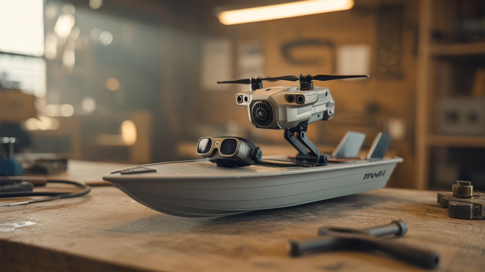

# #208 — FPV RC Boat

  

> A waterproof hull, a drone brushless motor with prop, a live camera feed, and FPV goggles — explore lakes and ponds from the boat's perspective.

## Ratings

     

## 🧪 What Is It?

A remote-controlled boat with a first-person-view camera that streams live video to goggles or a screen on shore. You pilot the boat from its own perspective, seeing the water surface, shoreline, wildlife, and underwater shadows as if you were sitting in a tiny cockpit. It's an FPV drone experience, but on water — and since there's no altitude to fall from, failures are far less catastrophic (the boat just floats until you retrieve it).

Drone brushless motors are excellent marine drives when paired with a boat propeller. They're already waterproof-adjacent (the stator is sealed in most quality motors), they produce strong thrust at moderate RPM, and the ESCs you salvaged with them handle throttle control. The drone's camera and video transmitter provide the FPV system. A rudder servo handles steering. The whole build is mechanically simpler than a quadcopter — there's only one motor, one control surface, and no flight dynamics to stabilize.

The clout potential is off the charts. FPV boat footage on a calm lake at sunset — with the camera just inches above the water surface — looks absolutely cinematic.

<strong>🧰 Ingredients</strong>

- [ ] Brushless drone motor x1 — a larger propulsion motor (2212 or bigger) *(source: crashed drone — free)*
- [ ] ESC — matched to the motor, salvaged from same drone *(source: crashed drone — free)*
- [ ] Drone camera + video transmitter (VTX) *(source: crashed drone — free)*
- [ ] FPV goggles or monitor *(online, ~$30-$80)*
- [ ] RC transmitter + receiver — 2.4GHz, minimum 2-channel *(online or salvaged, ~$10-$20)*
- [ ] Boat hull — foam RC boat hull, or hand-carved from insulation foam *(hobby store, or free from packaging foam)*
- [ ] Boat propeller — 40-50mm 2-blade *(hobby store, ~$3)*
- [ ] Servo motor — for rudder control *(electronics supplier or salvaged, ~$3)*
- [ ] Propeller shaft, stuffing tube, and rudder — waterproof drivetrain components *(hobby store, ~$8)*
- [ ] LiPo battery — 3S, 1500-2200mAh *(salvaged from drone or online, ~$10)*
- [ ] Marine grease, silicone sealant *(hardware store)*
- [ ] Waterproof bag or balloon — for electronics compartment *(dollar store)*

## 🔨 Build Steps

1. **Build or prepare the hull.** If using a foam hull kit, assemble according to instructions. If scratch-building, carve a simple V-bottom or flat-bottom hull from rigid insulation foam (XPS). The hull should be 18-30 inches long. Coat the foam with epoxy or polyurethane for water resistance. The hull needs a dry internal cavity for electronics.
2. **Install the drive shaft.** Drill a hole through the stern (rear) of the hull at a slight downward angle. Install a brass stuffing tube (a tube with a grease-packed seal) that allows the propeller shaft to spin while keeping water out. The prop shaft extends from inside the hull (where it connects to the motor) through the stuffing tube to outside the hull (where it holds the propeller). Pack the stuffing tube with marine grease.
3. **Mount the motor.** Secure the brushless motor inside the hull, aligned with the prop shaft. Connect the motor shaft to the prop shaft using a flexible coupler (a short piece of silicone tube works for small builds). This coupler absorbs vibration and compensates for slight misalignment.
4. **Install the rudder.** Mount a rudder behind the propeller using a rudder post through the hull. Connect the rudder to a servo motor inside the hull using a pushrod (stiff wire). Waterproof the rudder post hole with silicone sealant. Test rudder deflection — it should swing 30-45 degrees each side of center.
5. **Wire the power and control.** Connect the LiPo to the ESC. Connect the ESC signal wire to the RC receiver's throttle channel. Connect the rudder servo to the receiver's steering channel. Power the receiver from the ESC's BEC (battery eliminator circuit) output.
6. **Mount the FPV camera.** Attach the camera at the bow (front) of the boat, just above the waterline. Angle it slightly upward so the horizon is visible. Mount the VTX inside the hull with its antenna extending vertically through the deck. Seal any holes with silicone.
7. **Waterproof the electronics.** Wrap all electronics (ESC, receiver, VTX) in a waterproof bag or sealed compartment within the hull. Use silicone to seal wire pass-throughs. The camera lens must remain exposed but can be protected with a small windshield. Test waterproofing by placing the sealed hull in a bathtub — any leaks must be fixed before open water.
8. **Balance and test on calm water.** Launch on a calm pond or pool. Adjust the battery position to trim the hull level in the water. The bow should sit slightly up. Test throttle response, steering radius, and FPV video quality. Mark the maximum comfortable range — analog FPV typically gives 200-500 meters of clean video before breakup.
9. **Retrieve plan.** Always have a retrieval plan before launching. Tie a long, thin fishing line to the hull as a safety tether for early tests. If video cuts out or the boat loses signal, the failsafe should cut throttle (program this in the receiver). A dead boat on flat water can be retrieved with a canoe, kayak, or by wading in.

## ⚠️ Safety Notes

- Water and LiPo batteries do not mix. If the hull floods and the battery gets submerged, do not attempt to retrieve it by the wires — short-circuited LiPos in water can produce hydrogen gas and intense heat. Let it float to shore and handle with gloves.
- Never launch in water with swimmers, kayakers, or wildlife nests nearby. A spinning propeller can injure skin, and the boat is hard to see from water level. Use an unpopulated area of the lake or pond.
- Check local regulations. Some parks and waterways prohibit motorized RC vessels. FPV video transmission must comply with local RF regulations — stay under 200mW on 5.8GHz unless you hold a ham radio license.

## 🔗 See Also

- [FPV Ground Rover](202-fpv-ground-rover/) — same FPV concept on land
- [Camera Gimbal Stabilizer](201-camera-gimbal-stabilizer/) — add stabilization to the boat camera for smoother footage in chop

