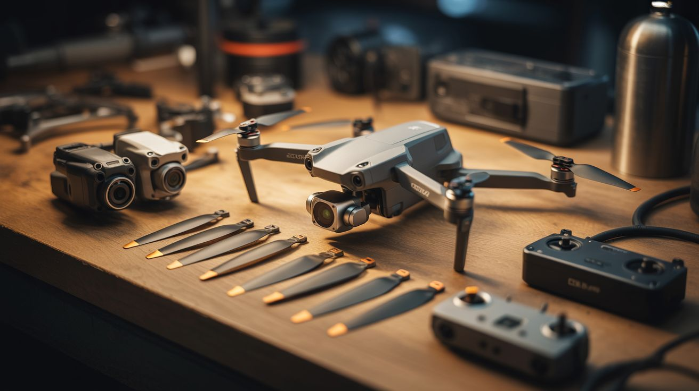

# 🚁 Drone Salvage

  

  

> A $500 drone took a nosedive. You just scored $500 worth of precision motors, cameras, and sensors for free.

Consumer drones pack an absurd amount of engineering into a small package. A dead DJI Phantom or Mavic that took a nosedive into a lake contains brushless gimbal motors with sub-degree precision, 4K cameras with stabilized optics, lithium polymer batteries with serious energy density, electronic speed controllers tuned for instant response, IMUs with accelerometers and gyroscopes, barometric altimeters, GPS modules, ultrasonic and infrared obstacle sensors, and flight controllers running sophisticated PID loops. All of this was designed to work together in a 500-gram airframe. When the airframe breaks, every one of those components is still perfectly usable for ground-based builds.

The gimbal motors alone are worth the salvage. These are brushless outrunners with extremely fine angular control, originally designed to keep a camera steady in turbulent wind. They're the same motors used in commercial camera stabilizers that sell for $200+. The flight controller's IMU (typically an MPU-6050 or ICM-20689) is a sensor package that costs $3 to buy new — but it's already soldered to a board with voltage regulation and signal conditioning. The ESCs are pre-tuned for the specific motor winding, so they work immediately as motor drivers for other projects.

**Common salvage sources:** crashed DJI Phantom/Mavic/Air, dead racing drones, toy drones (smaller components), eBay "for parts" listings.

---

## Builds

<a class="cat-card" href="201-camera-gimbal-stabilizer.md">
#201Camera Gimbal Stabilizer

Jaw

Brain

Wallet

Spicy

Clout

Time

</a>
<a class="cat-card" href="202-fpv-ground-rover.md">
#202FPV Ground Rover

Jaw

Brain

Wallet

Spicy

Clout

Time

</a>
<a class="cat-card" href="203-gimbal-motor-star-tracker.md">
#203Gimbal Motor Star Tracker

Jaw

Brain

Wallet

Spicy

Clout

Time

</a>
<a class="cat-card" href="204-drone-motor-wind-turbine.md">
#204Drone Motor Wind Turbine

Jaw

Brain

Wallet

Spicy

Clout

Time

</a>
<a class="cat-card" href="205-obstacle-dodging-robot.md">
#205Obstacle-Dodging Robot

Jaw

Brain

Wallet

Spicy

Clout

Time

</a>
<a class="cat-card" href="206-drone-lipo-powerwall.md">
#206Drone LiPo Powerwall

Jaw

Brain

Wallet

Spicy

Clout

Time

</a>
<a class="cat-card" href="207-precision-digital-scale.md">
#207Precision Digital Scale

Jaw

Brain

Wallet

Spicy

Clout

Time

</a>
<a class="cat-card" href="208-fpv-rc-boat.md">
#208FPV RC Boat

Jaw

Brain

Wallet

Spicy

Clout

Time

</a>

---

### Suggested Build Order

Start with simple motor reuse, progress toward autonomous systems:

1. **[#204 — Drone Motor Wind Turbine](204-drone-motor-wind-turbine.md)** — Simple motor-as-generator. Gentle intro.
2. **[#206 — Drone LiPo Powerwall](206-drone-lipo-powerwall.md)** — Battery management. Fast assembly.
3. **[#202 — FPV Ground Rover](202-fpv-ground-rover.md)** — First remote-control build.
4. **[#203 — Gimbal Motor Star Tracker](203-gimbal-motor-star-tracker.md)** — Precision motor control + astronomy.
5. **[#208 — FPV RC Boat](208-fpv-rc-boat.md)** — Adds waterproofing challenges.
6. **[#201 — Camera Gimbal Stabilizer](201-camera-gimbal-stabilizer.md)** — PID tuning and stabilization algorithms.
7. **[#205 — Obstacle-Dodging Robot](205-obstacle-dodging-robot.md)** — Sensor integration + autonomous movement.
8. **[#207 — Precision Digital Scale](207-precision-digital-scale.md)** — Load cells and calibration precision.

### Related Categories

- [Raspberry Pi & Arduino](../pi-and-arduino/) — Sensor networks and autonomous control
- [Functional Machines](../functional-machines/) — Motor-driven tools and equipment
- [Scooter & Motor](../scooter-and-motor/) — Brushless motor applications and ESC programming

---

## 📚 Reference Guides

- [Appliance Teardown Guide](../../docs/reference/appliance-teardown-guide.md)
- [Tools Needed](../../docs/reference/tools-needed.md)
- [Sourcing Guide](../../docs/reference/sourcing-guide.md)
- [Difficulty & Ratings Guide](../../docs/reference/difficulty-guide.md)
