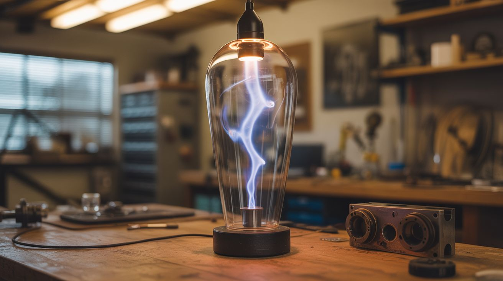

# #001 — Plasma Tornado Lamp

  

> A swirling column of plasma trapped in glass — part mad science, part living room art piece.

## Ratings

     

## 🧪 What Is It?

A microwave oven transformer (MOT) drives high voltage through a partial vacuum inside a glass vase, creating writhing tendrils of plasma that twist into a tornado shape when you introduce a rotating magnetic field or fan-driven airflow inside the chamber. The result looks like a commercial plasma globe on steroids — a foot-tall vortex of purple-white lightning trapped in glass, sitting on your desk.

The key insight is that plasma follows airflow. By evacuating most of the air from a glass vessel and introducing a gentle vortex with the remaining low-pressure gas, the electrical discharge naturally spirals into a tornado column. Different gas fills (neon, argon, or just low-pressure air) produce different colors.

<strong>🧰 Ingredients</strong>

- [ ] Microwave oven transformer (MOT) *(source: dead microwave — free from curb or appliance repair shop)*
- [ ] Large glass vase or bell jar, at least 10" tall *(source: thrift store, ~$5-10)*
- [ ] Vacuum hand pump with gauge *(source: automotive brake bleeder kit, ~$15)*
- [ ] Silicone sealant or epoxy for vacuum-tight seals *(source: hardware store)*
- [ ] Two bolts or steel electrodes *(source: hardware store or junk drawer)*
- [ ] Small PC fan (40mm) or magnetic stirrer for vortex *(source: dead computer)*
- [ ] Variac or lamp dimmer for voltage control *(source: online, ~$15-25)*
- [ ] 14-gauge wire, electrical tape, rubber mat *(source: hardware store)*
- [ ] Wooden base for mounting *(source: scrap wood)*

## 🔨 Build Steps

1. **Salvage the MOT.** Remove the transformer from a dead microwave. Keep the primary winding (thick wire, fewer turns) and the secondary winding (thin wire, many turns). Cut and discard the magnetic shunts (the thin plates between primary and secondary) — this increases output and makes it meaner.

2. **Build the base.** Mount the MOT securely on a thick wooden base. Drill holes for your electrodes to pass through the top platform where the glass vessel will sit. The base should be heavy enough that the whole assembly doesn't tip.

3. **Prepare the glass vessel.** Drill two small holes in the base of the vase (or use a vase with an open bottom that you can seal to a plate). Thread your steel bolt electrodes through the holes so they protrude 1-2 inches inside the vessel. Seal around them with silicone — this needs to hold a partial vacuum.

4. **Add a vacuum port.** Drill a third hole and install a small brass fitting or valve stem. Seal it airtight. This is where you'll connect the hand pump to evacuate air.

5. **Install the vortex generator.** Mount a small fan or angled vanes inside the vessel near the base, positioned so airflow spirals upward between the electrodes. Alternatively, mount the vessel on a lazy susan and spin the whole thing slowly — the plasma will lag and twist.

6. **Wire the MOT.** Connect the MOT primary to wall power through a variac or dimmer for adjustable voltage. Connect the MOT secondary outputs to your two electrodes. Use heavy gauge wire and solder or bolt all connections — no alligator clips on high voltage.

7. **Pull the vacuum.** Seal the glass vessel to the base, then use the hand pump to evacuate air. You want roughly 1-10 torr (most of the air out, but not a hard vacuum). The exact pressure changes the plasma character — experiment.

8. **Fire it up.** With the vessel sealed and partially evacuated, turn on the variac slowly from zero. At some point the gas will break down and plasma will arc between the electrodes. Adjust pressure and voltage until you get a stable, beautiful discharge.

9. **Tune the tornado.** Activate your vortex mechanism. The plasma column should begin to spiral. Adjust fan speed, electrode gap, and vacuum level to get the tightest, most photogenic tornado. Different pressures produce different colors and behaviors.

10. **Finish and display.** Once you've found the sweet spot, seal the vacuum port permanently with epoxy. Mount everything cleanly on the wooden base with the wiring hidden underneath. Add a toggle switch to the primary circuit.

## ⚠️ Safety Notes

> **Spicy Level 4 build.** Read the [Safety Guide](../../docs/safety/README.md) and [Chemical Safety](../../docs/safety/chemicals.md), [Fire & Pyro Safety](../../docs/safety/fire-and-pyro.md), [High Voltage Safety](../../docs/safety/high-voltage.md) before starting.

> [!CAUTION]
> **MOTs can kill you.** The secondary outputs around 2,000V at high current — enough to stop your heart. Never touch any exposed conductor while the unit is powered. Always use one hand only (keep the other in your pocket) and stand on a rubber mat. Wire a kill switch within arm's reach.

- **Glass under vacuum can implode.** Use thick-walled vessels only. Wear safety glasses during testing. If the glass has any chips or cracks, discard it — vacuum stress will find weak points.
- **UV radiation.** Plasma discharges in certain gases produce UV. Don't stare at it for extended periods without UV-filtering glass, and don't leave skin exposed to it at close range for long sessions.

## 🔗 See Also

- [Plasma Speaker](../sound-and-music/008-plasma-speaker.md) — another MOT plasma project, but this one plays music
- [Giant Plasma Globe](../light-and-visual/015-giant-plasma-globe.md) — similar concept but spherical

**References:**

- [Appliance Teardown Guide](../../docs/reference/appliance-teardown-guide.md)
- [Technical Glossary](../../docs/reference/glossary.md)
