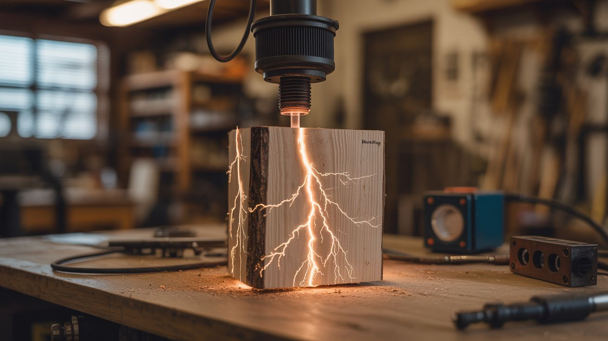

# #002 — Lichtenberg Wood Burner

  

> High voltage from a microwave transformer burns fractal lightning patterns into wood — nature's art, delivered at 2,000 volts.

## Ratings

     

## 🧪 What Is It?

A microwave oven transformer sends high-voltage current through a piece of wood soaked in a conductive solution (baking soda and water). The electricity follows the path of least resistance through the wet wood grain, burning branching fractal patterns called Lichtenberg figures as it goes. The result is a piece of wood with lightning-bolt patterns permanently scorched into the surface — every piece is unique and looks absolutely stunning.

The patterns emerge because wood grain isn't uniformly conductive. The current branches and forks as it finds easier and harder paths, creating the same fractal geometry you see in actual lightning. After burning, you sand lightly, apply finish, and you've got a one-of-a-kind art piece, cutting board, or tabletop.

<strong>🧰 Ingredients</strong>

- [ ] Microwave oven transformer (MOT) *(source: dead microwave — free from curb)*
- [ ] Piece of softwood — pine, plywood, or birch work best *(source: scrap pile or lumber yard, ~$5)*
- [ ] Baking soda *(source: kitchen, essentially free)*
- [ ] Water and a spray bottle *(source: around the house)*
- [ ] Two heavy-duty alligator clips or C-clamps with bolts *(source: hardware store, ~$5)*
- [ ] 14-gauge stranded wire *(source: hardware store)*
- [ ] Heavy-duty extension cord with switch or power strip with switch *(source: around the house)*
- [ ] Rubber mat and rubber gloves *(source: hardware store, ~$10)*

## 🔨 Build Steps

1. **Prepare the MOT.** Extract the transformer from a dead microwave. You need the high-voltage secondary output (the thin wire winding). Leave the primary (thick wire) intact. Remove the magnetic shunts for more power, or leave them in for a gentler burn.

2. **Mix the electrolyte solution.** Dissolve 1-2 tablespoons of baking soda in a cup of warm water. This creates a mildly conductive solution. Too much concentration and the burn goes too fast with less branching. Too little and nothing happens.

3. **Prepare the wood.** Sand the surface smooth. Generously brush or spray the baking soda solution across the entire surface you want to burn. The wood should be damp but not dripping. Let it soak in for a minute.

4. **Set up the electrodes.** Clamp or bolt your two electrodes to opposite ends of the wood piece. These are where the current enters and exits. Space them 6-18 inches apart depending on your piece. Use heavy wire from the MOT secondary to each electrode.

5. **Set up your workspace safely.** Place everything on a non-conductive surface. Stand on a rubber mat. Make sure the power cord runs to a switched outlet or power strip so you can kill power instantly without reaching near the wood. Have a fire extinguisher nearby.

6. **Power on and burn.** Flip the switch. You'll hear crackling and see smoke rising from the wood as the current burns through it. The fractal branches will spread from each electrode toward the center. This usually takes 30 seconds to 3 minutes depending on wood type and moisture level.

7. **Monitor and kill power.** Watch the burn carefully. When the branches from both electrodes meet in the middle (or when you like the pattern), kill the power immediately. Letting it run too long can start an actual fire or burn through the wood entirely.

8. **Clean and finish.** Unplug the MOT and wait 30 seconds before touching anything (capacitors may hold charge). Remove the electrodes. Brush off the charred debris with a stiff brush. Sand lightly if needed. Apply polyurethane, epoxy, or wood oil to seal and highlight the pattern.

## ⚠️ Safety Notes

> **Spicy Level 5 build.** Read the Safety Guide and Chemical Safety, Fire & Pyro Safety, High Voltage Safety before starting.

> [!CAUTION]
> **This build has killed people.** A microwave oven transformer outputs 2,000+ volts at up to 500mA — well above the 100mA threshold that causes fatal cardiac arrest. Contact with any energized conductor can kill instantly with no second chance. Multiple hobbyists have died doing this exact project.

- **One-hand rule.** When the unit is energized, keep one hand behind your back or in your pocket. Current passing hand-to-hand crosses your heart. Never reach across the work area with both hands.
- **Use a remote switch.** Plug the MOT into a power strip with a switch, positioned far from the work area. Never unplug or reach near the transformer to kill power. If someone is shocked, kill power at the switch or breaker — do NOT touch them while the circuit is live. Call 911 immediately.
- **Never work alone.** If you are incapacitated by a shock, you need someone who can kill power and call for help. Make sure your partner knows where the switch is before you start.
- **Fire risk is real.** The wood is literally burning. Keep a fire extinguisher or bucket of water within arm's reach. Never leave a burn unattended. Do this outdoors or in a well-ventilated workshop, never indoors on carpet or near flammable materials.
- **Never use this on wood that's dry.** Dry wood is an insulator — the current will arc through the air instead, which is unpredictable and more dangerous. Always soak the wood in electrolyte first.

## 🔗 See Also

- [Plasma Tornado Lamp](001-plasma-tornado-lamp/) — another MOT-based project with a very different aesthetic
- [Atmospheric Reentry Simulator](006-atmospheric-reentry-simulator/) — MOT used to heat metal instead of burn wood

