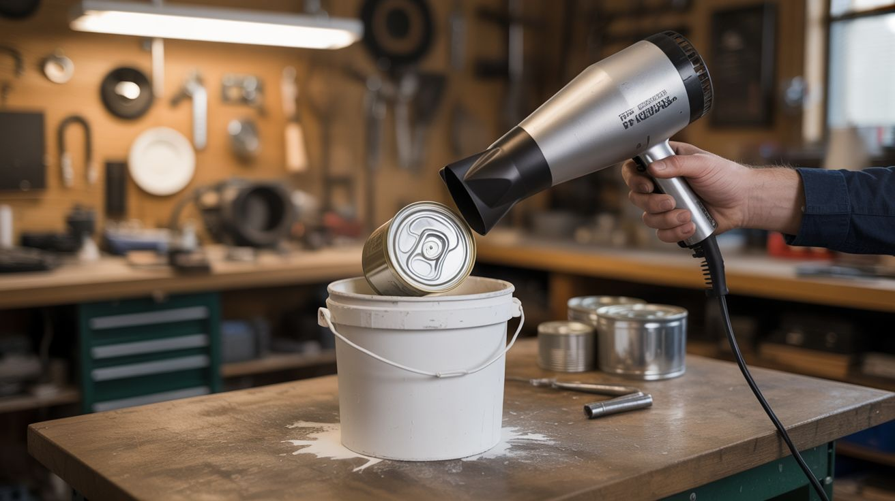

# #005 — Desktop Foundry

  

> A hair dryer, a bucket, and some plaster of paris — now you're melting aluminum cans into custom ingots and castings.

## Ratings

     

## 🧪 What Is It?

A miniature metal foundry built from a steel bucket lined with a homemade refractory (plaster of paris mixed with sand). A hair dryer blows air into the combustion chamber to supercharge charcoal or propane, pushing temperatures past 1,220degF (660degC) — the melting point of aluminum. Drop in crushed soda cans, wait a few minutes, and pour molten aluminum into sand molds or muffin tins.

This is the gateway drug to metalcasting. Once you realize you can melt metal in your backyard with stuff from the dollar store, you start looking at every aluminum object differently. Old engine blocks, broken lawn chairs, heat sinks — it's all just raw material now.

<strong>🧰 Ingredients</strong>

- [ ] Steel bucket or small steel trash can *(source: hardware store, ~$8)*
- [ ] Plaster of paris — 5-10 lbs *(source: hardware store or craft store, ~$8)*
- [ ] Play sand — 5-10 lbs *(source: hardware store, ~$4)*
- [ ] Hair dryer *(source: thrift store or around the house, ~$3)*
- [ ] Steel pipe, 1" diameter for the air inlet (tuyere) *(source: hardware store, ~$3)*
- [ ] Steel crucible — a small steel thermos, fire extinguisher body, or steel cup *(source: thrift store or junkyard, ~$2)*
- [ ] Charcoal briquettes or lump charcoal *(source: grocery store, ~$5)*
- [ ] Aluminum cans, at least 20-30 *(source: recycling bin, free)*
- [ ] Long steel tongs or pliers for handling the crucible *(source: hardware store, ~$8)*
- [ ] Muffin tin or sand mold for casting *(source: thrift store, ~$2)*

## 🔨 Build Steps

1. **Build the refractory lining.** Mix plaster of paris and sand at a 1:1 ratio by volume. Add water slowly until you get a thick, pourable consistency. Line the inside of your steel bucket by pouring the mix around a smaller bucket or can placed in the center (this creates the combustion chamber). Leave a hole in the side wall near the bottom for the air pipe. Let it cure for at least 48 hours — moisture in the lining will crack and potentially explode if heated too fast.

2. **Install the air inlet.** Insert your steel pipe through the hole in the side of the foundry. It should angle slightly downward into the chamber so melted metal doesn't flow back into it. The pipe should protrude 1-2 inches inside the chamber. The outer end connects to your hair dryer.

3. **Make a lid.** Pour another batch of refractory mix into a flat mold (a pie tin works) with a small vent hole in the center. The lid retains heat and dramatically improves efficiency. Let this cure fully too.

4. **Build or find a crucible.** A steel thermos with the plastic parts removed works great. A small fire extinguisher body works. Even a heavy steel cup will last several melts. The crucible sits inside the foundry chamber and holds the metal you're melting.

5. **Crush your aluminum.** Crush soda cans flat to maximize how many fit in the crucible at once. Remove any plastic liners by briefly burning them off (they'll burn away in the foundry anyway, but pre-crushing helps with packing).

6. **Load and light.** Place the crucible in the center of the foundry. Pack charcoal around it — fill the chamber. Light the charcoal and let it get going for 5 minutes with the lid off. Then put the lid on and turn on the hair dryer.

7. **Reach melting temperature.** With the forced air from the hair dryer, the charcoal will glow white-hot within 10-15 minutes. Use tongs to drop crushed cans into the crucible through the vent hole. They'll melt in about 30 seconds each. Keep adding cans until the crucible is full of liquid aluminum.

8. **Skim the dross.** Use a steel rod or spoon to skim the oxide layer (dross) off the top of the molten aluminum. This gray crusty layer is impurities and oxide — get as much off as you can for cleaner castings.

9. **Pour.** Using your long tongs, carefully lift the crucible out of the foundry and pour the molten aluminum into your mold. Pour steadily — don't splash. The metal is over 1,200degF and will burn through clothing instantly.

10. **Cool and demold.** Let the casting cool for at least 15 minutes before handling. Pop it out of the mold, clean up the edges with a file, and admire your work. You just made metal from trash.

## ⚠️ Safety Notes

> [!CAUTION]
> **Molten aluminum is invisible-hot.** It looks like silver liquid but it's over 1,200degF. A single splash will cause a severe burn. Wear leather boots (not sneakers), long pants, leather gloves, and a face shield. Never wear synthetic fabrics — they melt into skin.
- **Never let water contact molten aluminum.** Water flashes to steam instantly and causes a violent explosion that sprays molten metal everywhere. Make sure your molds, tools, and work area are completely dry. Even damp concrete can cause a steam explosion. Do NOT pour into wet molds.
- **Fumes are toxic.** Burning soda can coatings, paint, and plastics produce toxic fumes. Work outdoors or in very well-ventilated areas. If you're melting anything with paint or coatings, a respirator is smart.

## 🔗 See Also

- [Thermic Lance](004-thermic-lance.md) — when you want to cut metal instead of melt it
- [Fresnel Lens Solar Forge](../light-and-visual/020-fresnel-lens-solar-forge.md) — melt metal using focused sunlight instead of charcoal
