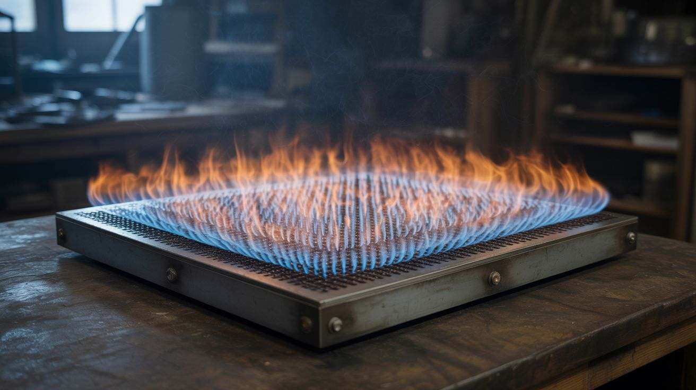

# #314 — 2D Pyro Board (Rubens' Square)

  

> The Rubens' Tube's big sibling — a flat box with 2,500 flame holes showing 2D standing wave patterns in fire when you play music.

## Ratings

     

## 🧪 What Is It?

A sealed metal box — about 2 feet by 2 feet by 3 inches deep — filled with propane, with a grid of roughly 2,500 small holes (50 rows by 50 columns) drilled in the top plate. A speaker is sealed to one side of the box, creating pressure variations inside the gas-filled chamber. Light all the jets and play music through the speaker. The flames form 2D standing wave patterns that dance with the beat. Bass notes create large, slow-moving mountains and valleys of fire. Treble creates intricate geometric fire mandalas. This is the two-dimensional evolution of the classic Rubens' Tube (#009). Where the tube shows standing waves along a single line, the pyro board reveals them across a flat surface — two dimensions simultaneously.

The result is exponentially more dramatic. You can see complex 2D mode shapes that you'd normally only encounter in physics simulations or textbook diagrams — concentric rings, checkerboard patterns, diagonal crosses, and shapes that shift and morph in real time as the frequency changes. Play actual music and the entire surface becomes a reactive fire display, with peaks and troughs of flame height tracing the pressure distribution inside the box at every instant. Bass-heavy music with clear beats produces the most dramatic visual response — the flames surge and retreat with every kick drum hit.

The engineering is a scaled-up version of the Rubens' Tube, with one critical difference: achieving uniform flame height across 2,500 holes requires much more attention to gas distribution and hole consistency. Every hole must be the same diameter, and the gas pressure must be even throughout the box. The speaker needs to be powerful enough to create measurable pressure variations across the full area of the chamber. A 6-8 inch woofer from a dead subwoofer works well — it moves enough air to affect the gas pressure across the entire box.

<strong>🧰 Ingredients</strong>

- [ ] Sheet steel — 2 pieces, 24"x24"x16 gauge, for top and bottom plates *(scrap yard or sheet metal supplier, ~$20)*
- [ ] Steel angle iron or channel — enough to form the sides of a 3" deep box *(scrap yard or hardware store, ~$10)*
- [ ] Speaker — 6-8" woofer *(dead subwoofer or car audio, free from e-waste)*
- [ ] Amplifier board — capable of driving the woofer *(old stereo or car amp, free from e-waste)*
- [ ] Propane tank + regulator + hose *(BBQ supply, ~$10 for regulator if you have a tank)*
- [ ] Flashback arrestor fitting *(welding supply, ~$10)*
- [ ] Drill press + 1/16" drill bit — for drilling 2,500 evenly spaced holes *(workshop)*
- [ ] Drilling jig or template — for consistent hole spacing *(make from scrap, free)*
- [ ] JB Weld or high-temp silicone sealant — for gas-tight sealing *(hardware store, ~$5)*
- [ ] Phone or audio source *(already own)*
- [ ] 3.5mm audio cable *(junk drawer, free)*

## 🔨 Build Steps

1. **Build the sealed metal box.** Weld or seal the angle iron sides between the top and bottom steel plates to form a flat, sealed chamber approximately 24"x24"x3". If you can't weld, use bolts with high-temp silicone gaskets at every joint. The box must be gas-tight — any leak is a safety hazard and reduces performance.

2. **Drill the flame hole grid.** Mark a grid of 50x50 holes on the top plate at approximately 0.45" spacing (leaving a small margin at the edges). Build a drilling jig from a piece of scrap with pre-drilled guide holes, or use a fence on your drill press with stop blocks for consistent positioning. Drill all 2,500 holes with a 1/16" bit. This is the most tedious step — it takes several hours. Keep the holes uniform in size and spacing; inconsistency produces uneven baseline flame heights. Deburr every hole from the top side.

3. **Mount the speaker.** Cut a speaker-sized hole in one side panel of the box. Seal the speaker to the hole using high-temp silicone, ensuring an airtight seal between the speaker frame and the box. The speaker cone pushes sound waves into the gas-filled chamber. The speaker must be mounted rigidly — any rattling or air leak around it reduces the acoustic coupling.

4. **Install the gas inlet.** On the side opposite the speaker, install a brass fitting for the propane hose with a shutoff valve. Add a flashback arrestor between the hose and the box fitting. The gas inlet should be positioned low on the side so propane (which is heavier than air) fills from the bottom up.

5. **Leak test everything.** Before introducing propane, seal all flame holes with tape, pressurize the box gently with compressed air, and spray every joint, seam, and fitting with soapy water. Fix every bubble. Remove the tape after testing.

6. **Purge and fill with propane.** Working outdoors in a well-ventilated area, connect the propane and open the valve slowly. Let the gas flow for 60+ seconds to fully purge the air from the box. You'll smell propane exiting the flame holes when the chamber is filled.

7. **Light the grid.** Using a long BBQ lighter, start at one corner and slowly run the flame across the rows of holes. All 2,500 jets should light with small, even flames. Adjust the gas flow so the baseline flame height is about 1-2 inches. If some areas are taller than others, the gas distribution inside the box is uneven — you may need internal baffles to distribute flow more evenly.

8. **Connect the audio.** Wire the speaker to the amplifier. Connect your phone or audio source via 3.5mm cable. Start at low volume.

9. **Play bass-heavy music.** Gradually increase the volume until you see the flame heights responding to the sound. Start with a sine wave tone sweep to see clean 2D mode shapes, then switch to music. Bass-heavy electronic music, hip-hop beats, and anything with a strong low-frequency pulse creates the most dramatic fire patterns. The flames will form peaks and valleys across the entire surface that shift in real time with the audio.

10. **Fine-tune and document.** Adjust gas pressure and amplifier gain to find the sweet spot where patterns are clearly visible but flames aren't dangerously tall. Film from above and at an angle for the most dramatic footage.

## ⚠️ Safety Notes

> **Spicy Level 4 build.** Read the [Safety Guide](../../docs/safety/README.md) and [Chemical Safety](../../docs/safety/chemicals.md), [Fire & Pyro Safety](../../docs/safety/fire-and-pyro.md), [High Voltage Safety](../../docs/safety/high-voltage.md) before starting.

> [!CAUTION]
> **Outdoors only.** Propane accumulation in an enclosed space is explosive. This project uses significantly more propane than a standard Rubens' Tube. Never operate indoors or in a garage with the door closed.

- **Keep the propane tank at a safe distance.** Use a hose at least 10 feet long between the tank and the pyro board. A flashback arrestor on the hose is mandatory, not optional.
- **The sheet metal gets extremely hot.** After running for more than a few minutes, the entire top plate will be too hot to touch. Operate on a fireproof surface (concrete, brick, bare dirt) and keep all flammable materials away. Let it cool completely before moving or storing.
- **Have a fire extinguisher within arm's reach.** If a leak develops while the board is lit, you need to be able to act immediately.
- **Hearing protection.** The speaker inside the resonant metal box can be surprisingly loud, especially at resonant frequencies.
- **Same fundamental safety rules as the Rubens' Tube (#009)** — but everything is scaled up. More gas, more fire, more respect required.

## 🔗 See Also

- [Rubens' Tube](../sound-and-music/009-rubens-tube.md)
- [Fire Tornado Table](007-fire-tornado-table.md)
- [Propane Vortex Cannon](003-propane-vortex-cannon.md)
