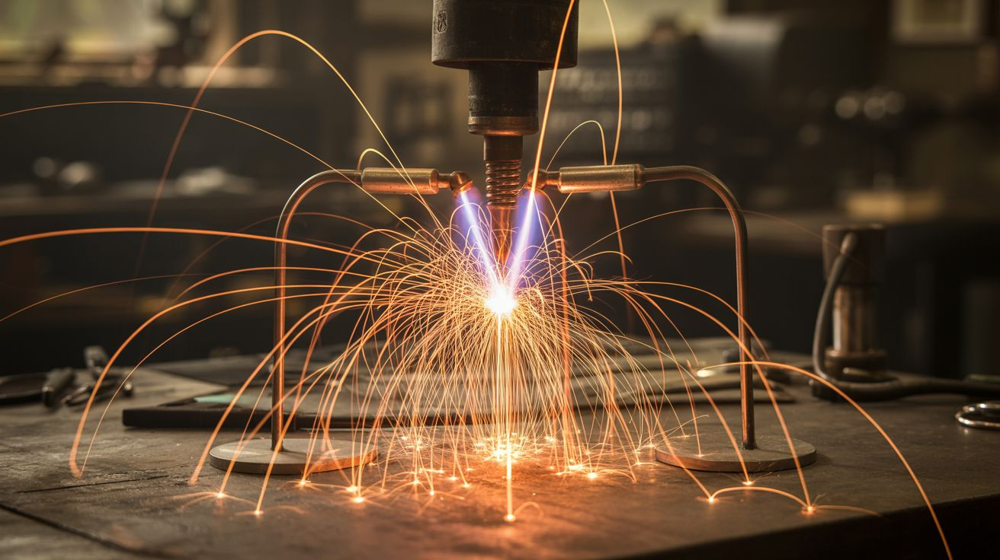

# 🔥 Fire & Plasma

  

  

> Where discarded microwaves and scrap metal become instruments of pure elemental fury.

This category is for builds that produce fire, plasma, molten metal, or things that glow white-hot. Every project here involves serious heat — respect it or it will humble you fast.

**Common salvage sources:** Microwave ovens (MOTs), propane tanks, hair dryers, steel pipe, scrap metal, oxygen cylinders.

## Builds

| # | Build | Jaw Drop | Brain Melt | Wallet | Spicy | Clout | Time |
|---|---|---|---|---|---|---|---|
| 001 | [Plasma Tornado Lamp](001-plasma-tornado-lamp.md) | ⭐⭐⭐⭐⭐ | ⭐⭐⭐ | ⭐⭐ | ⭐⭐⭐⭐ | ⭐⭐⭐⭐⭐ | ⭐⭐ |
| 002 | [Lichtenberg Wood Burner](002-lichtenberg-wood-burner.md) | ⭐⭐⭐⭐⭐ | ⭐⭐ | ⭐⭐ | ⭐⭐⭐⭐⭐ | ⭐⭐⭐⭐⭐ | ⭐ |
| 003 | [Propane Vortex Cannon](003-propane-vortex-cannon.md) | ⭐⭐⭐⭐⭐ | ⭐⭐ | ⭐⭐ | ⭐⭐⭐⭐ | ⭐⭐⭐⭐⭐ | ⭐⭐ |
| 004 | [Thermic Lance](004-thermic-lance.md) | ⭐⭐⭐⭐⭐ | ⭐⭐ | ⭐⭐ | ⭐⭐⭐⭐⭐ | ⭐⭐⭐⭐⭐ | ⭐ |
| 005 | [Desktop Foundry](005-desktop-foundry.md) | ⭐⭐⭐⭐ | ⭐⭐ | ⭐⭐ | ⭐⭐⭐⭐ | ⭐⭐⭐⭐ | ⭐⭐ |
| 006 | [Atmospheric Reentry Simulator](006-atmospheric-reentry-simulator.md) | ⭐⭐⭐⭐⭐ | ⭐⭐⭐ | ⭐⭐ | ⭐⭐⭐⭐ | ⭐⭐⭐⭐ | ⭐ |
| 007 | [Fire Tornado Table](007-fire-tornado-table.md) | ⭐⭐⭐⭐⭐ | ⭐ | ⭐⭐ | ⭐⭐⭐ | ⭐⭐⭐⭐⭐ | ⭐ |
| 314 | [2D Pyro Board](314-2d-pyro-board.md) | ⭐⭐⭐⭐⭐ | ⭐⭐⭐ | ⭐⭐ | ⭐⭐⭐⭐ | ⭐⭐⭐⭐⭐ | ⭐⭐⭐ |

---

### Suggested Build Order

Start with controlled fire and work toward high-energy plasma:

1. **[#007 — Fire Tornado Table](007-fire-tornado-table.md)** — Lazy Susan + mesh cage. Dramatic but contained.
2. **[#005 — Desktop Foundry](005-desktop-foundry.md)** — Melt aluminum. Learn heat management.
3. **[#003 — Propane Vortex Cannon](003-propane-vortex-cannon.md)** — Propane-fueled fire rings.
4. **[#314 — 2D Pyro Board](314-2d-pyro-board.md)** — Music-reactive 2D fire grid. Next-level Rubens' Tube.
5. **[#006 — Atmospheric Reentry Simulator](006-atmospheric-reentry-simulator.md)** — Extreme heat demo.
6. **[#001 — Plasma Tornado Lamp](001-plasma-tornado-lamp.md)** — High-voltage plasma containment.
7. **[#004 — Thermic Lance](004-thermic-lance.md)** — 4000°F. Cuts steel. Maximum respect required.
8. **[#002 — Lichtenberg Wood Burner](002-lichtenberg-wood-burner.md)** — MOT voltage. Lethal. Expert only.

### Related Categories

- [Sound & Music](../sound-and-music/) — Rubens' Tube, plasma speakers
- [Mad Scientist](../mad-scientist/) — More high-voltage extremes
- [Pyro & Chemistry](../pyro-and-chemistry/) — Chemical fire and reactions

---

## 📚 Reference Guides

- [Appliance Teardown Guide](../../reference/appliance-teardown-guide.md)
- [Tools Needed](../../reference/tools-needed.md)
- [Sourcing Guide](../../reference/sourcing-guide.md)
- [Difficulty & Ratings Guide](../../reference/difficulty-guide.md)
