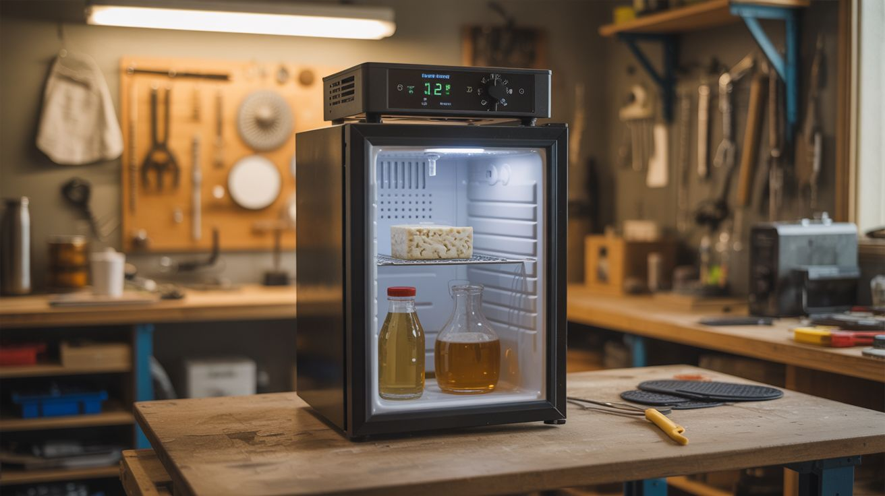

# #092 — Fermentation Chamber

  

> Mini-fridge + $12 temperature controller + heating pad. Exact temperature for beer, cheese, kombucha, tempeh. Lab-grade incubator for $15.

## Ratings

     

## 🧪 What Is It?

Fermentation is temperature-critical. Beer yeast wants 62-72F. Cheese cultures need 86-104F. Kombucha ferments at 75-85F. Tempeh needs a steady 88F. Commercial fermentation chambers and lab incubators cost $200-2000. But a mini-fridge already maintains temperature — it just only goes down. Add a $12 STC-1000 temperature controller (a thermostat with both heating and cooling outputs) and a cheap heating pad, and now you have a chamber that both heats and cools to hold any temperature within 1 degree. Set 68F for lager fermentation, 88F for tempeh, 55F for cheese aging — one device, infinite uses. This is the single best upgrade a home fermenter can make.

<strong>🧰 Ingredients</strong>

- [ ] Mini-fridge or dorm fridge — working, with enough interior space for your fermentation vessel *(thrift store, ~$20-30, or free from curb)*
- [ ] STC-1000 temperature controller *(~$12, electronics supplier or homebrew store)*
- [ ] Heating pad or seedling heat mat — low wattage, fits inside the fridge *(garden store, ~$10)*
- [ ] Temperature probe — included with STC-1000 *(included)*
- [ ] Electrical box or project box — to house the controller and wiring *(hardware store)*
- [ ] Outlet receptacles (2) — one for heating, one for cooling *(hardware store)*
- [ ] Wire, wire nuts, power cord *(hardware store)*
- [ ] Drill — for routing the temperature probe wire through the fridge wall *(workshop)*

## 🔨 Build Steps

1. **Understand the STC-1000.** This is a dual-output thermostat. It has a temperature probe, a cooling relay, and a heating relay. When the temperature rises above the setpoint, it activates the cooling outlet (fridge compressor). When it drops below, it activates the heating outlet (heat pad). It maintains temperature within 1F.
2. **Wire the controller.** Inside an electrical project box, wire the STC-1000 following its wiring diagram: power input to the controller, cooling relay output to one outlet receptacle, heating relay output to a second outlet receptacle. Label the outlets "HEAT" and "COOL" clearly.
3. **Route the temperature probe.** Drill a small hole through the fridge wall (through the side, not the back where coolant lines run). Thread the STC-1000's temperature probe through the hole and into the fridge interior. Seal the hole with silicone to maintain insulation.
4. **Plug in the fridge.** Plug the mini-fridge into the "COOL" outlet on the controller box. Set the fridge's internal thermostat to its coldest setting — the STC-1000 now controls when the compressor runs by cutting power to the outlet.
5. **Install the heating pad.** Place the heating pad or seedling mat on the bottom of the fridge interior (or on a shelf if your fermentation vessel sits on a shelf). Plug it into the "HEAT" outlet on the controller box. Set the heating pad to its highest setting — the STC-1000 controls when it runs.
6. **Set the temperature.** Program the STC-1000's target temperature. Set the hysteresis (deadband) to about 1-2 degrees — this prevents the heating and cooling from fighting each other. The compressor delay should be set to at least 5 minutes to protect the fridge compressor from short-cycling.
7. **Position the probe.** Place the temperature probe at the same height as your fermentation vessel, ideally taped to the side of the vessel with a piece of insulation over it. This measures the actual fermentation temperature rather than just the air temperature, which fluctuates more.
8. **Test without product.** Run the system empty for 24 hours at your target temperature. Monitor the controller's display — the temperature should hold steady within 1-2 degrees of your setpoint. If it oscillates wildly, adjust the hysteresis or probe position.
9. **Load and ferment.** Place your fermentation vessel in the chamber, set the target temperature for your recipe, and walk away. Check back periodically to verify temperature. The STC-1000 handles everything — heating when ambient temperature drops overnight, cooling when the sun warms the room during the day.

## ⚠️ Safety Notes

- Wiring mains electricity (120V/240V) requires basic electrical knowledge. If you're not comfortable wiring outlets, have someone experienced help. Use proper wire gauges, secure all connections with wire nuts, and mount everything in an enclosed electrical box. Loose mains wires are a fire and electrocution hazard.
- Do not drill through the back or bottom of the fridge — refrigerant lines and compressor components are located there. Drill through the side wall only, and go slowly to avoid puncturing the inner liner's coolant channels.
- The fridge compressor needs a minimum off-time between cycles (usually 5 minutes). The STC-1000's compressor delay setting prevents rapid on/off cycling that can damage the compressor. Set this to at least 5 minutes.

## 🔗 See Also

- [Fog Chiller](093-fog-chiller.md)
- [DIY Freeze Dryer](094-diy-freeze-dryer.md)
