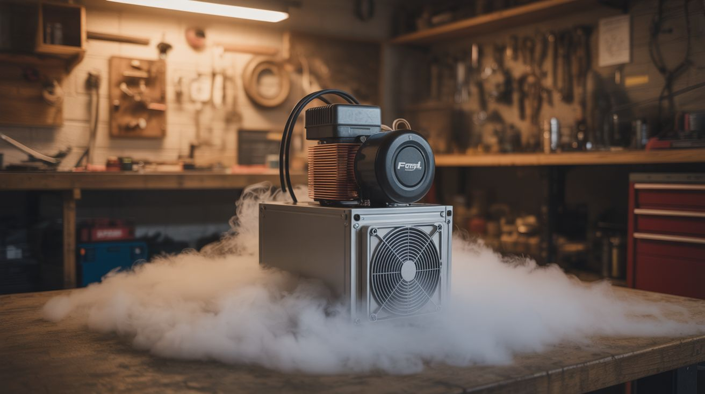

# #093 — Fog Chiller

  

> Fridge compressor + copper coil + insulated box + fog machine. Cold fog hugs the ground. Infinitely more dramatic. Essential for Halloween.

## Ratings

     

## 🧪 What Is It?

Standard fog machines heat glycol fluid to produce warm fog that rises and disperses quickly — impressive for about 5 seconds. But fog that stays on the ground, creeping across lawns and pooling around gravestones? That's the goal. A fog chiller passes hot fog from a standard fog machine through a cold heat exchanger before it exits. The fog cools to below ambient temperature, becomes denser than air, and sinks to the ground where it lingers and flows like a slow-motion liquid. Build the heat exchanger from a fridge compressor's evaporator coil (the part that gets cold) inside an insulated box. Pipe fog machine output through the cold box. What comes out the other side is ground-hugging fog that looks supernatural.

<strong>🧰 Ingredients</strong>

- [ ] Fridge compressor + evaporator coil — salvaged as a unit from a dead fridge *(e-waste bin)*
- [ ] Condenser coil — also from the fridge (the hot coil, usually on the back) *(same fridge)*
- [ ] Insulated cooler or box — styrofoam cooler works great *(dollar store)*
- [ ] Fog machine — standard glycol-based theatrical fog machine *(~$25, or borrow)*
- [ ] Flexible duct or PVC pipe — to route fog through the chiller *(hardware store)*
- [ ] Copper tubing — additional coils inside the cold box if needed for more cooling surface *(hardware store)*
- [ ] Fan — to push fog through the chiller if needed *(PC fan or small box fan)*
- [ ] Aluminum dryer duct — as the cold chamber fog path *(hardware store)*

## 🔨 Build Steps

1. **Understand the refrigeration cycle.** The compressor pumps refrigerant. The condenser coil (outside the chiller box) releases heat — it gets hot. The evaporator coil (inside the chiller box) absorbs heat — it gets cold. Fog passes over the cold evaporator coil and chills down.
2. **Salvage the refrigeration system.** From a dead fridge, carefully remove the compressor, condenser coil (the black coils on the back), and evaporator coil (the coils inside the fridge compartment), keeping the connecting copper tubing intact. The refrigerant system must remain sealed — if you hear hissing, the refrigerant has leaked and the system won't work.
3. **Build the cold box.** Cut holes in opposite sides of a styrofoam cooler for fog inlet and outlet. The fog path should be as long as possible inside the box for maximum cooling — snake the fog path back and forth with aluminum dryer duct or PVC elbows.
4. **Install the evaporator.** Mount the evaporator coil inside the cooler, in close contact with the fog path. The evaporator should be in the path of the fog or wrapped around the fog duct. Good thermal contact between the cold coil and the fog path is essential.
5. **Mount the compressor and condenser outside.** The compressor and condenser coil stay outside the insulated box. The condenser needs airflow to dissipate heat — mount it with space around it, or aim a fan at it. Connect the compressor to power.
6. **Seal and insulate.** Seal all gaps in the cooler with expanding foam or tape. The better the insulation, the colder the interior gets and the more effective the fog chilling. Seal around pipe penetrations with silicone.
7. **Connect the fog machine.** Route the fog machine's output into the chiller box inlet using flexible duct or PVC pipe. The fog enters hot, passes over or through the cold evaporator area, and exits chilled from the outlet on the other side.
8. **Test the system.** Power on the compressor and let it run for 10-15 minutes to chill the evaporator. Then fire the fog machine. Fog should enter the chiller warm and exit cold. Cold fog is visibly denser and sinks immediately upon exiting. If the fog is still rising, it needs more chilling — add more coils, improve insulation, or slow the fog flow rate.
9. **Deploy.** Point the chiller outlet at ground level in your target area. For Halloween, aim it across the yard, out of a coffin, or around gravestones. The cold fog will flow along the ground, pooling in low spots and drifting with gentle breezes. It lasts much longer than unchilled fog.

## ⚠️ Safety Notes

- Fridge compressors run on mains voltage (120V/240V). Ensure all electrical connections are properly insulated and grounded. Use a GFCI outlet, especially outdoors where moisture is present. Do not operate in rain.
- Refrigerant is pressurized and can cause frostbite on skin contact. If the refrigerant system is damaged and leaks, move to a ventilated area — older refrigerants (R-12, R-22) are toxic in enclosed spaces. Modern R-134a is less toxic but still displaces oxygen.
- Fog machine fluid (glycol/glycerin mixture) produces vapor that can irritate airways in high concentrations. Use outdoors or in well-ventilated areas. People with asthma should stay upwind.

## 🔗 See Also

- [Ultrasonic Fog Machine](../humidifier-and-water/084-ultrasonic-fog-machine.md)
- [DIY Freeze Dryer](094-diy-freeze-dryer.md)

**References:**

- [Appliance Teardown Guide](../../docs/reference/appliance-teardown-guide.md)
- [Technical Glossary](../../docs/reference/glossary.md)
