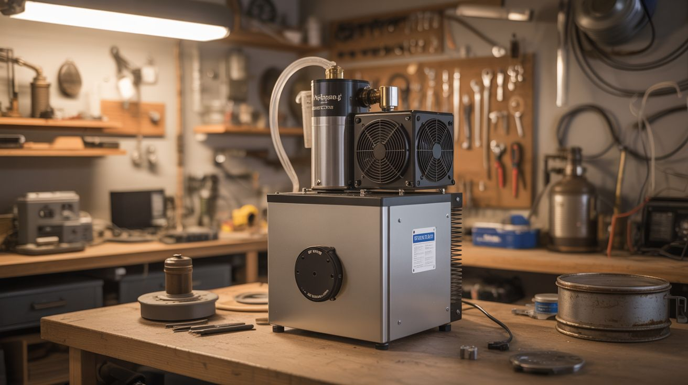

# #094 — DIY Freeze Dryer

  

> Fridge compressor + vacuum pump + vacuum chamber + cold trap. Freeze-dried food at home. Commercial freeze dryers cost $2000+.

## Ratings

     

## 🧪 What Is It?

Freeze drying (lyophilization) removes water from food by freezing it and then reducing pressure so the ice sublimes directly from solid to gas — skipping the liquid phase entirely. The result is food that retains its shape, nutrition, and flavor but weighs almost nothing and lasts 25+ years in sealed containers. Astronaut ice cream, backpacking meals, and emergency food supplies are all freeze-dried. Commercial home freeze dryers (Harvest Right) cost $2000-5000. A DIY version uses a fridge compressor as a cold trap (catches the sublimated water vapor before it reaches the pump), a second compressor or commercial vacuum pump to create vacuum, and a sealed chamber for the food. It's a serious build, but the physics are straightforward and the results are identical to commercial machines.

<strong>🧰 Ingredients</strong>

- [ ] Fridge compressor #1 — for the cold trap (chills a coil to -20F+ to catch water vapor) *(dead fridge)*
- [ ] Vacuum pump — second fridge compressor modified for vacuum duty, or a commercial 2-stage vacuum pump (~$80 used) *(dead fridge or HVAC surplus)*
- [ ] Vacuum chamber — mason jar (small batch), modified pressure cooker, or fabricated acrylic chamber *(kitchen or hardware store)*
- [ ] Cold trap container — insulated jar or coil that sits between the vacuum chamber and vacuum pump *(hardware store)*
- [ ] Copper coil — inside the cold trap, chilled by the compressor, catches water vapor *(hardware store)*
- [ ] Vacuum gauge — to monitor chamber pressure *(~$15, HVAC supplier)*
- [ ] Vacuum-rated tubing and fittings — to connect chamber, cold trap, and pump *(hardware store)*
- [ ] Silicone gaskets or vacuum grease — for sealing the chamber *(hardware store)*
- [ ] Temperature controller — to regulate cold trap temperature *(~$12, electronics supplier)*

## 🔨 Build Steps

1. **Understand the freeze drying process.** Food is pre-frozen (in a regular freezer). Then it's placed in a vacuum chamber. The pressure is reduced until the ice sublimes — goes from solid ice directly to water vapor without melting. A cold trap catches the water vapor before it reaches the vacuum pump (water destroys vacuum pumps). The process takes 12-24 hours per batch.
2. **Build or modify the vacuum pump.** A second fridge compressor can serve as a vacuum pump — cap the high-pressure outlet, and the low-pressure inlet becomes the vacuum source. Alternatively, use a commercial 2-stage vacuum pump (more reliable, better ultimate vacuum). The pump needs to pull at least 200 microns (0.2 torr) for effective freeze drying.
3. **Build the cold trap.** The cold trap sits between the vacuum chamber and the vacuum pump. Inside, a copper coil chilled by fridge compressor #1 to -20F or colder. Water vapor from the chamber condenses (actually deposits as ice) on the cold coil instead of entering the pump. Without a cold trap, water destroys the vacuum pump.
4. **Build the vacuum chamber.** For small batches: a large mason jar with a modified lid (drill through the lid, install a vacuum fitting, seal with epoxy). For larger batches: modify a pressure cooker (they're already designed to hold pressure differential) by replacing the pressure valve with a vacuum fitting. Ensure the seal is vacuum-tight.
5. **Connect the system.** Use vacuum-rated tubing to connect: vacuum chamber outlet → cold trap inlet → cold trap outlet → vacuum pump inlet. Every connection must be vacuum-tight — even tiny leaks prevent reaching the pressures needed for sublimation.
6. **Install the vacuum gauge.** Mount a vacuum gauge on the chamber or the vacuum line. You need to monitor pressure to verify the system reaches sublimation pressure (below 4.6 torr for water ice at 32F — but lower is better and faster).
7. **Pre-freeze the food.** Cut food into thin slices (1/4 inch or less) for faster drying. Pre-freeze solid in a regular freezer for at least 24 hours. The food must be completely frozen before entering the vacuum chamber.
8. **Load and start the cycle.** Place frozen food in the vacuum chamber. Seal the chamber. Start the cold trap compressor and let it chill for 15 minutes. Then start the vacuum pump. Monitor the pressure gauge — it should drop steadily. Sublimation begins when pressure drops below the vapor pressure of ice at the food's temperature.
9. **Monitor the process.** The cycle takes 12-24 hours for most foods. The vacuum gauge shows progress — pressure spikes when moisture sublimates rapidly, then drops as the food dries. The process is complete when the pressure stabilizes at a low value and no longer spikes when you briefly close the vacuum pump valve.
10. **Store the product.** Remove the finished food from the chamber. It should be dry, lightweight, and maintain its original shape. Seal immediately in airtight containers (mason jars with oxygen absorbers, or Mylar bags with desiccant). Properly sealed freeze-dried food lasts 25+ years.

## ⚠️ Safety Notes

- Vacuum chambers are under significant differential pressure (14.7 psi atmospheric pressure pushing inward). Improperly built chambers can implode. Use only pressure-rated vessels (pressure cookers, commercial vacuum chambers). Never use thin glass, plastic containers, or improvised chambers that haven't been pressure-tested. Acrylic chambers must be thick-walled (1/2" minimum).
- Fridge compressors and vacuum pumps run hot during the 12-24 hour cycles required for freeze drying. Ensure adequate ventilation and fire-safe surroundings. Monitor compressor temperature periodically — overheating can cause motor failure or oil ignition.
- Refrigerants in the cold trap compressor are environmentally regulated. Do not vent refrigerant to the atmosphere. If the system develops a leak, have it repaired by a certified HVAC technician.

## 🔗 See Also

- [Fermentation Chamber](092-fermentation-chamber.md)
- [Absorption Cooler](095-absorption-cooler.md)

**References:**
- [Appliance Teardown Guide](../../reference/appliance-teardown-guide.md)
- [Technical Glossary](../../reference/glossary.md)
