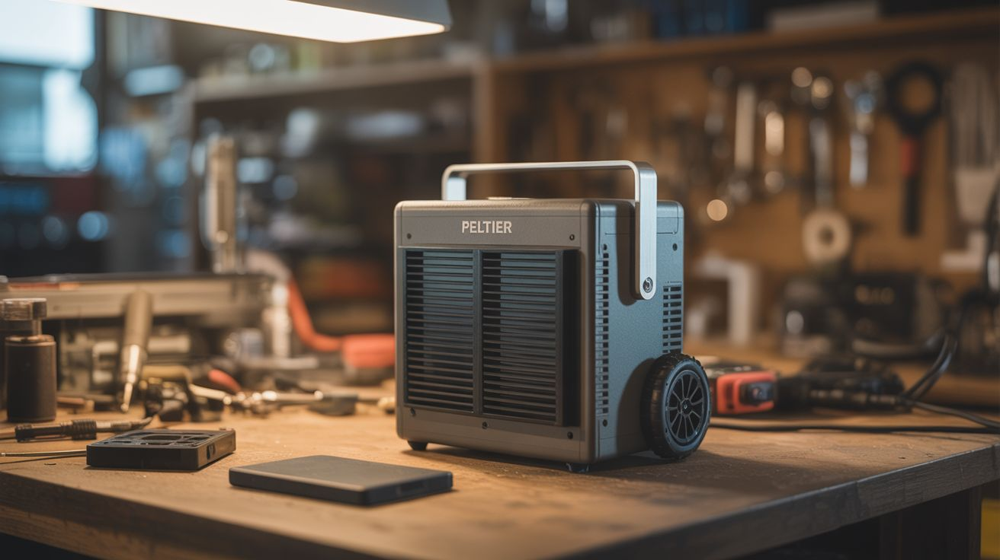

# #096 — Peltier Portable Cooler

  

> Thermoelectric modules from mini fridges become a portable cooler that runs off a car battery.

## Ratings

     

## 🧪 What Is It?

Peltier modules (thermoelectric coolers) move heat from one side to the other when you run current through them. Mini fridges, wine coolers, and car coolers all use them. Salvage the modules, mount them in an insulated box with heatsinks and fans, wire to a 12V source, and you've got a portable cooler that chills drinks without ice or a compressor. Runs silently off a car battery, solar panel, or any 12V supply. Not as cold as a compressor fridge, but gets 30-40°F below ambient — plenty for drinks and snacks.

<strong>🧰 Ingredients</strong>

- [ ] Peltier module TEC1-12706 or similar *(salvage from mini fridge, wine cooler, or Amazon ~$4)*
- [ ] Aluminum heatsinks — one for hot side, one for cold side *(salvage from old computers, amplifiers)*
- [ ] 2 small fans — 80mm or 120mm *(salvage from PCs or buy)*
- [ ] Insulated box — styrofoam cooler or build from foam board *(hardware store, ~$5)*
- [ ] Thermal paste *(electronics store or Amazon)*
- [ ] 12V power supply — car battery, bench supply, or solar panel *(salvage or buy)*
- [ ] Wire, solder, switch *(electronics supply)*
- [ ] Aluminum tape or silicone sealant *(hardware store)*

## 🔨 Build Steps

1. **Salvage the Peltier module.** Open a mini fridge or wine cooler. The Peltier module is a flat ceramic square between two heatsinks, usually held by thermal paste and screws. Remove it carefully without flexing — they crack easily.
2. **Prepare the insulated box.** Cut a hole in one wall of the styrofoam cooler slightly smaller than your heatsink. The Peltier module will sit in this hole, cold side facing in, hot side facing out.
3. **Mount the cold-side heatsink.** Apply thermal paste to the cold face of the Peltier module. Press the cold-side heatsink onto it. This heatsink goes inside the cooler.
4. **Mount the hot-side heatsink.** Apply thermal paste to the hot face. Attach the larger heatsink on the outside. The hot side needs to dissipate more heat, so use the bigger heatsink here.
5. **Attach fans.** Mount a fan on each heatsink. The inside fan circulates cold air around the cooler contents. The outside fan blows heat away from the hot-side heatsink. Without proper hot-side cooling, the module can't maintain a temperature differential.
6. **Seal the gap.** Use aluminum tape or silicone to seal the hole around the module and heatsinks. Any air leakage kills efficiency.
7. **Wire it up.** Connect the Peltier module and both fans to 12V. Add a switch. The module draws 4-6 amps, so use 16-gauge wire minimum. Polarity matters — reverse it and the module heats instead of cools.
8. **Test and measure.** Power on and let it run for 30 minutes. Measure inside temperature with a thermometer. Should drop 30-40°F below ambient. Add a second Peltier module in parallel for more cooling power.

## ⚠️ Safety Notes

- Peltier modules get very hot on the hot side (150°F+). Don't touch the hot-side heatsink during operation without fans running — it can burn.
- The module draws significant current (5A+). Use appropriate wire gauge and a fused connection to prevent fire.

## 🔗 See Also

- [Fermentation Chamber](092-fermentation-chamber.md)
- [Campfire Thermoelectric Charger](../power-and-energy/049-campfire-thermoelectric-charger.md)
