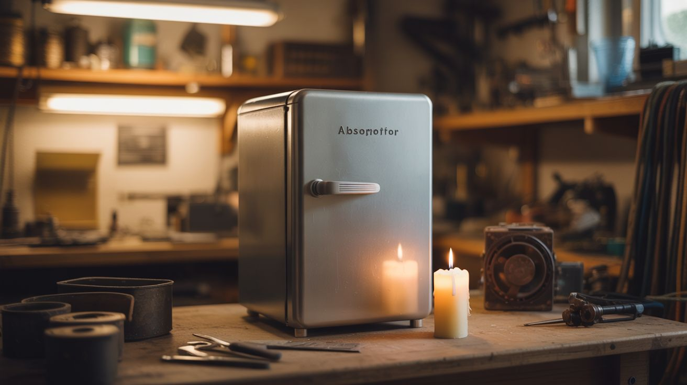

# #097 — Absorption Fridge

  

> A fridge with zero moving parts — just heat, ammonia, and gravity. Runs off a candle.

## Ratings

     

## 🧪 What Is It?

Absorption refrigeration uses heat to drive a cooling cycle — no compressor, no electricity, no moving parts. Ammonia evaporates, absorbs heat (making things cold), gets reabsorbed into water, then gets boiled out again by a heat source. RV fridges and old propane refrigerators use this exact cycle. Build one from scratch with steel tubing, ammonia solution, and a heat source (propane burner, candle, or even concentrated sunlight). A fridge powered by fire is a genuine mind-bender.

<strong>🧰 Ingredients</strong>

- [ ] Steel tubing — 1/4" to 3/8" *(hardware store, plumbing supply)*
- [ ] Ammonia solution — household ammonia 10% or stronger *(hardware store, cleaning aisle)*
- [ ] Hydrogen gas source — or use a three-fluid system with water *(welding supply for hydrogen, or ammonia-water-hydrogen salvage from old RV fridge)*
- [ ] Propane burner or alcohol lamp — heat source *(camping store)*
- [ ] Insulated box — styrofoam or build from rigid foam insulation *(hardware store)*
- [ ] Copper fittings, unions, and valves *(plumbing supply)*
- [ ] Solder and flux — silver solder for pressure-rated joints *(hardware store)*
- [ ] Pressure gauge *(auto parts store)*

## 🔨 Build Steps

1. **Study the Einstein-Szilard cycle.** Yes, THAT Einstein. He co-patented an absorption fridge design. The three-fluid cycle (ammonia, water, hydrogen) has no moving parts and no high pressures. Understand the flow: generator → condenser → evaporator → absorber → back to generator.
2. **Build the generator.** Coil steel tubing over the heat source. This is where ammonia-water solution gets heated, boiling off ammonia vapor. The vapor rises through the tubing to the condenser.
3. **Build the condenser.** A length of finned tubing (or coiled tubing with a fan) that cools the ammonia vapor back into liquid. Air-cooled or water-cooled. Mount this outside the insulated box.
4. **Build the evaporator.** Tubing inside the insulated box where liquid ammonia evaporates, absorbing heat from the box interior. This is where the cooling happens. Hydrogen gas (in a 3-fluid system) flows through here to lower the partial pressure of ammonia, enabling evaporation at low temperature.
5. **Build the absorber.** Where ammonia vapor re-dissolves into water. The ammonia-rich water flows back to the generator by gravity, completing the cycle.
6. **Assemble and seal.** Connect all sections with pressure-rated fittings. Silver solder all joints. This is a sealed system — any leak kills the cycle and releases ammonia (toxic).
7. **Charge the system.** Add the ammonia-water solution and hydrogen (if using 3-fluid). Seal permanently. Use the pressure gauge to verify no leaks under operating temperature.
8. **Test with heat source.** Light the burner under the generator. Within 30-60 minutes, the evaporator section should start getting cold. The system takes time to reach steady state. Expect 40-50°F inside the box.

## ⚠️ Safety Notes

> **Spicy Level 3 build.** Read the [Safety Guide](../../docs/safety/README.md) before starting.

- Ammonia is toxic and corrosive. Work outdoors or in extremely well-ventilated areas. Wear chemical splash goggles and nitrile gloves. If you smell ammonia during operation, you have a leak — shut down and ventilate immediately.
- The system operates under modest pressure. Use properly rated tubing and silver solder (not soft solder). Pressure-test with air before charging with ammonia.
- Keep the heat source away from the ammonia side of the system. Ammonia is flammable in high concentrations.

## 🔗 See Also

- [Freeze Dryer](094-diy-freeze-dryer.md)
- [Campfire Thermoelectric Charger](../power-and-energy/049-campfire-thermoelectric-charger.md)
