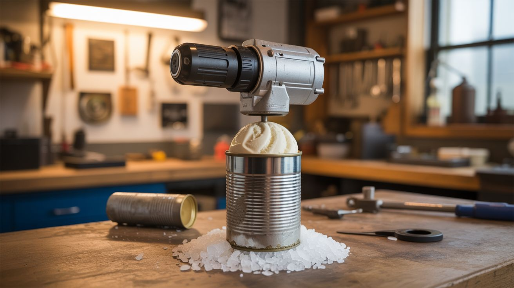

# #098 — Junk Ice Cream Maker

  

> Motor from a dead drill, a tin can, rock salt, and ice. Fresh ice cream in 20 minutes from parts headed for the landfill.

## Ratings

| Jaw Drop Rating | Brain Melt Level | Wallet Damage | Spicy Level | Clout Potential | Time to Build |
|---|---|---|---|---|---|
| ⭐⭐⭐ | ⭐⭐ | ⭐ | ⭐ | ⭐⭐⭐⭐ | ⭐⭐ |

## What Is It?

An electric ice cream maker built from salvaged parts. A small motor (from a dead drill, mixer, or rotisserie) spins a paddle inside a metal can. The can sits inside a larger container packed with ice and rock salt (which drops the temperature well below 32°F). Cream mixture goes in, motor spins, and 20 minutes later you've got fresh ice cream. The rock salt trick is centuries old — salt lowers the freezing point of ice to about 0°F, cold enough to freeze cream while it churns.

## Ingredients

- [ ] Small geared motor — from dead drill, hand mixer, rotisserie, or window wiper motor *(salvage)*
- [ ] Metal can — coffee can or large tin *(recycle bin)*
- [ ] Larger container — bucket, large pot, or another bigger can *(salvage or dollar store)*
- [ ] Paddle/dasher — bent wire, wooden spoon cut to fit, or 3D printed *(salvage or make)*
- [ ] Rock salt *(grocery store or hardware store, ~$3 for 5 lbs)*
- [ ] Ice *(freezer)*
- [ ] Shaft coupling — bolt or rod to connect motor to paddle *(hardware store)*
- [ ] 12V power supply or battery pack *(salvage from old electronics)*
- [ ] Ice cream ingredients — cream, sugar, vanilla *(grocery store)*

## Build Steps

1. **Prep the inner can.** Clean a metal coffee can thoroughly. This holds the ice cream mixture. Punch a hole in the center of the lid for the paddle shaft.
2. **Build the paddle.** Bend stiff wire into a scraper shape that fits inside the can with about 1/4" clearance from the walls. The paddle needs to scrape the sides — that's where the mixture freezes first. Alternatively, cut a wooden spoon to fit.
3. **Mount the motor.** Attach the motor to a bracket or frame that sits above the inner can. Connect the motor shaft to the paddle through the lid hole. A simple coupling is a bolt with a hole drilled crosswise for a cotter pin.
4. **Set up the outer container.** Place the inner can inside the larger bucket. There should be 2-3 inches of space on all sides for the ice/salt mixture.
5. **Add speed control (optional).** A potentiometer or PWM controller lets you adjust churning speed. Too fast whips in too much air. Too slow doesn't scrape well. 30-60 RPM is the sweet spot.
6. **Pack with ice and salt.** Layer ice and rock salt around the inner can in the outer container. Use a ratio of about 3:1 ice to salt. The temperature will drop to 0°F or below within minutes.
7. **Add ice cream base.** Pour your mixture into the inner can. Basic recipe: 2 cups heavy cream, 1 cup whole milk, 3/4 cup sugar, 2 tsp vanilla. Fill the can only 2/3 full — it expands as it freezes.
8. **Churn.** Start the motor. Churn for 15-20 minutes. The mixture will thicken as ice crystals form. When the motor starts laboring (mixture is thick), it's done. Eat immediately for soft-serve consistency, or freeze for another hour for hard ice cream.

## Safety Notes

- Make sure the motor and all electrical connections are completely isolated from the food container. No metal shavings, no grease, no contact between motor parts and ice cream.
- Clean all food-contact surfaces (inner can, paddle) thoroughly before use. If using a recycled can, make sure it had food-safe contents originally — no paint cans or chemical containers.

## See Also

- [Fermentation Chamber](092-fermentation-chamber.md)
- [Peltier Portable Cooler](096-peltier-portable-cooler.md)

**References:**
- [Appliance Teardown Guide](../../reference/appliance-teardown-guide.md)
- [Technical Glossary](../../reference/glossary.md)
