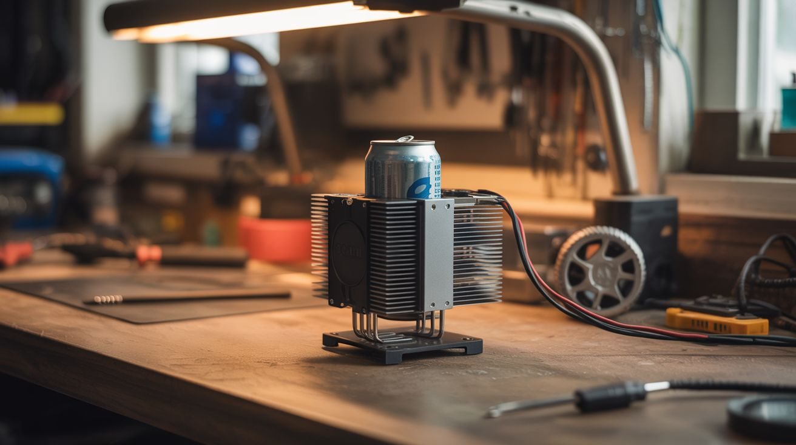

# #100 — Thermoelectric Beverage Chiller

  

> CPU cooler heatsink + Peltier module = a desktop drink chiller that gets your can ice cold in 5 minutes.

## Ratings

     

## 🧪 What Is It?

Take a CPU cooler heatsink (the one with the fan and copper heat pipes), flip the concept, and use it to chill instead of heat. A Peltier module sandwiched between two heatsinks — one dissipates heat to the room, the other gets cold enough to chill a drink can in minutes. Mount the cold side in an aluminum cup holder or plate, set your drink on it, and watch condensation form as it drops below room temperature. It's a single-can fridge for your desk. The same Peltier tech used in those USB cup coolers you see online, but built from salvage for free.

<strong>🧰 Ingredients</strong>

- [ ] Peltier module TEC1-12706 *(salvage from mini fridge or Amazon ~$4)*
- [ ] CPU heatsink with fan — the bigger the better *(salvage from any desktop PC)*
- [ ] Second heatsink or aluminum plate — cold side contact surface *(salvage from PC, amplifier, or buy)*
- [ ] Thermal paste *(electronics store or Amazon)*
- [ ] 12V power supply — old laptop charger works, needs 5A+ *(salvage)*
- [ ] Aluminum can holder or plate — machined, bent, or shaped to hold a drink *(aluminum sheet from hardware store, or repurpose a can koozie)*
- [ ] Switch and wiring *(electronics supply)*
- [ ] Foam or rubber gasket material — insulates cold plate from hot heatsink *(hardware store)*

## 🔨 Build Steps

1. **Prep the heatsinks.** Clean the mating surfaces of both heatsinks with isopropyl alcohol. They need to be flat and free of old thermal paste. The bigger heatsink (with fan) goes on the hot side. The smaller one or a flat aluminum plate goes on the cold side.
2. **Apply thermal paste.** Thin, even layer on both faces of the Peltier module. Good thermal contact is everything — without it, the module can't transfer heat efficiently and performance drops dramatically.
3. **Assemble the sandwich.** Cold-side heatsink → Peltier module (cold side down, check markings) → hot-side heatsink with fan. Clamp or bolt together firmly. Even pressure across the module matters.
4. **Insulate the gap.** Wrap foam or rubber around the edges between the two heatsinks. You don't want the hot side radiating heat directly to the cold side — that defeats the purpose.
5. **Shape the drink holder.** Bend aluminum sheet into a cup/can holder shape, or machine a flat plate with a slight rim. Attach to the cold-side heatsink with thermal paste and screws. The drink sits directly on this surface.
6. **Wire it up.** Connect the Peltier module and fan to the 12V supply through a switch. The module is polarity-sensitive — one direction cools, the other heats. Test before finalizing.
7. **Test performance.** Place a room-temperature can on the cold plate. With a good build, the can surface should be noticeably cold within 2-3 minutes and drink temperature drops 20-30°F within 5-10 minutes. Not a freezer, but turns a warm soda into a cold one at your desk.
8. **Optional: add a temperature display.** Wire a thermistor and small OLED to an Arduino Nano to show the cold plate temperature. Makes it look more impressive and lets you monitor performance.

## ⚠️ Safety Notes

- The hot side gets very hot (140°F+). Make sure the fan is always running when the module is powered — without active cooling on the hot side, the module can overheat and fail permanently.
- Don't leave it running unattended for extended periods. Condensation from the cold plate can drip onto electronics if not properly drained or sealed.

## 🔗 See Also

- [Peltier Portable Cooler](096-peltier-portable-cooler.md)
- [Fermentation Chamber](092-fermentation-chamber.md)

**References:**
- [Electronics & Microcontrollers Guide](../../reference/electronics-and-microcontrollers.md)
