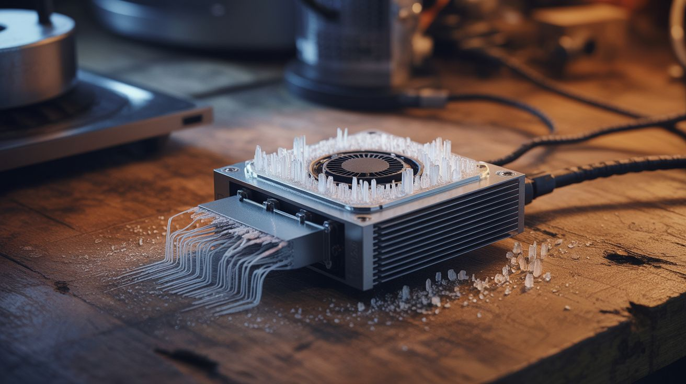

# Fridge & Cooling

  

> A fridge compressor is a heat pump. It moves thermal energy from one place to another. Where you put the cold side and the hot side is entirely up to you.

Refrigerator compressors are robust, sealed, and designed to run continuously for decades. They pump refrigerant through a cycle of compression and expansion that moves heat against its natural gradient — making one side cold and the other hot. This is the same thermodynamic cycle that powers air conditioners, freeze dryers, fog chillers, and even absorption coolers (which run on heat instead of electricity). A dead fridge's compressor, heat exchangers, and temperature controllers are the building blocks of precision thermal control.

Einstein literally patented a fridge design. This category is physics royalty.

---

## Builds

| # | Build | Jaw Drop | Brain Melt | Wallet | Spicy | Clout | Time |
|---|---|---|---|---|---|---|---|
| 092 | [Fermentation Chamber](092-fermentation-chamber.md) | ⭐⭐ | ⭐⭐ | ⭐ | ⭐ | ⭐⭐ | ⭐ |
| 093 | [Fog Chiller](093-fog-chiller.md) | ⭐⭐⭐⭐ | ⭐⭐⭐ | ⭐⭐ | ⭐ | ⭐⭐⭐⭐ | ⭐⭐⭐ |
| 094 | [DIY Freeze Dryer](094-diy-freeze-dryer.md) | ⭐⭐⭐⭐ | ⭐⭐⭐⭐ | ⭐⭐⭐ | ⭐⭐ | ⭐⭐⭐⭐ | ⭐⭐⭐⭐ |
| 095 | [Absorption Cooler](095-absorption-cooler.md) | ⭐⭐⭐⭐ | ⭐⭐⭐⭐⭐ | ⭐⭐⭐ | ⭐⭐⭐⭐ | ⭐⭐⭐⭐ | ⭐⭐⭐⭐⭐ |
| 096 | [Peltier Portable Cooler](096-peltier-portable-cooler.md) | ⭐⭐⭐ | ⭐⭐ | ⭐⭐ | ⭐ | ⭐⭐⭐ | ⭐⭐ |
| 097 | [Absorption Fridge](097-absorption-fridge.md) | ⭐⭐⭐⭐ | ⭐⭐⭐⭐ | ⭐⭐⭐ | ⭐⭐⭐ | ⭐⭐⭐⭐ | ⭐⭐⭐⭐ |
| 098 | [Junk Ice Cream Maker](098-junk-ice-cream-maker.md) | ⭐⭐⭐ | ⭐⭐ | ⭐ | ⭐ | ⭐⭐⭐⭐ | ⭐⭐ |
| 099 | [Swamp Cooler](099-swamp-cooler.md) | ⭐⭐⭐ | ⭐ | ⭐ | ⭐ | ⭐⭐⭐ | ⭐ |
| 100 | [Thermoelectric Beverage Chiller](100-beverage-chiller.md) | ⭐⭐⭐ | ⭐⭐ | ⭐ | ⭐ | ⭐⭐⭐⭐ | ⭐ |

---

### Suggested Build Order

Start with passive cooling, progress toward thermodynamic systems:

1. **[#099 — Swamp Cooler](099-swamp-cooler.md)** — Passive evaporative cooling. No electronics.
2. **[#100 — Thermoelectric Beverage Chiller](100-thermoelectric-beverage-chiller.md)** — Peltier introduction.
3. **[#092 — Fermentation Chamber](092-fermentation-chamber.md)** — Temperature controller basics.
4. **[#096 — Peltier Portable Cooler](096-peltier-portable-cooler.md)** — Builds on Peltier knowledge.
5. **[#098 — Junk Ice Cream Maker](098-junk-ice-cream-maker.md)** — Phase-change materials.
6. **[#093 — Fog Chiller](093-fog-chiller.md)** — Compressor integration.
7. **[#094 — DIY Freeze Dryer](094-diy-freeze-dryer.md)** — Vacuum + cooling systems.
8. **[#097 — Absorption Fridge](097-absorption-fridge.md)** — Alternative cooling without compressor.
9. **[#095 — Absorption Cooler](095-absorption-cooler.md)** — Maximum complexity. Full thermodynamic system.

### Related Categories

- [Power & Energy](../power-and-energy/) — Thermal energy management and waste heat recovery
- [Functional Machines](../functional-machines/) — Compressor salvage and equipment assembly
- [Household Chemistry](../household-chemistry/) — Phase-change chemistry and thermal reactions
