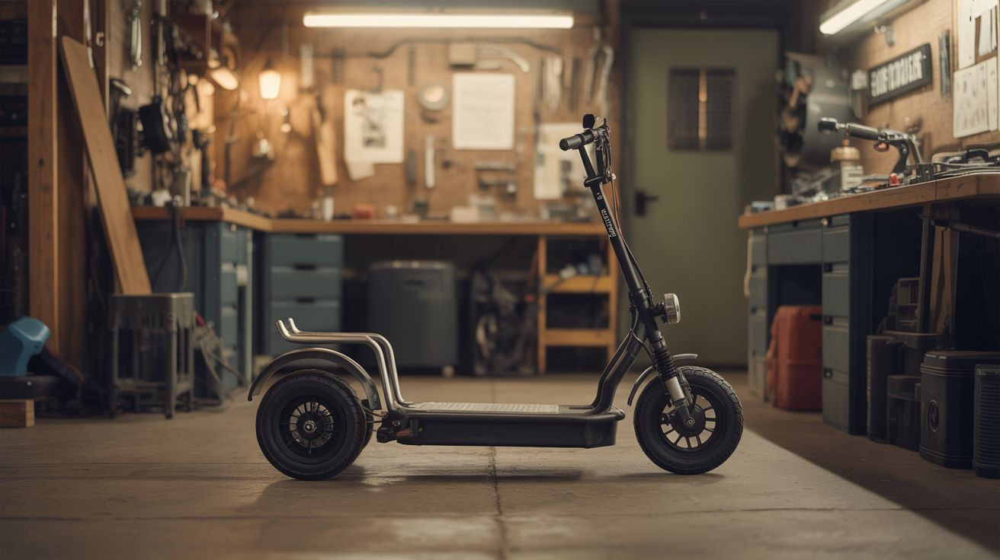

# #024 — Electric Go-Kart

  

> A scooter motor, a bed frame, and some batteries walk into a garage. They don't walk out — they drive out at 30 mph.

## Ratings

| Jaw Drop Rating | Brain Melt Level | Wallet Damage | Spicy Level | Clout Potential | Time to Build |
|---|---|---|---|---|---|
| ⭐⭐⭐⭐⭐ | ⭐⭐⭐ | ⭐⭐⭐ | ⭐⭐⭐ | ⭐⭐⭐⭐⭐ | ⭐⭐⭐ |

## What Is It?

An electric go-kart built from a steel bed frame chassis, powered by a brushless DC motor pulled from a dead electric scooter, and fed by salvaged lithium battery packs. The bed frame provides the structural rigidity you need — angle iron or square tube steel, already cut to useful lengths, already drilled with holes. The scooter motor provides the torque and RPM. Chain drive to a rear axle, simple steering geometry up front, and you've got a legitimate electric vehicle that can hit 25-30 mph depending on your motor and battery voltage.

This is the build that makes people take junkyard engineering seriously. It moves. It carries a person. It's fast enough to be genuinely fun and genuinely dangerous.

## Ingredients

- [ ] Electric scooter motor — brushless DC, 24V-48V, 250W-1000W *(dead scooter, e-waste)*
- [ ] Motor controller/ESC — matched to motor voltage and wattage *(from the same scooter, or purchased ~$20)*
- [ ] Steel bed frame — provides the main chassis rails *(curbside, thrift store)*
- [ ] Rear axle — solid steel rod, 3/4" to 1" diameter, ~30" long *(hardware store, or salvage from a garden cart)*
- [ ] Pillow block bearings x2 — to mount the rear axle *(hardware store, ~$10 each)*
- [ ] Sprockets and chain — bicycle chain and sprockets work for lower-power builds *(old bicycle, hardware store)*
- [ ] Front steering knuckles — fabricated from steel plate, or scavenged from a garden cart/wagon *(junkyard, hardware store)*
- [ ] Tie rod — steel rod connecting the two front knuckles *(hardware store)*
- [ ] Wheels x4 — pneumatic hand truck or garden cart wheels, 8"-10" *(hardware store, salvage)*
- [ ] Throttle — twist grip from the scooter, or a foot pedal with potentiometer *(scooter parts, electronics supplier)*
- [ ] Battery pack — 24V-48V lithium from scooter, e-bike, or salvaged 18650 cells *(e-waste, battery recycler)*
- [ ] Seat — lawn chair, bucket seat from junkyard, or fabricated from plywood *(junkyard, hardware store)*
- [ ] Brake — bicycle caliper or disc brake on the rear axle *(old bicycle)*
- [ ] Welder — MIG or stick *(workshop)*
- [ ] Angle grinder, drill, wrenches *(workshop)*
- [ ] Kill switch — big red button that cuts motor power *(electronics supplier)*

## Build Steps

1. **Design the frame geometry.** Lay out the bed frame rails on the ground to establish wheelbase and track width. A wheelbase of 48"-60" and track width of 30"-36" gives stable handling. Mark where the rear axle, front steering pivots, and seat will go. Sketch it out before you cut anything.
2. **Cut and weld the chassis.** Cut the bed frame angle iron to your dimensions. Weld a rectangular base frame, then add cross members for the rear axle mounts and front steering mounts. Gusset every joint — this frame has to hold a person at speed. Grind all welds smooth on surfaces you might contact.
3. **Install the rear axle.** Bolt the two pillow block bearings to the rear cross member. Slide the axle through both bearings. Weld or key the driven sprocket and the rear wheel hubs onto the axle. The sprocket should be centered between the bearings. Verify the axle spins freely with no binding.
4. **Build the front steering.** Fabricate or mount two steering knuckles at the front corners of the frame. Each knuckle pivots on a vertical bolt (kingpin). Connect them with a tie rod so they turn together. Attach a steering column — a vertical pipe welded to one knuckle, with a go-kart steering wheel or a T-bar at the top. Verify Ackermann geometry: the inner wheel should turn tighter than the outer wheel.
5. **Mount the motor and chain drive.** Bolt the scooter motor to the frame near the rear axle. Align the motor sprocket with the axle sprocket. Install the chain and adjust tension — you want about 1/2" of play at the midpoint. A slotted motor mount lets you adjust chain tension later.
6. **Wire the electrical system.** Connect the battery to the motor controller through a main fuse and the kill switch. Wire the throttle to the controller's signal input. Mount the controller somewhere protected from road spray. Use appropriately gauged wire — at 48V and 20A, you need 12-gauge minimum. Secure all wiring with zip ties away from moving parts.
7. **Install brakes.** Mount a bicycle disc brake caliper on the rear axle with a disc welded or bolted to the axle. Run a brake cable to a hand lever or foot pedal mounted on the frame. Adjust the caliper so the pads engage evenly. Test the brake before the first drive — pull the kart backward by hand while applying the brake.
8. **Mount the seat and safety features.** Bolt the seat to the frame with a seatbelt or lap bar if you're being responsible. Install a bumper — a loop of bent steel tube — around the front. Add a kill switch within arm's reach. Optionally add a headlight from an old bicycle or flashlight.
9. **Test at low speed.** Find a flat, empty parking lot. Power on the system and verify the throttle responds smoothly. Drive at walking speed first. Test steering lock-to-lock. Test brakes from 5 mph, then 10 mph. Check for anything loose or vibrating. Tighten everything.
10. **Tune and iterate.** Adjust chain tension, brake engagement, and throttle response. If the kart pulls to one side, check wheel alignment and tire pressure. If the motor overheats, you're either undergeared (too much load) or the battery voltage is too low.

## Safety Notes

- This is a real vehicle. Wear a helmet every single time. At 25 mph on a lightweight frame with no crumple zone, a crash into a curb or wall can cause serious injury. Eye protection and gloves are also non-negotiable.
- The kill switch must be accessible from the driver's seat with one hand, instantly. Wire it as a normally-open switch in the main power line — if the wire breaks, power cuts. Do not rely on the throttle returning to zero as your only way to stop the motor.
- Lithium battery packs can catch fire if shorted, punctured, or over-discharged. Mount the battery in a protected location away from the chain and road debris. Use a fuse rated appropriately for your system. Never charge unattended.

## See Also

- [DIY Powerwall](../power-and-energy/052-diy-powerwall.md)
- [Scooter Motor Lathe](025-scooter-motor-lathe.md)
