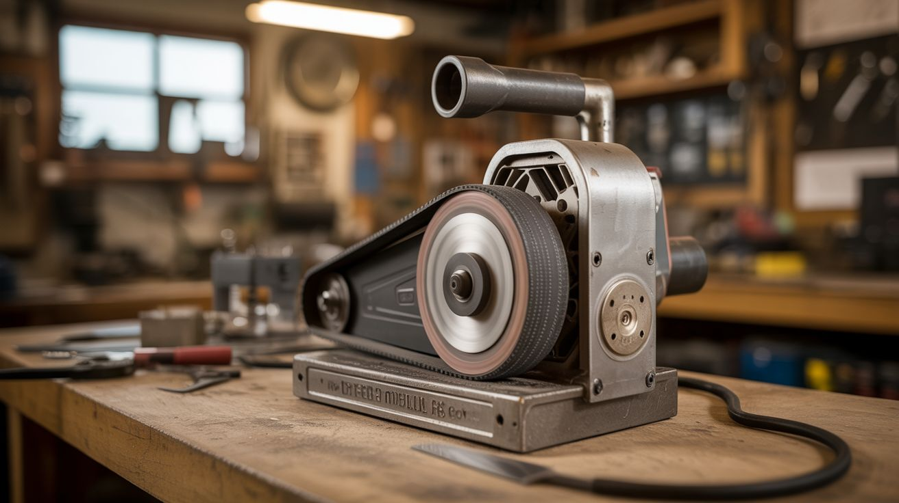

# #026 — Treadmill Belt Grinder

  

> The motor in a dead treadmill is a precision variable-speed DC motor. Strap a sanding belt to it and you've got a knife-maker's best friend.

## Ratings

| Jaw Drop Rating | Brain Melt Level | Wallet Damage | Spicy Level | Clout Potential | Time to Build |
|---|---|---|---|---|---|
| ⭐⭐⭐ | ⭐⭐ | ⭐⭐ | ⭐⭐ | ⭐⭐ | ⭐⭐ |

## What Is It?

A belt grinder is the single most versatile tool in a knife-making or metal-fabrication shop. It grinds, shapes, sharpens, deburrs, and finishes. Commercial 2x72" belt grinders cost $500-$2000. A treadmill motor is a permanent-magnet DC motor rated for continuous duty at variable speeds — exactly what a belt grinder needs. Pair it with a set of wheels, a platen, and standard sanding belts, and you've got a shop-grade tool for the cost of some bearings and a few hours of fabrication.

The treadmill's speed controller board usually survives when the tread belt or deck fails, giving you a ready-made variable speed drive. Low speed for heat-sensitive grinding, high speed for aggressive stock removal.

## Ingredients

- [ ] Treadmill DC motor — typically 1.5-3 HP, 90-180V DC *(dead treadmill, curbside, gym liquidation)*
- [ ] Treadmill speed controller board *(from the same treadmill)*
- [ ] Drive wheel — 4" diameter, crowned, with a shaft that fits the motor *(knifemaker supply, or turn one on a lathe)*
- [ ] Idler wheels x2 — 2"-3" diameter, on bearings *(hardware store, skateboard wheels work)*
- [ ] Tracking wheel — one idler with a spring-loaded tilt adjustment for belt tracking *(fabricated)*
- [ ] Platen — flat steel plate behind the grinding area, 2" x 8" *(scrap steel, hardware store)*
- [ ] Sanding belts — 2" x 72" in various grits *(knifemaker supply, hardware store)*
- [ ] Steel plate and tubing — for the frame *(scrap metal, hardware store)*
- [ ] Tension spring — to keep the belt taut *(hardware store)*
- [ ] Welder, angle grinder, drill *(workshop)*

## Build Steps

1. **Test the motor and controller.** Before building anything, wire up the treadmill motor to its controller board and verify it spins and the speed control works. The controller needs AC power in (120V) and outputs variable DC to the motor. Verify the speed potentiometer still functions — this becomes your grinder speed knob.
2. **Build the frame.** Weld a vertical frame from steel tubing or angle iron. The motor mounts at the bottom. The grinding area is at waist height. The frame must be heavy and rigid — vibration is the enemy of clean grinding. A 30-40 lb frame is not overkill. Bolt it to the floor or to a heavy bench.
3. **Mount the motor.** Bolt the motor at the base of the frame with the shaft pointing up. Press or key the drive wheel onto the motor shaft. The drive wheel should be crowned (slightly barrel-shaped) to help the belt track center.
4. **Install the idler wheels.** Mount two idler wheels on the frame above the motor — one at the top as the tracking wheel, one offset to create the belt path. The belt should form a triangle: drive wheel at bottom, tracking wheel at top, and the platen/contact wheel where you do the grinding.
5. **Add the tracking mechanism.** The top idler needs a tilt adjustment — a bolt that pushes one side of the wheel's axle forward or backward. This steers the belt left or right. A spring keeps tension on the tilt bolt. This is the most critical adjustment on the whole machine.
6. **Install the tension system.** One of the wheels (usually the tracking wheel arm) should be spring-loaded to maintain belt tension. A heavy extension spring or a pneumatic cylinder works. The belt needs to be tight enough to not slip under load, but not so tight that it overloads the bearings.
7. **Mount the platen.** Weld or bolt a flat steel plate behind the contact area where the belt meets the workpiece. The platen backs up the belt and gives you a flat grinding surface. For hollow grinds, remove the platen and grind against an unsupported section of belt.
8. **Install the belt and tune tracking.** Loop a sanding belt around all three wheels. Power on at low speed and adjust the tracking bolt until the belt runs centered on all wheels. If it drifts off, adjust further. Once tracking is stable, increase speed gradually.

## Safety Notes

- A belt grinder throws sparks and hot metal particles. Wear a full face shield and leather gloves. Keep a fire extinguisher within arm's reach — grinding sparks can ignite sawdust, paper, or oily rags.
- The treadmill motor runs on high-voltage DC (90-180V). The controller board has exposed mains voltage terminals. Enclose the controller in a junction box and ensure all connections are insulated. Do not work on the electrical system while it's plugged in.
- Grinding metal produces fine dust that is hazardous to breathe. Work in a ventilated area or use a dust collection setup. A respirator is mandatory for extended grinding sessions.

## See Also

- [Scooter Motor Lathe](025-scooter-motor-lathe.md)
- [Spot Welder](027-spot-welder.md)
