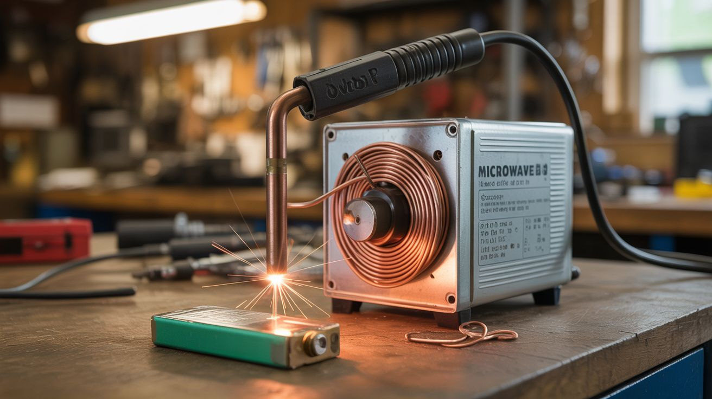

# #027 — Spot Welder

  

> A microwave oven transformer rewound with thick copper cable becomes a spot welder that fuses metal with a single pulse. Battery tab welding for a dollar in copper.

## Ratings

| Jaw Drop Rating | Brain Melt Level | Wallet Damage | Spicy Level | Clout Potential | Time to Build |
|---|---|---|---|---|---|
| ⭐⭐⭐⭐ | ⭐⭐ | ⭐ | ⭐⭐⭐ | ⭐⭐⭐ | ⭐⭐ |

## What Is It?

A microwave oven transformer (MOT) is designed to step 120V up to 2000V+ for the magnetron. But if you remove the high-voltage secondary winding and replace it with 2-3 turns of thick copper cable, you invert the ratio — now it steps 120V down to about 2-4V at hundreds of amps. That's not enough voltage to shock you, but it's enough current to melt metal at the contact point. Clamp two copper electrodes against thin sheet metal or a battery tab, pulse the power, and you get a clean spot weld in a fraction of a second.

This is the standard method for welding nickel tabs to lithium cells when building battery packs. Commercial spot welders for battery work cost $200-$500. This one costs the price of a few feet of welding cable and an afternoon.

## Ingredients

- [ ] Microwave oven transformer (MOT) *(dead microwave, e-waste)*
- [ ] Thick copper welding cable — 2/0 or 4/0 gauge, ~3 feet *(electrical supply, scrap yard)*
- [ ] Copper electrode tips — 1/4" copper rod, sharpened *(hardware store, or thick copper wire)*
- [ ] Momentary foot switch or push button — rated for mains voltage *(hardware store, electronics supplier)*
- [ ] Power cord with plug *(old appliance, hardware store)*
- [ ] Timer relay (optional) — for precise pulse duration control *(electronics supplier, ~$10)*
- [ ] Electrical tape, heat shrink tubing *(hardware store)*
- [ ] Hacksaw or angle grinder with cutoff wheel *(workshop)*
- [ ] Wooden or plastic base *(scrap)*

## Build Steps

1. **Remove the MOT from the microwave.** Unplug the microwave. Discharge the capacitor first — short the capacitor terminals with an insulated screwdriver (it can hold a lethal charge even when unplugged). Unbolt the transformer from the chassis.
2. **Remove the secondary winding.** The secondary is the winding with thinner wire and more turns (the high-voltage side). Cut it out with a hacksaw or angle grinder. Be careful not to cut into the primary winding (thicker wire, fewer turns) or the core laminations. A chisel and hammer can help knock out the remaining wire.
3. **Remove the magnetic shunts.** Most MOTs have thin metal shunts between the primary and secondary — they limit current. Pull or chisel them out. You want maximum current transfer.
4. **Wind the new secondary.** Thread 2-3 turns of the thick copper cable through the core window where the old secondary was. The cable is stiff and the window is tight — this takes muscle. Two turns gives roughly 2V out; three turns gives roughly 3V. More voltage means more aggressive welds.
5. **Attach the electrodes.** Crimp or solder copper rod tips to the ends of the cable. The tips should be pointed or slightly rounded — a smaller contact area concentrates the current for cleaner welds. Mount the tips in insulated holders (wood blocks or 3D-printed handles) so you can press them against the workpiece.
6. **Wire the primary side.** Connect the power cord to the primary winding through the momentary switch. The switch controls the weld pulse — press to weld, release to stop. A foot switch is ideal because it keeps both hands free for holding the electrodes and workpiece.
7. **Add a timer relay (optional).** For battery tab welding, pulse duration matters — too long melts through the tab, too short doesn't fuse. A timer relay set for 100-300 milliseconds gives consistent welds. Wire it between the switch and the primary.
8. **Mount and insulate.** Bolt the transformer to a wooden base. Insulate all mains-voltage connections with heat shrink or electrical tape. Ensure no bare primary wiring is exposed.
9. **Test on scrap.** Start with two pieces of thin sheet metal. Press the electrodes on opposite sides (or both on the same side for single-sided welding), step on the foot switch, and check the weld. Adjust electrode pressure and pulse duration until you get a clean nugget weld without burn-through.

## Safety Notes

- The primary side of this device runs on mains voltage (120V AC). All mains connections must be fully insulated. Never touch the primary wiring while the unit is plugged in. Use a grounded power cord.
- The secondary produces extremely high current (300-800A) at low voltage. The electrodes and cable will get hot during extended use. Allow cooling time between welds. The cable can melt its insulation if overworked.
- When welding lithium battery cells, work in a ventilated area. A bad weld can puncture the cell casing, causing venting or thermal runaway. Practice on scrap before welding live cells. Keep a sand bucket nearby.

## See Also

- [DIY Powerwall](../power-and-energy/052-diy-powerwall.md)
- [Capacitor Discharge Welder](032-capacitor-discharge-welder.md)
