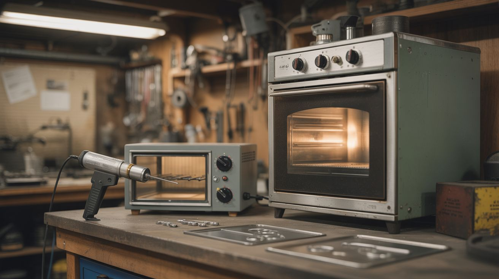

# #028 — Powder Coating Oven

  

> An old kitchen oven, a thrift-store toaster oven for small parts, and an electrostatic gun turn raw metal into factory-finish coated parts.

## Ratings

     

## 🧪 What Is It?

Powder coating is how factories finish metal parts — a dry powder is electrostatically charged and sprayed onto a grounded metal part. The charged particles cling to the metal, and then the part goes into an oven at 350-450°F where the powder melts and flows into a hard, smooth, durable finish. It's tougher than paint, more even than spray cans, and comes in every color imaginable.

A professional powder coating setup costs thousands. But a discarded kitchen oven already hits the right temperatures. A cheap electrostatic powder gun costs $20-$60. And the powder itself is inexpensive. The result is a finish that looks and performs like it came from a professional shop.

<strong>🧰 Ingredients</strong>

- [ ] Kitchen oven — full-size, must reach 450°F reliably *(curbside, appliance recycler, estate sale)*
- [ ] Toaster oven — for small parts that don't justify heating the big oven *(thrift store)*
- [ ] Electrostatic powder coating gun — basic units are $20-$60 *(online, harbor freight)*
- [ ] Powder coat powder — polyester or epoxy-polyester hybrid, various colors *(online supplier, $10-$20 per lb)*
- [ ] High-temperature hooks and hanging wire — to suspend parts in the oven *(hardware store)*
- [ ] Oven thermometer — don't trust the oven's built-in dial *(kitchen store, hardware store)*
- [ ] Sandblaster or chemical degreaser — parts must be perfectly clean *(hardware store)*
- [ ] Compressed air source — for the powder gun *(shop compressor, or see [Silent Compressor](031-silent-compressor.md))*
- [ ] Grounding wire — alligator clip to the part, connected to the oven chassis ground *(hardware store)*
- [ ] Heat-resistant gloves *(hardware store)*

## 🔨 Build Steps

1. **Prepare the oven.** Clean the kitchen oven thoroughly — any grease or food residue will outgas and contaminate your finish. Remove oven racks you don't need. Install hooks or a wire rack system for hanging parts. Do not use this oven for food again after powder coating in it — the powder releases fumes during curing.
2. **Set up a spray booth.** You need an enclosed or semi-enclosed area to spray powder. A large cardboard box works for small parts. For larger work, hang plastic sheeting to contain overspray. Overspray powder can be swept up and reused — it's dry and non-toxic before curing.
3. **Prepare the parts.** Powder coating requires bare, clean, grease-free metal. Sandblast or chemically strip any existing finish. Degrease with acetone or brake cleaner. Handle parts with clean gloves after degreasing — skin oil will cause adhesion failures and fish-eyes in the finish.
4. **Preheat the oven.** Bring the oven to the temperature specified on your powder (typically 375-400°F). Use an independent oven thermometer to verify — kitchen ovens can be off by 25°F or more.
5. **Ground the part.** Clip a grounding wire from the metal part to a known ground. The electrostatic gun gives the powder a positive charge, and it needs to be attracted to the grounded (negative) part. A bare metal clip directly on the part works — the clip mark won't be coated, so put it somewhere hidden.
6. **Spray the powder.** Hold the gun 6-8 inches from the part and spray in smooth, even passes. The powder should cling immediately. Build up an even coat — too thin looks patchy, too thick runs and sags during curing. Faraday cage effect can make inside corners difficult; spray those areas first at a different angle.
7. **Cure the part.** Hang the coated part in the preheated oven. The powder will melt and flow (called "gelling") within 5-10 minutes, then cure over 15-20 minutes at temperature. Total oven time is typically 20-30 minutes. Don't open the door to check — temperature drops cause orange peel texture.
8. **Cool and inspect.** Remove the part and let it air cool. The finish should be smooth, even, and hard within minutes of cooling. If you see thin spots, you can recoat — scuff lightly with fine sandpaper, respray, and cure again.

## ⚠️ Safety Notes

- Never use a powder coating oven for food afterward. The curing process releases volatile organic compounds that embed in the oven walls. Dedicate the oven to powder coating permanently.
- Powder coat powder is finely ground plastic. Wear a dust mask or respirator while spraying. In high concentrations, airborne powder is an explosion hazard — work in a ventilated area away from open flames or sparks.
- The electrostatic gun generates high voltage (up to 100kV) at extremely low current. It's not dangerous in the way mains electricity is, but it will give you a static shock if you touch the charged tip. Keep the gun away from grounded metal when pulling the trigger.

## 🔗 See Also

- [Silent Compressor](031-silent-compressor.md)
- [Vacuum Former](029-vacuum-former.md)
