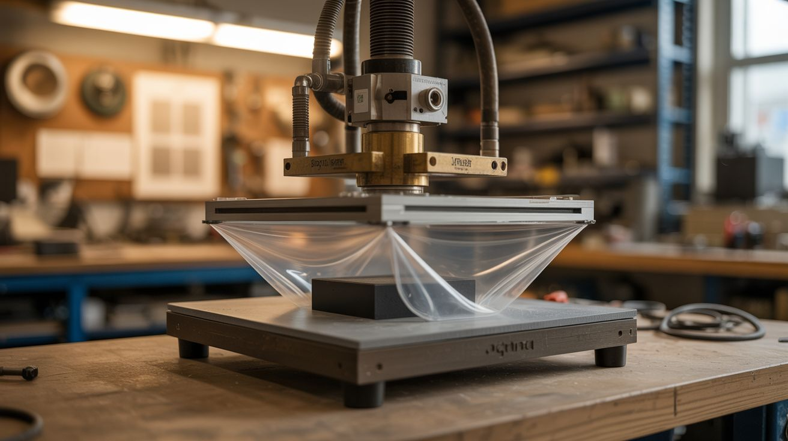

# #029 — Vacuum Former

  

> Heat plastic sheet, drape it over a mold, suck the air out. Perfect copies of anything, for almost nothing.

## Ratings

     

## 🧪 What Is It?

Vacuum forming is one of the oldest and simplest methods of shaping plastic. Heat a sheet of thermoplastic until it softens, stretch it over a mold, and pull a vacuum underneath to suck the plastic tight against every contour. When it cools, you've got a perfect shell that matches your mold exactly. It's how blister packaging, costume armor, equipment enclosures, and chocolate mold trays are made.

An oven provides the heat. A vacuum cleaner provides the suction. A plywood frame holds the plastic sheet. A pegboard platform provides even vacuum distribution. The molds can be anything — wood blocks, existing objects, clay sculptures, 3D prints. Total cost beyond the salvaged oven and vacuum cleaner is maybe $30 in plywood and screws.

<strong>🧰 Ingredients</strong>

- [ ] Oven — kitchen oven or large toaster oven that fits your frame *(curbside, thrift store)*
- [ ] Vacuum cleaner — shop vac works best, household vacuum works for small builds *(closet, thrift store)*
- [ ] Plywood — 3/4" for the vacuum box, 1/4" for the plastic-holding frame *(hardware store)*
- [ ] Pegboard — perforated hardboard for the vacuum platform *(hardware store)*
- [ ] Weatherstripping or foam tape — to seal the frame against the platform *(hardware store)*
- [ ] Thermoplastic sheets — PETG, ABS, HIPS, or styrene, 0.020"-0.060" thick *(plastics supplier, online)*
- [ ] Binder clips or toggle clamps — to hold the plastic in the frame *(office supply, hardware store)*
- [ ] Mold objects — wood blocks, existing parts, clay, whatever you want to duplicate *(workshop, imagination)*
- [ ] Drill with 1/8" bit — for the pegboard if holes need adjusting *(workshop)*
- [ ] Oven thermometer *(hardware store)*

## 🔨 Build Steps

1. **Build the vacuum box.** Construct a shallow plywood box (12"x12"x4" is a good starting size) with an open top. Drill a hole in one side for the vacuum cleaner hose. Seal all corners with wood glue and caulk — this box needs to hold vacuum.
2. **Install the pegboard platform.** Cut a piece of pegboard to fit the top of the vacuum box. Screw it in place with a bead of caulk around the edge. The holes in the pegboard distribute the vacuum evenly across the surface. If your mold is small, tape over distant holes to concentrate suction near the mold.
3. **Build the plastic-holding frame.** Build two matching rectangular frames from 1/4" plywood or hardboard — the plastic sheet sandwiches between them, held by binder clips or toggle clamps. The frame must fit inside your oven. Make it 1/2" smaller than the oven opening on all sides.
4. **Prepare the mold.** Your mold goes on top of the pegboard. It must have no undercuts (areas where the plastic would lock around and not release). Sand the mold smooth — every scratch transfers to the plastic. Apply a thin coat of mold release (cooking spray works) to help the formed plastic pop off.
5. **Clamp the plastic.** Sandwich a plastic sheet between the two frame halves and clamp it tight. The plastic should be taut like a drum — any sagging before heating means it will pool and thin unevenly.
6. **Heat the plastic.** Put the framed plastic sheet in the oven at 300-375°F (varies by material — PETG around 300°F, ABS around 350°F). Watch it through the oven window. The plastic will start to sag in the middle. When it sags about 1"-2" uniformly, it's ready. This takes 2-5 minutes depending on thickness.
7. **Form it.** Working quickly, pull the frame out of the oven, flip it plastic-side-down over the mold on the vacuum box, and turn on the vacuum. Press the frame down firmly — the weatherstripping on the box rim seals against the frame. The vacuum sucks the softened plastic tight against the mold instantly. Hold for 30 seconds.
8. **Cool and release.** Let the plastic cool for a minute (you can speed this with a fan). Turn off the vacuum. Lift the frame and pop the formed plastic off the mold. Trim the excess with scissors, a utility knife, or a bandsaw.

## ⚠️ Safety Notes

- Heated thermoplastic is hot enough to cause burns. Wear heat-resistant gloves when handling the frame coming out of the oven. The plastic itself stays hot for 30+ seconds after forming.
- Overheating plastic produces toxic fumes — especially PVC (never vacuum form PVC). Work in a ventilated area. If the plastic starts smoking or turning brown, it's too hot. Stick to PETG, ABS, HIPS, or styrene.
- The vacuum box and oven are both burn hazards. Keep the workspace clear and have a plan for where the hot frame goes at each step. Rushing leads to fumbled frames and burned fingers.

## 🔗 See Also

- [Powder Coating Oven](028-powder-coating-oven.md)
- [Electrostatic Precipitator](030-electrostatic-precipitator.md)
