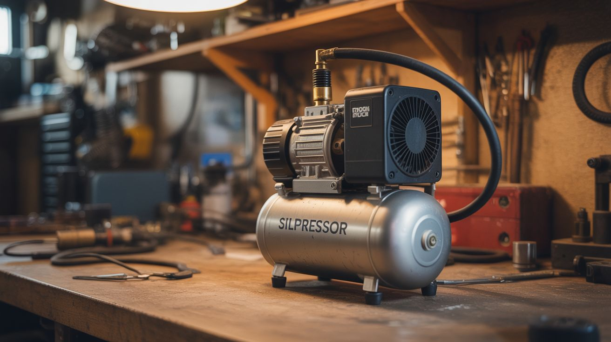

# #031 — Silent Compressor

  

> A fridge compressor is engineered to run 24/7 at barely audible levels. Pipe it to a tank and you've got the quietest air compressor in existence.

## Ratings

| Jaw Drop Rating | Brain Melt Level | Wallet Damage | Spicy Level | Clout Potential | Time to Build |
|---|---|---|---|---|---|
| ⭐⭐⭐ | ⭐⭐ | ⭐ | ⭐ | ⭐⭐ | ⭐⭐ |

## What Is It?

Every refrigerator contains a hermetically sealed compressor — a piston pump driven by an electric motor, sealed in a steel canister, running on refrigerant. When the fridge dies, that compressor is almost always still perfectly functional. It's engineered for continuous duty, quiet operation, and extreme reliability (compressors routinely run for 20+ years without maintenance).

Disconnect it from the refrigerant system and plumb it to a small air tank, and it becomes an air compressor that you can run at 2 AM in an apartment without anyone knowing. It won't fill a tank as fast as a shop compressor, and it tops out around 100-120 PSI, but for airbrushing, inflating tires, running small nail guns, blowing off parts, and feeding pneumatic tools intermittently, it's perfect. And it's essentially free.

## Ingredients

- [ ] Fridge compressor — from any dead refrigerator *(curbside, appliance recycler)*
- [ ] Small air tank — old propane tank (purged), fire extinguisher, or purchased 2-5 gallon tank *(junkyard, hardware store)*
- [ ] Pressure switch — turns the compressor on/off at set pressure range *(hardware store, ~$15)*
- [ ] Pressure gauge — 0-150 PSI *(hardware store)*
- [ ] Safety relief valve — set to 125 PSI or below *(hardware store)*
- [ ] Air line fittings — 1/4" NPT brass fittings, Teflon tape *(hardware store)*
- [ ] Copper or rubber air hose — to connect compressor to tank *(hardware store)*
- [ ] Inline oil/water separator — fridge compressors pump oil-laced air *(hardware store, auto parts)*
- [ ] Check valve — prevents tank pressure from backflowing into the compressor *(hardware store)*
- [ ] Power cord — the compressor needs a start relay and overload protector, usually still attached *(from the fridge)*

## Build Steps

1. **Recover the compressor.** Cut the refrigerant lines from the compressor (the system is likely already empty if the fridge is dead, but assume it's not — do this outdoors). Keep the start relay and overload protector attached to the compressor's electrical pins — you need them.
2. **Identify the ports.** A fridge compressor has three copper tubes: suction (intake — larger tube), discharge (output — smaller tube, gets hot when running), and process (sealed stub, used for charging refrigerant). Run the compressor briefly and feel which tube blows air — that's the discharge. The suction tube should suck air.
3. **Prepare the air tank.** If using an old propane tank, you MUST purge it completely — fill with water, drain, repeat. Cut an opening, wash the interior, and weld in threaded fittings for the pressure switch, gauge, relief valve, inlet, and outlet. Hydrostatically test the tank before use. If this sounds like too much hassle, just buy a small tank with fittings already welded in.
4. **Connect the compressor to the tank.** Run a hose from the compressor's discharge port to the tank inlet, through a check valve (arrow pointing toward the tank). The check valve prevents tank pressure from pushing back against the compressor when it's off.
5. **Install the oil/water separator.** Mount it inline between the compressor and the tank, or on the tank's output side. Fridge compressors circulate oil internally, and some gets into the air stream. The separator catches it.
6. **Install the pressure switch.** Mount the pressure switch on the tank. Wire it between the power cord and the compressor so it cuts power when the tank hits your set pressure (typically 90-100 PSI) and turns back on when it drops to the cut-in pressure (typically 60-70 PSI).
7. **Install the safety valve and gauge.** The safety relief valve is non-negotiable — it's what prevents the tank from becoming a bomb if the pressure switch fails. Set it at or below the tank's rated pressure. The gauge lets you monitor tank pressure at a glance.
8. **Add a drain valve.** Install a petcock or ball valve at the lowest point of the tank. Compressed air produces condensation. Drain the tank after every use to prevent internal rust.
9. **Test the system.** Power on and listen. The compressor should hum quietly and start building pressure. Check every fitting with soapy water — bubbles reveal leaks. Let it run up to the pressure switch cutoff. Verify the relief valve by temporarily setting the pressure switch above the relief valve's rating (then set it back).

## Safety Notes

- Compressed air tanks store significant energy. A tank failure at 100 PSI is a fragmentation event. Use only rated pressure vessels. Do not use plastic containers, PVC pipe, or containers not designed for pressure. Test and inspect the tank before first use and periodically.
- Fridge compressors use oil internally. The discharge air contains oil mist. An oil/water separator is required for any application where oil contamination matters (painting, airbrushing, food). Drain the separator regularly.
- The compressor's start relay can fail, causing the compressor to hum without starting. This overheats the motor rapidly. If the compressor hums but doesn't run within 2-3 seconds, cut power immediately and check the relay.

## See Also

- [Powder Coating Oven](028-powder-coating-oven.md)
- [Vacuum Chamber](../mad-scientist/039-vacuum-chamber.md)

**References:**
- [Appliance Teardown Guide](../../reference/appliance-teardown-guide.md)
- [Technical Glossary](../../reference/glossary.md)
