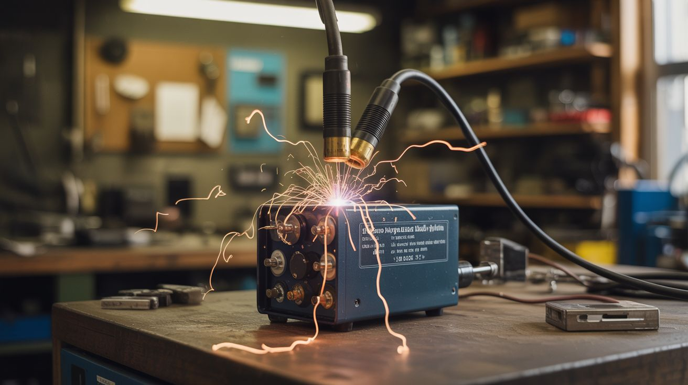

# #032 — Capacitor Discharge Welder

  

> A bank of microwave capacitors dumps stored energy in one violent pulse — enough to weld battery tabs and thin metal in milliseconds.

## Ratings

     

## 🧪 What Is It?

A capacitor discharge (CD) welder stores electrical energy in capacitors and dumps it all at once through the weld joint. Unlike the MOT spot welder that flows current continuously while the switch is held, a CD welder delivers all its energy in a single pulse lasting 1-5 milliseconds. This is ideal for welding battery tabs — the pulse is so short that heat doesn't have time to penetrate into the cell, so you get a solid weld without cooking the battery.

Microwave oven capacitors are large, high-voltage, and available for free from dead microwaves. Wire several in parallel (same voltage, increased capacitance), charge them from a controlled power supply, and discharge through heavy copper electrodes pressed against your workpiece. The energy per pulse is determined by the capacitance and the charge voltage — adjustable for different material thicknesses.

<strong>🧰 Ingredients</strong>

- [ ] Microwave oven capacitors x3-6 — typically 1-2 µF at 2100V each *(dead microwaves, e-waste)*
- [ ] Charging circuit — variac or current-limited DC supply to charge the capacitors safely *(electronics supplier, salvage)*
- [ ] Discharge switch — heavy-duty SCR (silicon controlled rectifier) or IGBT, rated for high pulse current *(electronics supplier)*
- [ ] Trigger circuit — pushbutton + gate driver for the SCR *(electronics supplier)*
- [ ] Thick copper bus bars — to connect the capacitor bank to the electrodes with minimal resistance *(electrical supplier)*
- [ ] Copper electrode tips — 1/4" copper rod *(hardware store)*
- [ ] Bleed resistor — high-wattage resistor to safely discharge capacitors when not in use *(electronics supplier)*
- [ ] Voltmeter — to monitor charge level *(multimeter or panel meter)*
- [ ] Insulated enclosure — plastic or wooden box for the capacitor bank *(hardware store)*
- [ ] Heavy-gauge wire — 8 AWG or thicker for all power connections *(electrical supplier)*

## 🔨 Build Steps

1. **Test each capacitor.** Using an insulated setup, charge each capacitor individually and verify it holds voltage. Discard any that leak, bulge, or show signs of failure. A leaking microwave capacitor is unpredictable and dangerous.
2. **Wire the capacitor bank.** Connect all capacitors in parallel — positive to positive, negative to negative. This keeps the voltage the same but multiplies the capacitance. More capacitance = more energy per pulse = stronger welds. Mount them securely in the insulated enclosure with cable ties or brackets.
3. **Install the bleed resistor.** Wire a high-value, high-wattage resistor (10K-50K ohm, 5W+) across the capacitor bank terminals. This slowly drains the charge when the unit is turned off. Without it, the capacitors can hold a lethal charge for hours or days.
4. **Build the charging circuit.** A variac (variable transformer) feeding a bridge rectifier provides adjustable DC voltage for charging. Start with a low voltage (100-200V) and work up. Include a current-limiting resistor in the charging path to prevent current surges when charging empty capacitors. A voltmeter across the bank monitors the charge level.
5. **Install the discharge switch.** An SCR or IGBT handles the high-current pulse. Wire it in series between the capacitor bank and the electrode circuit. The gate trigger fires the SCR, dumping the stored energy through the electrodes. The trigger should be a momentary pushbutton or foot switch.
6. **Build the electrode assembly.** Mount two copper rod tips in insulated handles. Wire them to the output of the discharge switch with the thickest cable you have — the entire capacitor bank discharges through this path in milliseconds, and resistance here wastes energy as heat in the cable instead of the weld.
7. **Calibrate on scrap.** Charge the bank to a low voltage (200V) and test on scrap sheet metal or nickel strip. A good weld shows a small nugget fused through both layers. Too much energy blows a hole. Too little just leaves a mark. Increase voltage in small steps until you find the sweet spot for your material thickness.
8. **Add safety features.** Install a charge indicator LED (through a high-value resistor) so you always know when the bank is charged. Add a manual bleed switch that shorts the bank through a heavy resistor for rapid discharge. Label everything. The enclosure should be impossible to open without tools.

## ⚠️ Safety Notes

- Charged capacitors are the most dangerous component in this entire book. A microwave capacitor bank at 2000V stores enough energy to kill instantly. Treat every capacitor as charged until proven otherwise. Always verify discharge with a voltmeter AND a shorting tool before touching any terminal. The bleed resistor is a last resort, not a primary safety measure.
- Never charge the bank and walk away. Charged capacitors should be attended at all times. Discharge them before leaving the bench, even for a moment.
- When welding battery cells, a capacitor discharge welder is safer for the cells than a continuous-current spot welder (less heat transfer), but a mis-fire or poorly positioned electrode can still puncture a cell. Work on one cell at a time. Keep the rest of the pack isolated.

## 🔗 See Also

- [Spot Welder](027-spot-welder.md)
- [DIY Powerwall](../power-and-energy/052-diy-powerwall.md)

**References:**
- [Appliance Teardown Guide](../../reference/appliance-teardown-guide.md)
- [Technical Glossary](../../reference/glossary.md)
