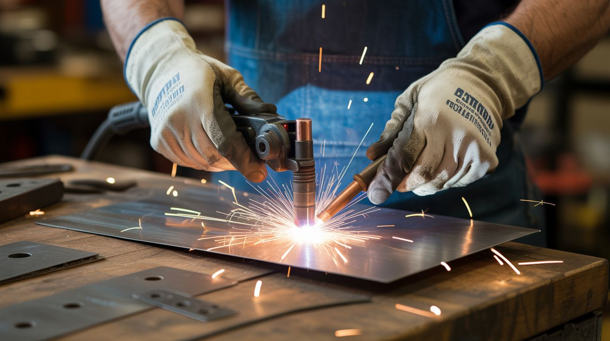

# 🔧 Functional Machines

  

  

> Turning junk into machines that actually do real work. No toy builds here — these replace tools you'd otherwise buy.

Scooter motors become lathes. Treadmill motors become belt grinders. Microwave transformers become welders. Fridge compressors become silent air compressors. Every dead appliance contains industrial-grade components that were engineered to run for decades under load. Pull them out, give them a new job, and you've got shop equipment that cost you essentially nothing.

The builds in this category are practical first. They make things, shape things, coat things, and move things. The fact that they're built from garbage is just a bonus.

---

## Builds

<a class="cat-card" href="024-electric-go-kart/">
#024Electric Go-Kart

Jaw

Brain

Wallet

Spicy

Clout

Time

</a>
<a class="cat-card" href="025-scooter-motor-lathe/">
#025Scooter Motor Lathe

Jaw

Brain

Wallet

Spicy

Clout

Time

</a>
<a class="cat-card" href="026-treadmill-belt-grinder/">
#026Treadmill Belt Grinder

Jaw

Brain

Wallet

Spicy

Clout

Time

</a>
<a class="cat-card" href="027-spot-welder/">
#027Spot Welder

Jaw

Brain

Wallet

Spicy

Clout

Time

</a>
<a class="cat-card" href="028-powder-coating-oven/">
#028Powder Coating Oven

Jaw

Brain

Wallet

Spicy

Clout

Time

</a>
<a class="cat-card" href="029-vacuum-former/">
#029Vacuum Former

Jaw

Brain

Wallet

Spicy

Clout

Time

</a>
<a class="cat-card" href="030-electrostatic-precipitator/">
#030Electrostatic Precipitator

Jaw

Brain

Wallet

Spicy

Clout

Time

</a>
<a class="cat-card" href="031-silent-compressor/">
#031Silent Compressor

Jaw

Brain

Wallet

Spicy

Clout

Time

</a>
<a class="cat-card" href="032-capacitor-discharge-welder/">
#032Capacitor Discharge Welder

Jaw

Brain

Wallet

Spicy

Clout

Time

</a>

---

### Suggested Build Order

Start with simple motor reuse, progress toward full vehicle builds:

1. **[#027 — Spot Welder](027-spot-welder/)** — Simple energy discharge. Essential shop tool.
2. **[#026 — Treadmill Belt Grinder](026-treadmill-belt-grinder/)** — Motor + belt mechanics.
3. **[#031 — Silent Compressor](031-silent-compressor/)** — Fridge salvage + sound damping.
4. **[#029 — Vacuum Former](029-vacuum-former/)** — Vacuum + heating element integration.
5. **[#032 — Capacitor Discharge Welder](032-capacitor-discharge-welder/)** — Rapid discharge circuits.
6. **[#030 — Electrostatic Precipitator](030-electrostatic-precipitator/)** — High-voltage particle control.
7. **[#025 — Scooter Motor Lathe](025-scooter-motor-lathe/)** — Tool precision + motor tuning.
8. **[#028 — Powder Coating Oven](028-powder-coating-oven/)** — Heating control and coating physics.
9. **[#024 — Electric Go-Kart](024-electric-go-kart/)** — Full vehicle integration. The showpiece.

### Related Categories

- [Scooter & Motor](../scooter-and-motor/) — Motor reuse and drive mechanics
- [Junkyard Auto](../junkyard-auto/) — Vehicle assembly and power transmission
- [Power & Energy](../power-and-energy/) — Battery systems and power distribution

---

## 📚 Reference Guides

- Tools Needed
- Sourcing Guide
- Difficulty & Ratings Guide
