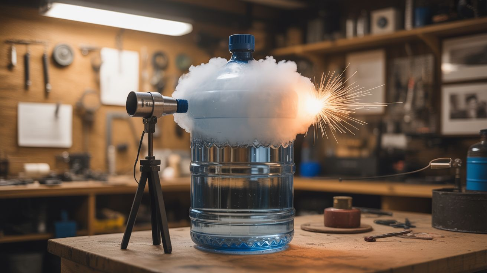

# #209 — Alcohol Vapor Cannon

  

> Isopropyl alcohol vapor inside a water cooler jug, a spark from a piezo igniter, and WHOMP — a pressure wave launches a projectile across the yard.

## Ratings

     

## 🧪 What Is It?

A combustion cannon that uses isopropyl alcohol vapor as fuel. Pour a small amount of rubbing alcohol into a large plastic jug (5-gallon water cooler bottles work perfectly), swirl it around to coat the interior with a thin film, wait for it to evaporate into vapor, and ignite it with a spark. The alcohol vapor combusts rapidly, producing a burst of hot gas that pressurizes the bottle and launches whatever is sitting in the neck opening — a tennis ball, a foam ball, a potato — with a deeply satisfying WHOMP and a visible flash.

The science is straightforward: isopropyl alcohol (C3H8O) has a flash point of 53 degrees F, meaning its vapor readily ignites at room temperature. When mixed with air inside the jug, the vapor-air mixture burns in a deflagration (fast burn, not a detonation). The combustion products (CO2 and water vapor) occupy more volume than the reactants, creating a pressure pulse. The weakest point in the system is the open neck — where your projectile sits — so all that pressure vents in one direction, launching the payload.

The bottle is reusable. Just swirl in more alcohol and fire again. One bottle of rubbing alcohol gives you dozens of shots.

<strong>🧰 Ingredients</strong>

- [ ] 5-gallon polycarbonate water cooler jug — the standard blue ones *(source: office water cooler, thrift store, ~$5)*
- [ ] 91% isopropyl alcohol — higher concentration = more vapor = better ignition *(pharmacy, ~$3)*
- [ ] Piezo igniter — from a long-neck BBQ lighter or replacement igniter *(dollar store, ~$1)*
- [ ] Tennis balls, foam balls, or small potatoes — projectiles *(around the house — free)*
- [ ] Drill and drill bit — to make a hole for the igniter *(existing tool)*
- [ ] Hot glue or silicone — to seal the igniter in place *(hardware store)*

## 🔨 Build Steps

1. **Prepare the jug.** Drill a small hole in the side of the jug, near the bottom (the closed end). The hole should be just large enough to fit the piezo igniter's spark tip. Position it low so the spark is surrounded by the densest concentration of vapor, which settles toward the bottom.
2. **Install the igniter.** Push the piezo igniter's spark electrode through the hole so the gap (where the spark jumps) is inside the jug. Seal around the igniter with hot glue or silicone to make it airtight. The igniter's button stays on the outside for easy access. Test the spark — you should see a small blue arc inside the jug in dim light.
3. **Load the fuel.** Pour about 1 tablespoon (15ml) of 91% isopropyl alcohol into the jug. Cap the jug with your hand or the original cap, then swirl and shake the jug to coat the interior walls with a thin film of alcohol. Uncap the jug and wait 15-30 seconds for the liquid to evaporate into vapor. The goal is a vapor-air mixture, not liquid pooling at the bottom.
4. **Load the projectile.** Place a tennis ball or similar soft projectile into the neck opening of the jug. It should sit loosely in the opening — snug enough to build a moment of pressure, loose enough to launch cleanly. Don't jam it in tight; the jug needs to vent, not explode.
5. **Aim and fire.** Point the jug neck at an open area — a backyard, field, or driveway. Stand to the side, not behind the jug. Press the piezo igniter button. The vapor ignites with a visible blue flash and a percussive WHOMP, launching the projectile 30-80 feet depending on the amount of alcohol vapor and how well the projectile seals the neck.
6. **Reload and repeat.** The combustion uses up the alcohol vapor. Add another tablespoon of alcohol, swirl, wait for vapor, load a new projectile, and fire again. If the jug fails to ignite, either the mixture is too lean (add a bit more alcohol and swirl) or too rich (let it air out for 30 seconds more). The stoichiometric sweet spot takes a few shots to dial in.

## ⚠️ Safety Notes

> **Spicy Level 3 build.** Read the [Safety Guide](../../docs/safety/README.md) and [Chemical Safety](../../docs/safety/chemicals.md), [Fire & Pyro Safety](../../docs/safety/fire-and-pyro.md) before starting.

- Perform this outdoors only, in a clear area with nothing breakable or flammable downrange. The projectile can travel 50+ feet with real force. Never aim at people, animals, windows, or anything you don't want to hit.
- Use polycarbonate jugs only — not glass. Glass jugs can shatter from thermal shock or pressure, creating deadly shrapnel. Polycarbonate deforms but doesn't fragment.
- The flame inside the jug can persist for a second or two. Do not immediately pour more alcohol into a jug that just fired — let it cool for 30 seconds and verify there's no residual flame. Pouring liquid alcohol into a hot jug ignites the stream.

## 🔗 See Also

- [Baking Soda Vinegar Rocket](215-baking-soda-vinegar-rocket.md) — pressure-based projectile launch without combustion
- [Hand Sanitizer Fire Art](210-hand-sanitizer-fire-art.md) — another controlled combustion build using household alcohol

**References:**

- [Chemicals Reference](../../docs/reference/chemicals.md)
