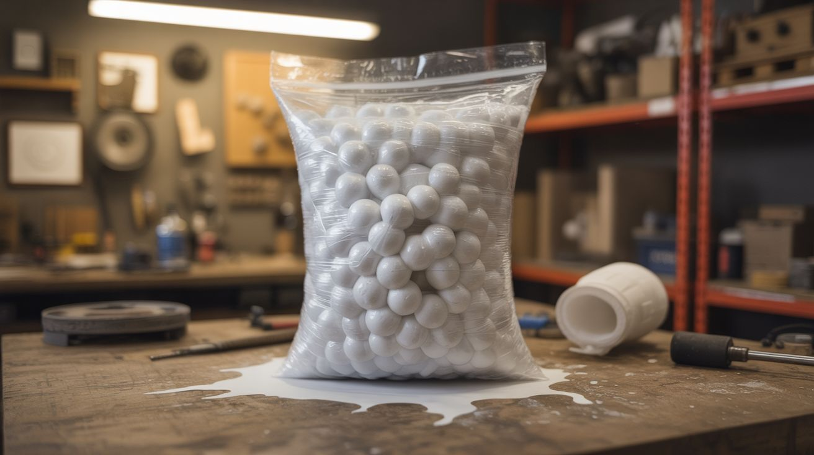

# #211 — Acetone Styrofoam Sculptor

  

> Acetone dissolves expanded polystyrene on contact, collapsing a trash bag of packing peanuts into a dense, moldable putty you can sculpt into anything.

## Ratings

     

## 🧪 What Is It?

Expanded polystyrene (EPS) — the white foam used in packing peanuts, takeout containers, and shipping blocks — is 98% air by volume. The remaining 2% is polystyrene plastic. Acetone (the active ingredient in nail polish remover) is a powerful organic solvent that dissolves polystyrene instantly. When you drop a styrofoam block into acetone, it collapses like a deflating balloon as the solvent breaks down the foam structure and releases all that trapped air. A cubic foot of styrofoam reduces to a golf-ball-sized blob of gooey plastic.

That blob is moldable. While the acetone is still present, the polystyrene is a thick, putty-like mass that can be pressed into molds, shaped by hand, or sculpted with tools. As the acetone evaporates over 24-48 hours, the polystyrene hardens into a solid, dense plastic. The result is a free sculpting material made entirely from trash — packing peanuts that would otherwise sit in a landfill for centuries.

The visual effect of styrofoam dissolving in acetone is dramatic on its own — it looks like the foam is being eaten. The sculpting applications are a bonus.

<strong>🧰 Ingredients</strong>

- [ ] Acetone — 100% pure, not nail polish remover with additives *(hardware store or beauty supply, ~$5 per quart)*
- [ ] Expanded polystyrene (EPS) — packing peanuts, shipping blocks, takeout containers *(source: free from packages, moving supplies, dumpsters)*
- [ ] Glass or metal container — for dissolving (acetone melts most plastics) *(kitchen or hardware store)*
- [ ] Molds (optional) — silicone molds, cookie cutters, or shaped containers *(craft store or kitchen)*
- [ ] Nitrile gloves *(pharmacy or hardware store)*
- [ ] Sculpting tools (optional) — toothpicks, plastic knives, wooden skewers *(around the house — free)*

## 🔨 Build Steps

1. **Set up the workspace.** Work outdoors or in a very well-ventilated area. Acetone vapor is flammable and can cause dizziness in enclosed spaces. Cover your work surface with aluminum foil — acetone dissolves or damages most painted surfaces, varnishes, and many plastics. Do not use a styrofoam, polycarbonate, or ABS container for the acetone.
2. **Pour the acetone.** Add 1-2 cups of acetone to a glass or metal bowl. You need less than you think — the acetone is recycled as each batch of foam dissolves.
3. **Add the styrofoam.** Break packing peanuts or foam blocks into smaller pieces and push them into the acetone. They dissolve almost instantly on contact, collapsing with a satisfying hiss as trapped air escapes. Keep adding foam — a surprising volume dissolves into a small amount of acetone. A full trash bag of packing peanuts can reduce to a fist-sized mass.
4. **Reach the right consistency.** Keep adding foam until the mixture becomes a thick, putty-like paste. If it's too runny, add more foam. If it's too stiff to work, add a few drops of acetone. The ideal consistency is like modeling clay — firm enough to hold a shape but soft enough to sculpt.
5. **Sculpt or mold.** Press the putty into silicone molds for precise shapes, or sculpt freeform with your hands (wear nitrile gloves — acetone dries skin and the dissolved plastic is sticky). For detailed work, use wooden sculpting tools or toothpicks. Work quickly — the surface starts to skin over as acetone evaporates.
6. **Dry and cure.** Place the molded or sculpted pieces in a ventilated area to dry. Drying time depends on thickness: thin pieces (under 1/4 inch) cure in 12-24 hours, thicker pieces take 48-72 hours. The acetone must fully evaporate for the piece to reach maximum hardness. The finished product is dense, hard polystyrene — lighter than solid plastic but much denser than the original foam.
7. **Finish (optional).** Once fully cured, the hardened polystyrene can be sanded, drilled, painted, or coated with epoxy for a smooth, glossy finish. It accepts spray paint and acrylic paint well.

## ⚠️ Safety Notes

- Acetone is highly flammable — vapor can ignite from sparks, pilot lights, or static discharge. No open flames anywhere near the workspace. Do not smoke. Keep the acetone container capped when not actively dissolving foam.
- Work in a ventilated area. Acetone vapor causes headaches, dizziness, and nausea with prolonged exposure. Outdoors is best. If indoors, use a fan blowing vapors away from you and open multiple windows.
- Wear nitrile gloves (not latex — acetone degrades latex). Acetone strips oils from skin, causing dryness and cracking. If it contacts skin, wash with soap and water and apply moisturizer.

## 🔗 See Also

- [Density Tower](280-density-tower.md) — another build that exploits liquid-material interactions for visual effect
- [Electroforming Art](../chemical-electronic/160-electroforming-art.md) — coat your polystyrene sculptures in real copper

**References:**
- [Chemicals Reference](../../reference/chemicals.md)
