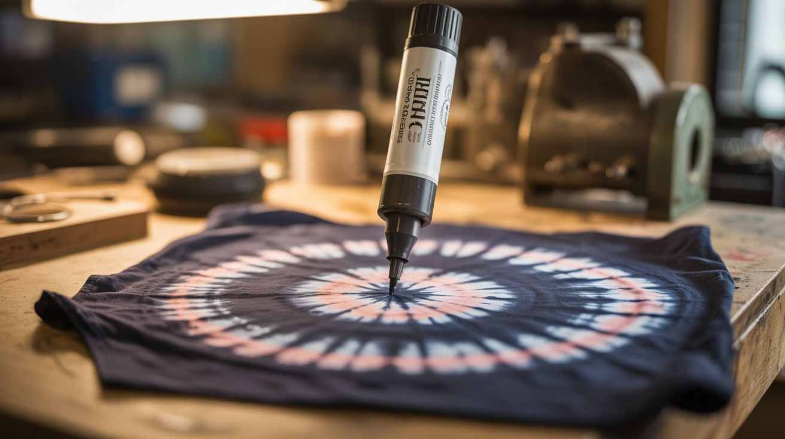

# #214 — Bleach Pen Tie-Dye

  

> A bleach pen removes dye from dark fabric in precise, controlled patterns — reverse tie-dye that looks professional with zero artistic skill required.

## Ratings

| Jaw Drop Rating | Brain Melt Level | Wallet Damage | Spicy Level | Clout Potential | Time to Build |
|---|---|---|---|---|---|
| ⭐⭐⭐ | ⭐ | ⭐ | ⭐ | ⭐⭐⭐⭐ | ⭐ |

## What Is It?

Traditional tie-dye adds color to white fabric. Bleach tie-dye does the opposite — it removes color from dark fabric. A bleach pen (or a squeeze bottle of diluted bleach) is applied in patterns to a dark-colored cotton shirt, hoodie, or tote bag. The sodium hypochlorite in the bleach oxidizes the dye molecules, breaking them down and stripping the color from the fabric. The result depends on the original fabric color: black cotton turns orange or rust, navy turns pale blue or white, dark green turns yellow-green. Each dye reacts differently, creating unique and unpredictable color effects.

The beauty of bleach tie-dye is the control. Unlike traditional tie-dye where colors bleed unpredictably, bleach pen lines stay sharp. You can draw fine details, write text, create stenciled patterns, or do the classic rubber-band crumple for organic shapes. The contrast between the bleached pattern and the remaining dark fabric is dramatic. And unlike regular tie-dye, there's no mess of multiple dye bottles — one pen, one shirt, done.

## Ingredients

- [ ] Bleach pen (gel type) — Clorox Bleach Pen or similar thick bleach gel *(grocery store, ~$3)*
- [ ] Dark-colored cotton garment — 100% cotton works best, polyester-blend fabrics resist bleach *(thrift store or closet, ~$2-$5)*
- [ ] Rubber bands (optional) — for classic crumple/spiral patterns *(office supply)*
- [ ] Stencils (optional) — cardboard cutouts for shapes *(free — make your own)*
- [ ] Spray bottle with diluted bleach (optional) — 50/50 bleach and water for splatter effects *(dollar store)*
- [ ] Bucket of cold water — to stop the bleach reaction *(free)*
- [ ] Hydrogen peroxide — to neutralize remaining bleach *(pharmacy, ~$2)*

## Build Steps

1. **Choose the fabric.** 100% cotton works dramatically. Cotton-poly blends work but bleach more slowly and less completely. Avoid synthetic fabrics (polyester, nylon) — bleach won't remove their dye. Dark colors produce the most dramatic contrast: black, navy, dark green, dark red, burgundy. Test a hidden area first (inside seam) to see how the dye reacts.
2. **Set up the workspace.** Work outdoors or on a protected surface — bleach destroys any fabric it drips on. Lay the garment flat on a plastic garbage bag or old towel you don't care about. Wear old clothes and rubber gloves.
3. **Apply the pattern.** For freehand designs: draw directly on the fabric with the bleach pen. For text, draw block letters. For spirals, twist the shirt from the center, rubber-band it, and apply bleach to one side. For stencils, lay a cardboard cutout on the fabric and apply bleach around or inside it. For splatter art, mist from a spray bottle held 12-18 inches above the fabric.
4. **Watch the color change.** The bleach begins working within 1-5 minutes. You'll see the dark fabric lighten progressively. The final color depends on the original dye — black usually bleaches to orange/rust first, then to white if left long enough. Navy goes to pale blue. Stop the process when you like the color by moving to the rinse step.
5. **Rinse and neutralize.** Submerge the garment in a bucket of cold water to stop the bleach reaction. Agitate gently to remove excess bleach. For thorough neutralization, soak in a solution of 1 cup hydrogen peroxide per gallon of water for 10 minutes. This breaks down any remaining sodium hypochlorite and prevents continued lightening in the wash.
6. **Wash and dry.** Machine wash the garment alone in cold water on a gentle cycle. Dry as normal. The bleached pattern is permanent — it looks just as sharp after washing. The first wash may release residual dye, so don't wash with other clothes.

## Safety Notes

- Bleach irritates skin, eyes, and lungs. Wear rubber gloves and avoid breathing the fumes. Work in a ventilated area — outdoors is best. If bleach contacts skin, rinse immediately with water.
- Never mix bleach with ammonia, vinegar, or rubbing alcohol — these combinations produce toxic gases (chloramine gas, chlorine gas, or chloroform respectively). Keep bleach away from all other chemicals.
- Bleach weakens cotton fibers over time. Heavy application to thin fabric can create holes. Avoid leaving bleach on for more than 15-20 minutes, and always neutralize with a rinse.

## See Also

- [Hand Sanitizer Fire Art](210-hand-sanitizer-fire-art.md) — another build using a common household chemical for artistic effect
- [Invisible Ink Message Board](216-invisible-ink-message-board.md) — pH chemistry used for revealing hidden patterns

**References:**
- [Chemicals Reference](../../reference/chemicals.md)
