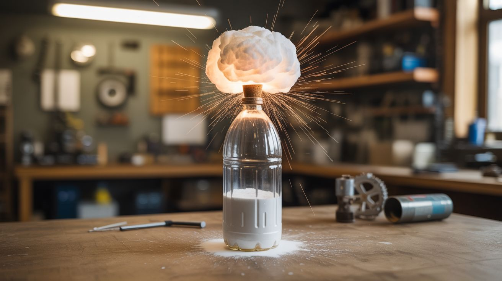

# #215 — Baking Soda Vinegar Rocket

  

> Baking soda meets vinegar inside a sealed 2-liter bottle, CO2 pressure builds behind a cork, and when it blows — the bottle launches 50+ feet into the air.

## Ratings

     

## 🧪 What Is It?

The classic baking soda and vinegar volcano, scaled up and weaponized. When sodium bicarbonate (baking soda) reacts with acetic acid (vinegar), the acid-base reaction produces carbon dioxide gas, water, and sodium acetate. In an open container, the CO2 just fizzes out. In a sealed container, it pressurizes. Put a cork in a 2-liter bottle with vinegar on the bottom and baking soda dropped in from above, and the CO2 pressure builds until it ejects the cork with a satisfying POP — or, if you flip the bottle upside down (cork on the ground), the entire bottle launches straight up like a rocket.

The key to maximum height is maximizing the rate of CO2 production. More baking soda + more vinegar = faster pressure rise = higher launch velocity before the cork blows. Warm vinegar reacts faster than cold. Fine baking soda powder reacts faster than clumps. A tight-fitting cork holds pressure longer, building more force before release. With optimized ratios and a snug cork, launches of 50-80 feet are common. Adding a cardboard nose cone and paper fins gives the rocket stability in flight.

This is the build that every kid remembers. Scaling it up with a 2-liter bottle makes it genuinely impressive.

<strong>🧰 Ingredients</strong>

- [ ] 2-liter plastic soda bottle — empty and clean *(recycling bin — free)*
- [ ] Baking soda — 3-4 tablespoons per launch *(grocery store, ~$1)*
- [ ] White vinegar — 1-2 cups per launch *(grocery store, ~$2)*
- [ ] Cork or rubber stopper — must fit snugly in the bottle mouth *(craft store, wine supply, ~$1)*
- [ ] Paper towel — to wrap the baking soda for delayed release *(kitchen — free)*
- [ ] Cardboard — for nose cone and fins (optional, for flight stability) *(recycling bin — free)*
- [ ] Tape — masking or duct *(hardware store)*
- [ ] Launch pad — a flat board with a ring or pipe fitting to hold the bottle upside down *(hardware store scrap)*

## 🔨 Build Steps

1. **Build the launch pad.** Nail or screw a PVC pipe coupling (sized to loosely hold a 2-liter bottle neck) to a flat piece of plywood. The bottle sits inverted in this ring with the cork pointing down. The pad keeps the rocket vertical during the pressure buildup phase and provides a stable base for launch. Alternatively, just hold the bottle upside down by hand and run (less dignified, more exciting).
2. **Add fins and nose cone (optional).** Cut three or four triangular fins from cardboard and tape them symmetrically around the bottom of the bottle (which becomes the top during flight, since the bottle launches upside down). Add a cardboard cone taped over the bottle's base (the top of the rocket in flight). Fins and a nose cone don't add thrust, but they dramatically improve flight stability — without them, the bottle tumbles wildly.
3. **Prepare the baking soda packet.** Wrap 3-4 tablespoons of baking soda in a small square of paper towel, twisting the ends to create a packet. The paper towel delays the reaction — it takes a few seconds for the vinegar to soak through, giving you time to seal and flip the bottle. This is the critical timing mechanism.
4. **Load the vinegar.** Pour 1-2 cups of white vinegar into the 2-liter bottle. Warm vinegar (not hot — just warm from the tap) reacts faster and produces more energetic launches. Fill about one-third of the bottle.
5. **Insert the baking soda packet.** Drop the paper-towel-wrapped baking soda packet into the bottle. It should sit on top of the vinegar without immediately contacting it much.
6. **Cork it and flip.** Immediately push the cork firmly into the bottle opening. It should be snug but not hammered in — you want it to blow out under pressure, not turn the bottle into a pressure bomb. Flip the bottle upside down and place it in the launch pad, cork down. Step back at least 10 feet.
7. **Wait for launch.** The vinegar soaks through the paper towel, contacts the baking soda, and CO2 production begins. Pressure builds inside the sealed bottle. After 5-20 seconds (depending on paper towel thickness and vinegar temperature), the cork ejects with a POP and the bottle launches upward on a jet of foamy vinegar and CO2.
8. **Iterate and optimize.** Experiment with ratios: more baking soda increases total gas but slows the reaction (alkaline environment). More vinegar ensures complete reaction. The sweet spot is roughly 4 tablespoons baking soda to 1.5 cups vinegar in a 2-liter bottle. Try different cork tightness — tighter corks build more pressure but risk splitting the bottle.

## ⚠️ Safety Notes

- Never use glass bottles. The pressure can cause catastrophic failure, and glass shrapnel is lethal. Plastic 2-liter bottles are designed to hold carbonation pressure and deform rather than fragment.
- Stand well back after corking and flipping — the launch is unpredictable in timing. Never look directly into the bottle opening while pressurizing. A cork ejected at high velocity can cause eye injury.
- This launch produces a vinegar spray zone around the launch pad. Don't launch near cars, pets, or anything you don't want smelling like vinegar. Launch in an open field or driveway with clear sky above.

## 🔗 See Also

- [Alcohol Vapor Cannon](209-alcohol-vapor-cannon.md) — another household-chemical projectile launcher (combustion instead of acid-base)
- [Hydrogen Generator](../chemical-electronic/159-hydrogen-generator.md) — electrolysis-based gas production for more controlled experiments

**References:**
- [Chemicals Reference](../../reference/chemicals.md)
