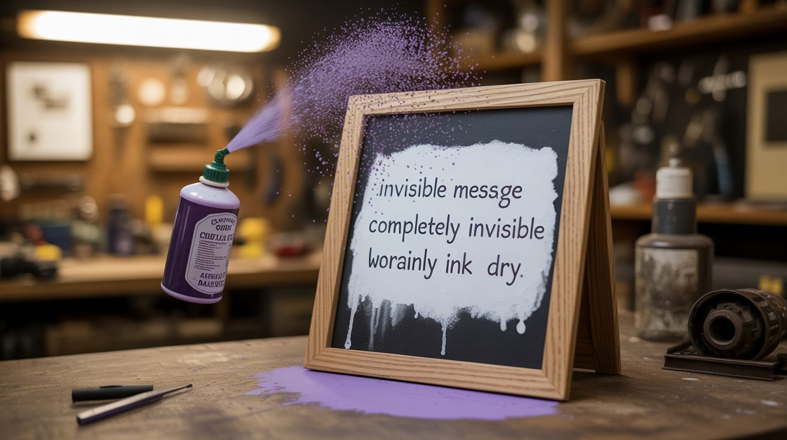

# #216 — Invisible Ink Message Board

  

> Write messages with baking soda solution — completely invisible when dry. Reveal them by spraying with grape juice, which turns dark purple where the alkaline ink sits.

## Ratings

     

## 🧪 What Is It?

Baking soda dissolved in water makes an alkaline solution (pH ~8.5) that dries clear and invisible on white paper. Grape juice contains anthocyanins — natural pH-sensitive pigments that change color depending on whether they contact an acid or a base. On neutral paper, grape juice dries as its natural purple-red. On alkaline baking soda residue, it turns dark blue-green. The contrast reveals the hidden message instantly.

This is pH indicator chemistry at its simplest. Anthocyanins are found in red cabbage, blueberries, blackberries, and grape juice. Each works as a pH indicator, but grape juice is the most convenient — it's already liquid, widely available, and the color change is dramatic. The baking soda ink can be applied with a paintbrush, cotton swab, or dip pen. Write on white paper, let it dry (it becomes completely invisible), and hand it to someone with a spray bottle of grape juice. One spritz and the message appears in dark purple-blue against a lighter background.

It's simple, it's cheap, and the reveal moment never fails to impress.

<strong>🧰 Ingredients</strong>

- [ ] Baking soda — 1 tablespoon *(grocery store, ~$1)*
- [ ] Water — 2 tablespoons, to dissolve the baking soda *(free)*
- [ ] 100% grape juice — Welch's or similar, not grape drink *(grocery store, ~$3)*
- [ ] White paper or card stock *(office supply — free from around the house)*
- [ ] Small paintbrush, cotton swab, or toothpick — for writing *(around the house — free)*
- [ ] Spray bottle — for even grape juice application *(dollar store, ~$1)*
- [ ] Small mixing cup *(kitchen — free)*

## 🔨 Build Steps

1. **Mix the invisible ink.** Dissolve 1 tablespoon of baking soda in 2 tablespoons of warm water. Stir until fully dissolved. The solution should be perfectly clear. If any undissolved grains remain, they'll leave visible residue on the paper — filter through a coffee filter or paper towel if needed.
2. **Write the message.** Dip a paintbrush, cotton swab, or toothpick into the baking soda solution and write on white paper. Use smooth, heavy paper or card stock — thin paper wrinkles when wet and may show the writing through texture. Write with enough solution to wet the paper but not so much that it pools and bleeds. Block letters work best; cursive tends to blur.
3. **Let it dry completely.** Set the paper aside in a dry spot for 15-30 minutes. As the water evaporates, the baking soda crystals remain in the paper fibers but become invisible against the white paper. Hold the paper up to light and confirm the message is undetectable. If you can see faint marks, the paper was too thin or too much solution was applied.
4. **Prepare the revealer.** Pour grape juice into a spray bottle. Straight grape juice works — no dilution needed. Shake gently. If you don't have a spray bottle, you can brush the grape juice on with a sponge or wide paintbrush, but spraying gives the most dramatic, instant reveal.
5. **Reveal the message.** Spray the grape juice evenly across the entire paper surface. The juice wets the paper uniformly — where there's no baking soda, the juice stays its normal purple-red. Where the baking soda residue sits, the juice instantly turns dark blue-green. The message appears in contrasting color within seconds.
6. **Upgrade to a message board.** For a reusable version, use a whiteboard or glass pane. Write with baking soda solution on the smooth surface, let it dry, and spray with grape juice to reveal. Wipe clean and start over. A glass-frame message board makes this a party trick or interactive display.

## ⚠️ Safety Notes

- All ingredients are food-safe and non-toxic. This is one of the safest builds in the repo. The only hazard is grape juice staining clothes, carpet, and furniture — it's extremely difficult to remove from fabric. Work on a protected surface and wear old clothes.
- If young children are involved, supervise the spray bottle use — grape juice in eyes stings (it's mildly acidic). Rinse with water if it happens.

## 🔗 See Also

- [Density Tower](280-density-tower.md) — another kitchen-science demonstration using grocery store ingredients
- [Bleach Pen Tie-Dye](214-bleach-pen-tie-dye.md) — another build using chemical reactions to create visible patterns

**References:**

- [Chemicals Reference](../../docs/reference/chemicals.md)
