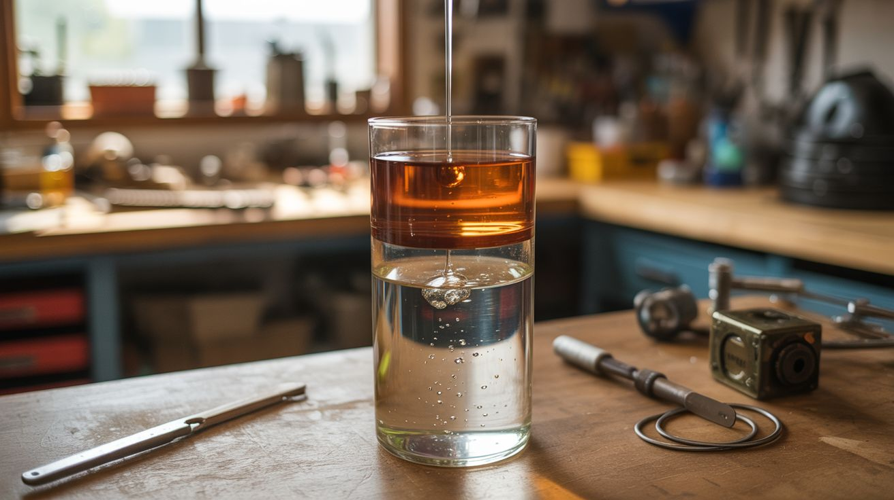

# #280 — Density Tower

  

> Layer liquids by density — honey, corn syrup, dish soap, water, oil, rubbing alcohol — then drop objects in and watch them float at different levels. A kitchen rainbow in a glass.

## Ratings

     

## 🧪 What Is It?

A density tower is a column of immiscible liquids stacked by density in a tall, clear container. Each liquid has a different density (mass per volume), so heavier liquids sink to the bottom and lighter ones float on top. Because many of these liquids don't mix with each other, the layers remain distinct and visible — creating a rainbow column of colored bands.

The classic tower uses 7-9 layers: honey (1.42 g/cm3), corn syrup (1.33), maple syrup (1.32), whole milk (1.03), dish soap (1.06), water (1.00), vegetable oil (0.92), rubbing alcohol (0.79), and lamp oil (0.80). Add food coloring to the water and alcohol layers for visual contrast. The real fun starts when you drop small objects into the tower — a grape sinks through the alcohol and oil but floats on the syrup. A cherry tomato floats on the water. A bolt sinks to the very bottom. Each object finds its own density level and hovers there.

It's a beautiful physics demonstration that takes 20 minutes to build with ingredients entirely from the kitchen and bathroom.

<strong>🧰 Ingredients</strong>

- [ ] Honey — darkest/densest layer *(grocery store)*
- [ ] Corn syrup or maple syrup — light or dark *(grocery store)*
- [ ] Dish soap — blue or green for color contrast *(grocery store)*
- [ ] Whole milk *(grocery store)*
- [ ] Water — add food coloring for visibility *(tap water + food coloring)*
- [ ] Vegetable oil or olive oil *(grocery store)*
- [ ] Rubbing alcohol (91% isopropyl) — add food coloring *(pharmacy)*
- [ ] Food coloring — multiple colors *(grocery store)*
- [ ] Tall clear glass, jar, or vase *(kitchen or dollar store)*
- [ ] Small dense objects — grape, cherry tomato, bolt, coin, cork, ping pong ball, die, bead *(around the house — free)*

## 🔨 Build Steps

1. **Choose the container.** A tall, narrow, clear container shows the layers best. A 1-liter graduated cylinder is ideal if you have one. A tall glass vase, a clear water bottle with the top cut off, or a mason jar all work. The taller the container, the more distinct the layers appear.
2. **Pour the heaviest liquid first.** Start with honey. Pour it slowly down the center of the container. It should form a thick pool at the bottom. Pour about 1/2 inch to 1 inch of depth.
3. **Add each layer in decreasing density order.** After honey: corn syrup, then dish soap, then milk, then water (colored with food coloring), then vegetable oil, then rubbing alcohol (colored with a different food coloring). Pour each new liquid slowly against the side of the container or down a spoon held against the glass. Pouring too fast punches through the layer below and mixes them.
4. **Wait between layers.** Let each layer settle for 30-60 seconds before adding the next. Some adjacent layers (like milk and dish soap) have close densities and need time to separate. If two layers mix slightly, wait — they'll often separate on their own.
5. **Color the clear layers.** Water and rubbing alcohol are both clear, which makes the tower less dramatic. Add different food coloring to each before pouring. Blue water and red alcohol (or vice versa) creates strong visual contrast. Don't color the oil — food coloring is water-based and won't mix with oil anyway.
6. **Drop objects.** The payoff: drop small objects into the tower one at a time. A grape (density ~1.1) sinks through the alcohol, oil, and water but floats on the syrup. A cherry tomato (density ~0.95) floats on the water. A small bolt (density ~7.8) sinks all the way to the bottom through every layer. A cork (density ~0.2) stays on top of the alcohol. Each object finding its level demonstrates density in a viscerally satisfying way.
7. **Photograph from the side.** Backlight the tower with a white light source (phone flashlight, desk lamp) for maximum visual impact. Each layer glows with its own color and transparency. The suspended objects add visual interest at multiple heights.

## ⚠️ Safety Notes

- Rubbing alcohol is flammable. Keep it away from open flames and heat sources. Cap the bottle when not pouring.
- This build uses food-safe ingredients, but the combination is not edible. Don't drink the tower or let young children taste it. The dish soap and rubbing alcohol are the main concerns.
- Cleanup is easy — pour the tower into the trash (not the sink — the oil and honey can clog drains). Wipe the container with paper towels before washing.

## 🔗 See Also

- [Acetone Styrofoam Sculptor](211-acetone-styrofoam-sculptor.md) — another build demonstrating how different materials interact chemically
- [Invisible Ink Message Board](216-invisible-ink-message-board.md) — another kitchen-science visual demonstration

**References:**
- [Chemicals Reference](../../docs/reference/chemicals.md)
