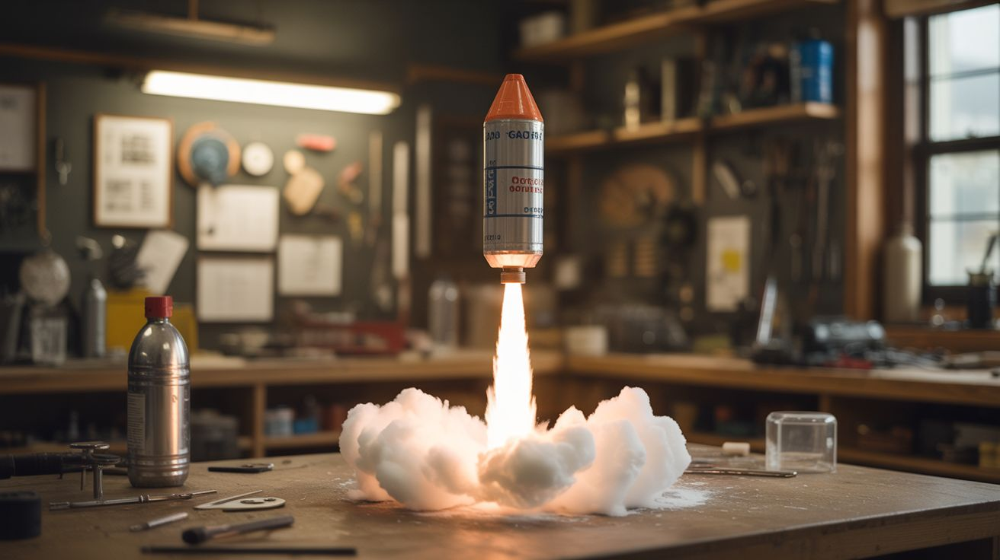

# #281 — Vinegar Baking Soda Rocket

  

> Film canister, vinegar, baking soda, CO2 pressure, liftoff. The gateway drug of backyard science. Scale it up with 2-liter bottles and things get genuinely impressive.

## Ratings

| Jaw Drop Rating | Brain Melt Level | Wallet Damage | Spicy Level | Clout Potential | Time to Build |
|---|---|---|---|---|---|
| ⭐⭐⭐ | ⭐ | ⭐ | ⭐ | ⭐⭐⭐ | ⭐ |

## What Is It?

Every kid who’s ever mixed vinegar and baking soda in a volcano model has felt the primal thrill of a chemical reaction doing physical work. Acetic acid meets sodium bicarbonate, hydrogen ions swap partners, and CO2 gas rushes out of solution. In an open container, it just fizzes and overflows — boring. But seal that reaction inside a container with a weak point, and pressure builds until the seal fails catastrophically. That’s a rocket. Newton’s third law in a fizzy, sour-smelling package.

The classic version uses a 35mm film canister (remember those?) with a snap-on lid. Drop in some baking soda, add vinegar, snap the lid on, flip it upside down, and run. Pressure builds for 5-10 seconds until the lid pops off and the canister launches 15-20 feet in the air. It’s harmless, hilarious, and never gets old. But we’re not here for 15 feet. We’re here for altitude.

Scale up to a 2-liter soda bottle and you enter a different league entirely. A cork or rubber stopper seals the neck, and the pressure builds much higher before the seal fails. A 2-liter bottle can handle around 100 PSI before the cork blows. At that pressure, launches of 50-100 feet are routine. Add a PVC launch tube for guidance, some cardboard fins for stability, and a nose cone for aerodynamics, and you’ve got a legit rocket that rivals the commercial water rockets sold for $30. The whole thing costs about $3 in consumables per launch.

## Ingredients

- [ ] Film canisters — Fuji-style with internal snap lid (not the external lid type) *(camera store, eBay, or ask a photo lab, ~$1)*
- [ ] 2-liter soda bottles — for the scaled-up version *(recycling bin, free)*
- [ ] White vinegar — standard 5% acidity *(grocery store, ~$2)*
- [ ] Baking soda — sodium bicarbonate *(grocery store, ~$1)*
- [ ] Cork or rubber stopper — sized to fit the 2-liter bottle neck *(craft store or hardware, ~$2)*
- [ ] PVC pipe — 1.5" diameter, 3-foot length, for launch tube *(hardware store, ~$3)*
- [ ] Cardboard — for fins and nose cone *(cereal box, free)*
- [ ] Duct tape — for attaching fins *(existing supply)*
- [ ] Tissue paper — for wrapping baking soda into a time-delay packet *(existing supply)*
- [ ] Safety glasses — for launches *(dollar store, ~$1)*

## Build Steps

1. **Start with film canisters (beginner version).** Drop 1 teaspoon of baking soda into a film canister. Quickly add 2 teaspoons of vinegar, snap the lid on tight, flip the canister upside down (lid on the ground), and back up 10 feet. The lid pops off within 5-10 seconds and the canister flies 15-20 feet up. Experiment with ratios — more vinegar isn’t always better, since you need gas volume AND pressure.

2. **Build the 2-liter rocket body.** Take a clean, undamaged 2-liter bottle. Cut 3-4 triangular fins from cardboard (3 inches tall, 4 inches at the base). Attach them symmetrically around the bottom of the bottle (the neck is the bottom during flight) using duct tape. Space them evenly for stable flight. Add a nose cone to the bottle’s base — a cone of rolled cardboard taped securely.

3. **Build the launch tube.** Cut a 3-foot length of 1.5" PVC pipe. Mount it vertically in a base made from a cross of PVC fittings, or just duct-tape it to a stake driven into the ground. The bottle slides over this tube neck-first — the tube guides the rocket during the initial phase of flight before it clears the rail.

4. **Prepare the fuel.** Wrap 3 tablespoons of baking soda in a tissue paper packet — twist the ends like a candy wrapper. This creates a time delay: the tissue paper takes a few seconds to dissolve in the vinegar, giving you time to insert the cork and flip the bottle onto the launch tube. Pour 1 cup of vinegar into the bottle.

5. **Load and launch.** Drop the tissue-wrapped baking soda packet into the bottle without letting it hit the vinegar yet (hold the bottle at an angle). Quickly push the cork firmly into the bottle neck. Flip the bottle upside down and slide it onto the launch tube. The vinegar soaks through the tissue, hits the baking soda, and pressure builds rapidly. Stand back at least 20 feet. When the cork blows, the bottle launches.

6. **Add a parachute (optional).** Cut a 12-inch square of thin plastic (trash bag material). Tie 4 equal-length strings from the corners to the nose cone. Stuff the chute and strings loosely into the nose cone area. When the rocket reaches apogee and tips over, the chute deploys from gravity and drag. This saves your rocket from crash-landing destruction.

7. **Optimize for altitude.** Experiment with vinegar-to-baking-soda ratios, cork tightness (tighter = more pressure before release = higher launch), bottle size, and fin design. Keep a log of each launch configuration and estimated altitude. The current record for a vinegar-and-baking-soda bottle rocket is surprisingly high — well over 100 feet with optimized ratios.

## Safety Notes

- Always wear safety glasses during launches. A cork or bottle bottom blown out under pressure can cause eye injuries.
- Never stand over a pressurized bottle. Once the cork is in and the baking soda packet is dissolving, back away immediately. Misfires happen — sometimes the cork is too tight and the bottle bursts instead of launching.
- Inspect bottles for cracks, dents, or scratches before each use. Damaged bottles fail at lower pressures and can shatter instead of launching cleanly.
- Launch in open areas away from people, cars, windows, and overhead power lines. A 2-liter rocket at 100 feet altitude comes down fast and hard.
- This is messy. Vinegar spray goes everywhere when the rocket launches. Don’t do this near anything that shouldn’t get wet and smell like salad dressing.

## See Also

- [Alcohol Vapor Cannon](209-alcohol-vapor-cannon.md)
- [Elephant Toothpaste](282-hydrogen-peroxide-elephant-toothpaste.md)

**References:**
- [Chemicals Reference](../../reference/chemicals.md)
