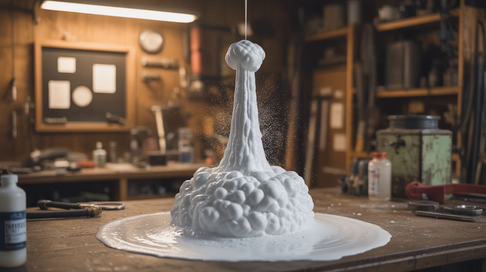

# #282 — Elephant Toothpaste

  

> Concentrated hydrogen peroxide meets potassium iodide catalyst and erupts into a massive tower of steaming foam. The most photogenic chemistry demo on the planet.

## Ratings

     

## 🧪 What Is It?

Elephant toothpaste is the undisputed champion of visual chemistry demonstrations. The reaction is simple: hydrogen peroxide (H2O2) naturally decomposes into water and oxygen gas, but at room temperature this happens so slowly you’d never notice. Add a catalyst — potassium iodide (KI) — and the decomposition happens all at once, violently fast. The oxygen gas gets trapped in dish soap mixed into the solution, creating a massive eruption of warm, foamy goodness that looks exactly like a giant tube of toothpaste being squeezed by an invisible elephant.

The store-bought 3% hydrogen peroxide from the pharmacy produces a decent demo, but the real spectacle requires salon-grade 12% or industrial 30% H2O2. The higher the concentration, the more oxygen gets released, and the more dramatic the eruption. With 30% peroxide, the foam column can shoot 6-8 feet out of a narrow-necked bottle. The reaction is exothermic — the foam comes out warm, and with high-concentration peroxide, it steams. Add food coloring for vivid stripes. Use multiple bottles with different colors for a rainbow eruption. The whole thing happens in about 2 seconds and produces enough foam to fill a bathtub.

The chemistry is beautifully elegant. The iodide ion (I-) from the potassium iodide acts as a true catalyst — it participates in the reaction but gets regenerated at the end. It strips one oxygen atom from H2O2, temporarily forming hypoiodite (IO-), which then reacts with another H2O2 molecule to release O2 gas and regenerate the I-. The catalyst isn’t consumed, the oxygen comes from the peroxide, and the dish soap captures it all in glorious, pillowy foam. This is catalysis 101, and it’s spectacular.

<strong>🧰 Ingredients</strong>

- [ ] Hydrogen peroxide — 12% salon grade minimum, 30% for maximum effect *(beauty supply store or online, ~$8-15)*
- [ ] Potassium iodide — powder or saturated solution *(online chemical supplier, ~$8 for 100g)*
- [ ] Dish soap — concentrated liquid, Dawn works well *(kitchen, ~$2)*
- [ ] Food coloring — gel food coloring gives the most vivid results *(grocery store, ~$3)*
- [ ] Narrow-neck bottle — 500mL or 1-liter flask, soda bottle, or graduated cylinder *(lab supply or recycling, ~$5)*
- [ ] Large tray or bin — to catch the foam overflow *(dollar store, ~$2)*
- [ ] Warm water — for dissolving KI *(free)*
- [ ] Safety goggles and gloves — mandatory with concentrated peroxide *(~$5)*
- [ ] Measuring cups and spoons *(existing kitchen supplies)*

## 🔨 Build Steps

1. **Prepare the catalyst solution.** Dissolve 2 tablespoons of potassium iodide in 3 tablespoons of warm water. Stir until fully dissolved. This saturated KI solution is your trigger — set it aside in a small cup. You can also use a packet of dry active yeast dissolved in warm water as a weaker but more accessible catalyst.

2. **Set up the containment area.** Place your narrow-neck bottle in the center of a large tray, bin, or kiddie pool. The foam eruption will overflow the bottle and spread 2-3 feet in every direction. Do this outdoors on grass, or indoors on a surface you can hose down. The foam is just soapy water and oxygen — it’s not hazardous, just messy.

3. **Load the bottle.** Pour 1/2 cup (120mL) of concentrated hydrogen peroxide into the bottle. Add a generous squirt of dish soap (about 1 tablespoon) directly into the peroxide. Swirl gently to mix. Do not shake — you don’t want premature foaming.

4. **Add color.** Squeeze lines of food coloring down the inside walls of the bottle — don’t stir it in. The coloring will create stripes in the foam as it erupts up and over the sides. Use multiple colors for a rainbow effect. Gel food coloring is better than liquid because it’s more concentrated and creates bolder stripes.

5. **Trigger the eruption.** This is the moment. Pour the entire KI solution into the bottle in one quick motion. Step back immediately. The reaction starts within 1-2 seconds — the foam rockets out of the bottle neck like a volcano, steaming and expanding as it goes. The narrow bottle neck concentrates the eruption into a dramatic column. The whole thing is over in about 5 seconds.

6. **Scale up for maximum effect.** For a truly legendary demo, use multiple bottles arranged in a row, each with different colors. Have helpers pour the KI into each bottle simultaneously for a synchronized eruption. Or use a single large container (like a 5-gallon bucket) with a full liter of 30% peroxide for a foam mountain instead of a foam column.

7. **Clean up.** The foam is just oxygen, water, dish soap, and a trace of potassium iodide. It’s safe to wash down a drain or hose off grass. The foam dissipates on its own within 30 minutes as the bubbles pop.

## ⚠️ Safety Notes

- Concentrated hydrogen peroxide (12-30%) is a strong oxidizer that will bleach skin and clothing on contact and can cause chemical burns. Always wear nitrile gloves and safety goggles when handling it. If it contacts skin, flush immediately with large amounts of water.
- Do not inhale the steam from the reaction. While the products are non-toxic (water, oxygen, soap), the steam from high-concentration peroxide can irritate airways. Stand upwind.
- The reaction is exothermic. The foam from 30% peroxide is hot — not scalding, but uncomfortably warm. Don’t stick your hand in the foam stream.
- Store concentrated hydrogen peroxide in its original container, away from heat and organic materials. It’s a powerful oxidizer — spills on clothing, paper, or wood can eventually cause spontaneous ignition as the material is slowly oxidized.
- The 3% pharmacy-grade peroxide is safe for anyone. If working with kids, stick to 3% and use yeast as the catalyst for a gentler, safer version that still produces an impressive foam tower.

## 🔗 See Also

- [Vinegar Baking Soda Rocket](281-vinegar-baking-soda-rocket.md)
- [Sugar Smoke Bombs](327-sugar-smoke-bombs.md)

**References:**

- [Appliance Teardown Guide](../../docs/reference/appliance-teardown-guide.md)
- [Technical Glossary](../../docs/reference/glossary.md)
- [Chemicals Reference](../../docs/reference/chemicals.md)
