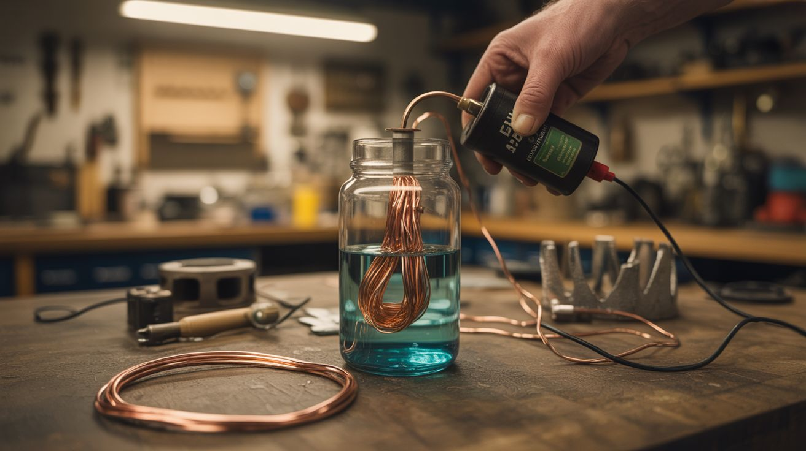

# #328 — Copper Plating with Vinegar

  

> Vinegar dissolves copper wire into a blue-green solution. Add a battery and you can electroplate anything conductive with a gorgeous layer of real copper. Kitchen alchemy at its finest.

## Ratings

     

## 🧪 What Is It?

Electroplating is one of those industrial processes that sounds impossibly complex until you realize it’s just a battery, two wires, and a jar of slightly angry liquid. The concept: dissolve a metal into a solution (creating metal ions floating in liquid), then use electrical current to force those ions to deposit onto another object, coating it in a thin, even layer of metal. Factories do this with cyanide baths and precisely controlled rectifiers. You’re going to do it with vinegar, table salt, some copper wire, and a 9V battery.

The setup is dead simple. Strip the insulation from a length of copper wire and coil it around a jar of white vinegar with a tablespoon of salt dissolved in it. The acetic acid in the vinegar combined with the chloride ions from the salt slowly dissolve the copper, turning the solution blue-green with dissolved copper sulfate and copper chloride. This is your plating bath. Now connect the copper coil to the positive terminal of a battery (the anode — the copper source) and connect your target object to the negative terminal (the cathode — the thing getting plated). Submerge both in the solution, turn on the power, and watch copper atoms migrate from the wire to your object.

Within 30 minutes, your target object will have a visible copper coating. Leave it for a few hours and the coating thickens into a durable, shiny copper layer that can be buffed to a mirror finish. You can plate keys, coins, bolts, jewelry findings, 3D prints coated in conductive paint, or basically anything that conducts electricity. The results look professional — genuinely indistinguishable from factory-plated items if you control the current and solution concentration properly.

<strong>🧰 Ingredients</strong>

- [ ] White vinegar — standard 5% acidity *(grocery store, ~$2)*
- [ ] Table salt — 1-2 tablespoons *(kitchen, free)*
- [ ] Copper wire — bare solid copper, 14-18 gauge, about 3 feet *(hardware store or strip from Romex, ~$3)*
- [ ] 9V battery or DC power supply — 3-9V range *(junk drawer or electronics store, ~$3)*
- [ ] Alligator clip leads — 2 sets *(electronics store, ~$3)*
- [ ] Glass jar — pint or quart Mason jar *(kitchen, free)*
- [ ] Objects to plate — keys, coins, bolts, small metal items *(around the house, free)*
- [ ] Steel wool or fine sandpaper — 400-600 grit for surface prep *(hardware store, ~$2)*
- [ ] Baking soda — for neutralizing and cleaning *(kitchen, free)*
- [ ] Rubbing alcohol — for final degreasing *(medicine cabinet, ~$2)*

## 🔨 Build Steps

1. **Make the plating solution.** Dissolve 1 tablespoon of salt in 2 cups of white vinegar in your glass jar. Drop in a coil of bare copper wire and let it sit for 24 hours. The solution will turn blue-green as copper dissolves. For faster results, heat the vinegar to near-boiling before adding the salt and copper — dissolution happens in 2-3 hours. The stronger the blue-green color, the more copper ions are available for plating.

2. **Prepare the object to be plated.** Surface prep is everything in electroplating. Sand your target object with fine sandpaper or steel wool until uniformly clean and shiny. Then degrease it with rubbing alcohol. Don’t touch it with bare fingers after cleaning — skin oils prevent copper adhesion. Handle with gloves or by the edges.

3. **Set up the anode.** Remove the dissolved copper wire from the solution (it will be partly eaten away) and replace it with a fresh coil of copper wire. This is your anode — the copper source during plating. The fresh copper provides a steady supply of copper ions as the plating process consumes them from the solution. Wrap the wire around the inside of the jar for maximum surface area.

4. **Connect the circuit.** Clip one alligator lead from the POSITIVE terminal of your battery to the copper anode wire. Clip another lead from the NEGATIVE terminal to your target object (the cathode). This is critical — get the polarity wrong and you’ll dissolve your target object instead of plating it.

5. **Plate the object.** Submerge both the copper anode and the target object in the plating solution. Position them 1-2 inches apart, parallel to each other. Bubbles should appear on the cathode (your target) — that’s hydrogen gas, a normal byproduct. Within 5-10 minutes, you’ll see a dull copper color forming on the target. Leave it submerged for 30 minutes to 2 hours for a thicker coating.

6. **Control the current for quality.** Higher voltage deposits copper faster but produces a rough, powdery coating. Lower voltage deposits slowly but produces a smooth, shiny finish. For best results, use a variable DC power supply set to 3-5V, or put a small resistor (10-47 ohm) in series with the 9V battery. The ideal current density is about 20-30 mA per square inch of surface area.

7. **Finish and polish.** Remove the plated object, rinse in clean water, and neutralize any remaining acid by dipping in a baking soda solution. Pat dry. The coating will be somewhat dull — buff it with a soft cloth or polishing compound to bring out a brilliant copper shine. For long-term protection, coat with clear lacquer or Renaissance wax.

## ⚠️ Safety Notes

- The plating solution is acidic and contains dissolved copper salts. Wear gloves to avoid skin irritation. Don’t drink it (copper sulfate is toxic in significant quantities). Dispose of the used solution responsibly — don’t pour it down the drain in large quantities.
- The electrolysis process produces small amounts of hydrogen gas and chlorine gas (from the salt). Both are hazardous in concentration. Work in a well-ventilated area. If you smell a swimming-pool-like odor (chlorine), increase ventilation immediately.
- The battery voltage used here is safe — no shock risk. But don’t upgrade to a car battery charger without understanding the current involved. High current through a small plating bath can overheat the solution.
- Wash hands thoroughly after handling the plating solution and plated objects before the final rinse.

## 🔗 See Also

- [Electrolysis Rust Eraser](212-electrolysis-rust-eraser/)
- [Bleach Crystal Garden](213-bleach-crystal-garden/)

