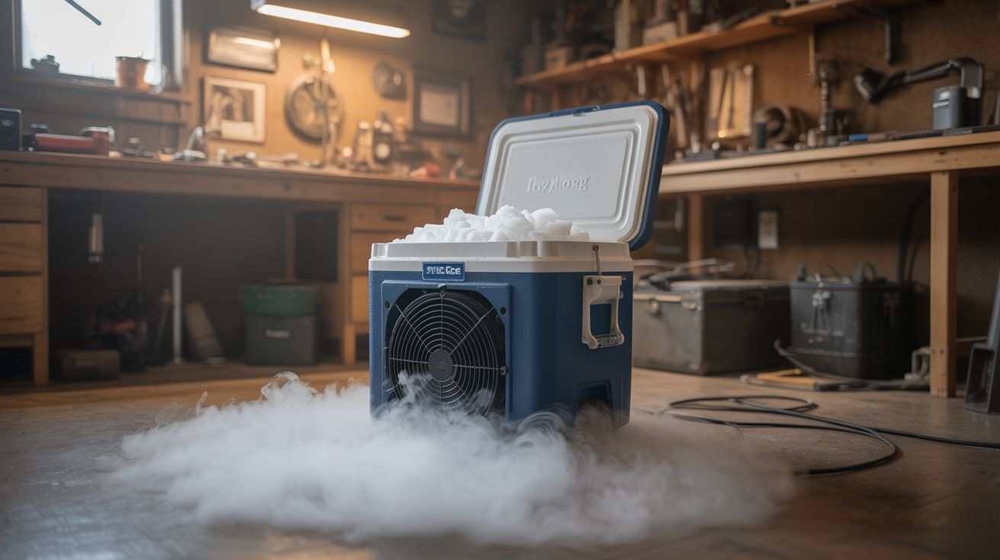

# #329 — Dry Ice Fog Machine

  

> Dry ice plus hot water plus a fan in a cooler equals low-lying theatrical fog that crawls across the floor like something out of a horror movie. Five minutes of build time, hours of atmosphere.

## Ratings

     

## 🧪 What Is It?

Dry ice is frozen carbon dioxide — solid CO2 at -78.5°C (-109°F). Unlike regular ice, it doesn’t melt into a liquid. It sublimates directly from solid to gas. When you drop chunks of dry ice into hot water, the rapid sublimation produces a massive volume of CO2 gas, but that’s not what you see. The visible fog is actually water vapor — the extremely cold CO2 gas condenses the moisture in the surrounding air into tiny water droplets, creating a thick, white fog that’s heavier than air and sinks to the ground. It’s the same physics that makes your breath visible on a cold day, just weaponized for maximum theatrical effect.

The beauty of dry ice fog compared to commercial fog machines (which use heated glycol fluid) is the behavior. Glycol fog rises and disperses — it fills a room from the top down. Dry ice fog hugs the floor because cold CO2 is denser than warm air. It pools in low spots, cascades down stairs, and crawls across surfaces in slow-motion waves. It looks like every haunted house, concert stage, and horror movie you’ve ever seen, and it costs about $10 in dry ice.

Building a controllable fog machine from a cooler takes about five minutes. A Styrofoam or plastic cooler serves as the reservoir. Hot water in the bottom provides the thermal energy for rapid sublimation. A fan (PC fan, desk fan, or even a hair dryer on cool) mounted to a port in the cooler wall pushes the fog out through a PVC pipe or dryer vent hose, letting you aim the fog wherever you want. Drop dry ice into the hot water, close the lid, and fog pours out of the outlet for 15-30 minutes per batch. Refill the hot water periodically to maintain output — as the water cools, sublimation slows down.

<strong>🧰 Ingredients</strong>

- [ ] Dry ice — 5-10 pounds for a good session *(grocery stores, ice cream shops, or welding supply, ~$1-2/lb)*
- [ ] Styrofoam cooler — medium size, 20-30 quart *(hardware or grocery store, ~$5)*
- [ ] Hot water — near-boiling produces the most fog *(kettle, free)*
- [ ] PC fan or small desk fan — for pushing fog through the outlet *(dead computer or dollar store, ~$3)*
- [ ] PVC pipe or dryer vent hose — 3-4" diameter, for directing fog output *(hardware store, ~$5)*
- [ ] 12V power supply — wall wart for the PC fan *(junk drawer, free)*
- [ ] Duct tape — for sealing the fan mount and hose connection *(existing)*
- [ ] Insulated gloves — for handling dry ice *(hardware store, ~$5 or existing winter gloves)*
- [ ] Tongs — for placing dry ice in water *(kitchen, existing)*

## 🔨 Build Steps

1. **Cut the outlet port.** On one end of the cooler, near the bottom, cut a circular hole sized to fit your PVC pipe or dryer vent hose. The outlet should be near the bottom because the cold, dense fog naturally settles to the lowest point inside the cooler. Seal the pipe or hose into the hole with duct tape — it doesn’t need to be airtight, just snug.

2. **Mount the fan.** Cut a second hole in the cooler — either in the lid or on the opposite end from the outlet — and mount your fan so it blows air INTO the cooler. This positive pressure pushes fog out through the outlet. Duct tape the fan in place. Wire it to a 12V wall wart with the switch accessible. The fan is optional but dramatically improves fog output and control.

3. **Attach the output hose.** Connect a length of dryer vent hose or PVC to the outlet port. A 4-6 foot flexible hose lets you aim the fog precisely — down stairs, across a stage, under a table, or out of a window. The hose should slope slightly downward since the fog wants to sink anyway.

4. **Heat the water.** Boil a kettle or large pot of water. Pour 2-3 gallons of near-boiling water into the bottom of the cooler. The hotter the water, the faster the sublimation and the denser the fog. Water temperature is the single biggest variable in fog output — as the water cools, output drops dramatically.

5. **Add the dry ice.** Using insulated gloves and tongs, drop 2-3 pounds of dry ice into the hot water. Large chunks last longer; small pieces produce a faster initial burst but deplete quickly. A mix of sizes gives you both immediate gratification and sustained output. Close the cooler lid immediately.

6. **Turn on the fan and direct.** Switch on the fan. Fog should pour out of the outlet hose within seconds. Direct the hose where you want the fog to accumulate. For floor-crawling fog, keep the outlet at ground level. For cascading-down-stairs effects, position the outlet at the top of the staircase. The fog dissipates as it warms and the CO2 disperses, so there’s a natural range limit of about 10-15 feet before it thins out.

7. **Maintain the output.** The water cools over 15-20 minutes and fog production drops off. Add more hot water (carefully — open the lid slowly to avoid a fog blast to the face) to revive the output. Add more dry ice as needed. With 10 pounds of dry ice and periodic hot water refills, you can run this for 2-3 hours.

## ⚠️ Safety Notes

- Dry ice is -78.5°C and will cause frostbite on contact with skin. Always handle with insulated gloves or tongs. Never put dry ice in your mouth or touch it with bare hands.
- CO2 is an asphyxiant. In enclosed spaces, large quantities of dry ice can displace oxygen and create a suffocation hazard. Use in well-ventilated areas. If you feel dizzy or short of breath, move to fresh air immediately. Do not use in small, sealed rooms.
- Never seal dry ice in an airtight container. The sublimating CO2 builds pressure rapidly and the container will explode. The cooler lid should rest on top without being latched — the fan hole and outlet hole prevent dangerous pressure buildup.
- Hot water in the cooler is a scald hazard. Pour carefully and don’t let kids reach into the cooler.
- Transport dry ice in a vehicle with windows cracked. CO2 buildup in a sealed car can cause drowsiness and disorientation.

## 🔗 See Also

- [Chemical Smoke Screen Machine](../alchemist-cookbook/276-chemical-smoke-screen-machine.md)
- [Elephant Toothpaste](282-hydrogen-peroxide-elephant-toothpaste.md)

**References:**
- [Appliance Teardown Guide](../../reference/appliance-teardown-guide.md)
- [Technical Glossary](../../reference/glossary.md)
- [Chemicals Reference](../../reference/chemicals.md)
