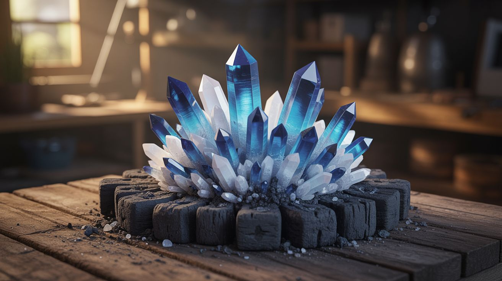

# 🧹 Household Chemistry

  

  

> Everything under the kitchen sink is an ingredient — bleach, vinegar, baking soda, rubbing alcohol, acetone, hand sanitizer, dish soap, and pool shock are all you need.

You don't need a lab supply catalog to do chemistry. The cleaning aisle at the grocery store is a chemistry set hiding in plain sight. Isopropyl alcohol is a flammable solvent and fuel. Baking soda is sodium bicarbonate — a base that reacts violently with acids to produce CO2. White vinegar is dilute acetic acid. Bleach is sodium hypochlorite, one of the strongest oxidizers you can buy without a license. Acetone dissolves plastics on contact. Pool shock (calcium hypochlorite) is concentrated bleach in granular form. Hand sanitizer is ethanol or isopropyl gel that burns with an almost invisible blue flame.

The builds in this category exploit the chemistry of these everyday substances — gas production, combustion, pH-driven reactions, solvent chemistry, and electrochemistry. Some are pure spectacle (fire art, vapor cannons). Some are genuinely useful (rust removal, tie-dye). All of them use materials you can buy at the grocery store, hardware store, or dollar store for a few dollars total.

**Key chemicals and where to find them:** rubbing alcohol (pharmacy), hand sanitizer (pharmacy), acetone (hardware/beauty supply), baking soda (grocery), white vinegar (grocery), bleach (grocery), washing soda (laundry aisle), pool shock (pool supply/hardware), food coloring (grocery), dish soap (grocery).

---

## Builds

<a class="cat-card" href="209-alcohol-vapor-cannon.md">
#209Alcohol Vapor Cannon

Jaw

Brain

Wallet

Spicy

Clout

Time

</a>
<a class="cat-card" href="210-hand-sanitizer-fire-art.md">
#210Hand Sanitizer Fire Art

Jaw

Brain

Wallet

Spicy

Clout

Time

</a>
<a class="cat-card" href="211-acetone-styrofoam-sculptor.md">
#211Acetone Styrofoam Sculptor

Jaw

Brain

Wallet

Spicy

Clout

Time

</a>
<a class="cat-card" href="212-electrolysis-rust-eraser.md">
#212Electrolysis Rust Eraser

Jaw

Brain

Wallet

Spicy

Clout

Time

</a>
<a class="cat-card" href="213-bleach-crystal-garden.md">
#213Bleach Crystal Garden

Jaw

Brain

Wallet

Spicy

Clout

Time

</a>
<a class="cat-card" href="214-bleach-pen-tie-dye.md">
#214Bleach Pen Tie-Dye

Jaw

Brain

Wallet

Spicy

Clout

Time

</a>
<a class="cat-card" href="215-baking-soda-vinegar-rocket.md">
#215Baking Soda Vinegar Rocket

Jaw

Brain

Wallet

Spicy

Clout

Time

</a>
<a class="cat-card" href="216-invisible-ink-message-board.md">
#216Invisible Ink Message Board

Jaw

Brain

Wallet

Spicy

Clout

Time

</a>
<a class="cat-card" href="217-pool-shock-smoke-signals.md">
#217Pool Shock Smoke Signals

Jaw

Brain

Wallet

Spicy

Clout

Time

</a>
<a class="cat-card" href="218-coin-battery-stack.md">
#218Coin Battery Stack

Jaw

Brain

Wallet

Spicy

Clout

Time

</a>
<a class="cat-card" href="280-density-tower.md">
#280Density Tower

Jaw

Brain

Wallet

Spicy

Clout

Time

</a>
<a class="cat-card" href="281-vinegar-baking-soda-rocket.md">
#281Vinegar Baking Soda Rocket

Jaw

Brain

Wallet

Spicy

Clout

Time

</a>
<a class="cat-card" href="282-hydrogen-peroxide-elephant-toothpaste.md">
#282Elephant Toothpaste

Jaw

Brain

Wallet

Spicy

Clout

Time

</a>
<a class="cat-card" href="327-sugar-smoke-bombs.md">
#327Sugar Smoke Bombs

Jaw

Brain

Wallet

Spicy

Clout

Time

</a>
<a class="cat-card" href="328-copper-plating-with-vinegar.md">
#328Copper Plating with Vinegar

Jaw

Brain

Wallet

Spicy

Clout

Time

</a>
<a class="cat-card" href="329-dry-ice-fog-machine.md">
#329Dry Ice Fog Machine

Jaw

Brain

Wallet

Spicy

Clout

Time

</a>

---

### Suggested Build Order

Start with instant spectacles, progress toward electrochemistry:

1. **[#209 — Alcohol Vapor Cannon](209-alcohol-vapor-cannon.md)** — Instant gratification. One ingredient.
2. **[#210 — Hand Sanitizer Fire Art](210-hand-sanitizer-fire-art.md)** — Visual fire demonstration.
3. **[#211 — Acetone Styrofoam Sculptor](211-acetone-styrofoam-sculptor.md)** — Immediate solvent results.
4. **[#213 — Bleach Crystal Garden](213-bleach-crystal-garden.md)** — Passive crystallization.
5. **[#214 — Bleach Pen Tie-Dye](214-bleach-pen-tie-dye.md)** — Artistic chemistry application.
6. **[#215 — Baking Soda Vinegar Rocket](215-baking-soda-vinegar-rocket.md)** — Classic acid-base reaction.
7. **[#216 — Invisible Ink Message Board](216-invisible-ink-message-board.md)** — Chemistry reveal magic.
8. **[#217 — Pool Shock Smoke Signals](217-pool-shock-smoke-signals.md)** — Colored smoke generation.
9. **[#218 — Coin Battery Stack](218-coin-battery-stack.md)** — Stacked redox cells.
10. **[#280 — Density Tower](280-density-tower.md)** — Layered liquid physics demo.
11. **[#281 — Vinegar Baking Soda Rocket](281-vinegar-baking-soda-rocket.md)** — Scaled-up pressure launch.
12. **[#282 — Elephant Toothpaste](282-hydrogen-peroxide-elephant-toothpaste.md)** — Catalytic decomposition spectacle.
13. **[#329 — Dry Ice Fog Machine](329-dry-ice-fog-machine.md)** — Phase-change fog effects.
14. **[#212 — Electrolysis Rust Eraser](212-electrolysis-rust-eraser.md)** — Introduces electrical chemistry.
15. **[#327 — Sugar Smoke Bombs](327-sugar-smoke-bombs.md)** — Combustion kinetics and timing.
16. **[#328 — Copper Plating with Vinegar](328-copper-plating-with-vinegar.md)** — Electroless plating. The capstone.

### Related Categories

- [Pyro & Chemistry](../pyro-and-chemistry/) — Advanced combustion and reaction chemistry
- [Mad Scientist](../mad-scientist/) — Scaling up household experiments
- [Alchemist Cookbook](../alchemist-cookbook/) — Crossover builds with electronics and energy

---

## 📚 Reference Guides

- [Accessible Chemicals Guide](../../reference/chemicals.md)
- [Tools Needed](../../reference/tools-needed.md)
- [Sourcing Guide](../../reference/sourcing-guide.md)
- [Difficulty & Ratings Guide](../../reference/difficulty-guide.md)
