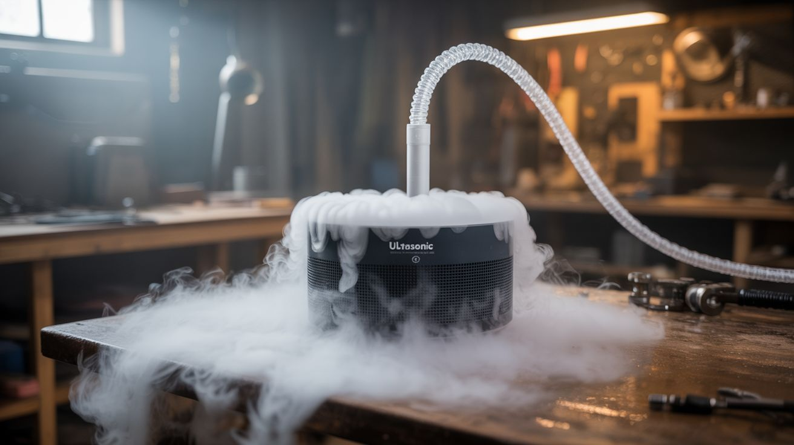

# #084 — Ultrasonic Fog Machine

  

> A humidifier's ultrasonic disc creates cold fog that's denser than air. It pools on the ground like a horror movie. Pump it through tubes for cascading effects.

## Ratings

     

## 🧪 What Is It?

Ultrasonic humidifiers work by vibrating a piezoelectric disc at 1.7 MHz, atomizing water into microscopic droplets that form a cool, dense mist. Unlike theatrical fog machines that heat glycol fluid (producing warm fog that rises), ultrasonic mist is cold and denser than the surrounding air, so it sinks and pools on the ground like something out of a horror movie or a concert stage. Salvage the ultrasonic disc and driver board from a dead humidifier, drop it in a container of water, and you have an instant fog machine. Pump the fog through tubes, PVC pipes, or channels for cascading effects over tables, shelves, or down staircases. Add colored LEDs for an unreal visual experience.

<strong>🧰 Ingredients</strong>

- [ ] Dead ultrasonic humidifier — or standalone ultrasonic mist maker disc module ($5-8) *(e-waste bin, electronics supplier)*
- [ ] Shallow water container — bowl, baking pan, or plastic tub *(kitchen)*
- [ ] 12-24V power supply — matching the mist maker's requirements *(old charger)*
- [ ] PVC pipe or flexible tubing — for directing fog flow *(hardware store)*
- [ ] Small fan (PC fan works) — to push fog through tubes *(e-waste bin)*
- [ ] LED strip or submersible LEDs — for colored fog effects *(electronics supplier, ~$5)*
- [ ] Optional: dry ice — for even denser, more dramatic ground fog *(grocery store or gas supplier)*

## 🔨 Build Steps

1. **Salvage the ultrasonic disc.** Open the humidifier and locate the ultrasonic transducer — it's a small metal disc mounted in the water reservoir. Disconnect it along with its driver circuit board. If the humidifier is too damaged, buy a standalone mist maker module for $5-8 — they come with the disc and driver built in.
2. **Set up the water container.** Fill a shallow container with about 1-2 inches of water. The ultrasonic disc must be submerged to about 1-2 inches below the water surface — too shallow and it won't mist, too deep and the mist can't escape the water.
3. **Install the mist maker.** Place the ultrasonic disc in the water container. Many standalone modules have a float that keeps the disc at the correct depth automatically. Connect the driver board to the power supply.
4. **Test the mist.** Power on. The disc should immediately produce a plume of dense, cold fog rising from the water surface. If no mist appears, check the water depth — the disc needs to be fully submerged at the correct depth. A thin layer of mineral buildup on the disc can reduce output — clean with vinegar.
5. **Build a fog channel.** To direct fog flow, build an enclosed channel from PVC pipe or a trough covered with a lid. Attach a small PC fan at one end to push the fog through. The fog exits the other end and cascades wherever you point the opening.
6. **Add LED lighting.** Place LED strips or submersible LEDs in the water container. The mist picks up and scatters the light beautifully. Try different colors — blue and purple create an eerie atmospheric effect, green looks radioactive, red looks volcanic.
7. **Scale up.** For more fog, use multiple ultrasonic discs in a larger water container. Three or four discs produce enough fog to fill a room floor within minutes. A large container also needs a small fan to push fog out — without airflow, the mist just pools directly above the water surface.
8. **Create a ground fog effect.** Pipe the fog into a long, flat trough or channel placed on the floor. The fog flows along the channel and spills over the edges, creeping across the floor. Perfect for Halloween, parties, photography, or theatrical effects.

## ⚠️ Safety Notes

- Ultrasonic mist makers must always operate in water. Running a dry disc destroys the piezoelectric element within seconds and can overheat the driver board. Ensure the water level stays above the disc during operation.
- The mist increases humidity in enclosed spaces. Prolonged operation indoors can cause condensation on electronics, walls, and floors (slipping hazard). Ventilate the area and wipe up wet surfaces.
- If using dry ice for enhanced effect, never handle it with bare hands (instant frostbite). Use insulated gloves or tongs. Ensure adequate ventilation — sublimating CO2 displaces oxygen in enclosed or low-lying spaces.

## 🔗 See Also

- [Fog Waterfall Table](086-fog-waterfall-table.md)
- [Nebula Lamp](087-nebula-lamp.md)
