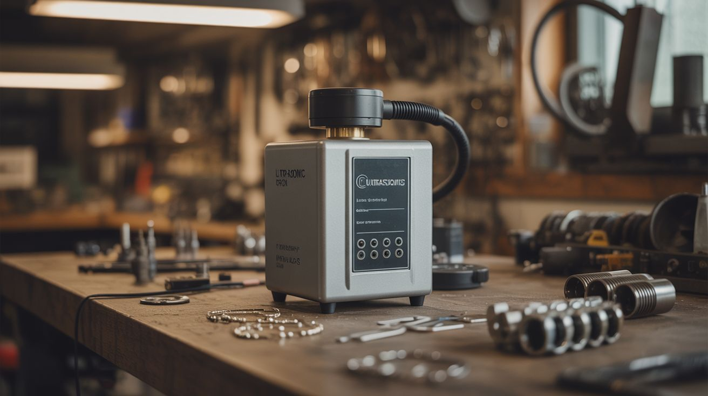

# #085 — Ultrasonic Parts Cleaner

  

> Same transducers, higher power. Cavitation bubbles blast contaminants off surfaces. Clean jewelry, carburetors, and circuit boards.

## Ratings

     

## 🧪 What Is It?

When an ultrasonic transducer vibrates at high power underwater, it doesn't just make mist — it creates cavitation. Millions of microscopic vacuum bubbles form and implode against nearby surfaces with tremendous localized force, blasting away dirt, grease, carbon deposits, flux residue, tarnish, and biological contaminants without scrubbing, harsh chemicals, or disassembly. Commercial ultrasonic cleaners cost $30-200+. Build one by bonding ultrasonic transducers (from a humidifier or purchased cheaply) to the bottom of a metal container, submerge your dirty parts, and power it on. In minutes, carburetors come out looking new, tarnished jewelry sparkles, and circuit boards shed flux residue from every crevice a brush could never reach.

<strong>🧰 Ingredients</strong>

- [ ] Ultrasonic transducer(s) — 40kHz cleaning transducers, or salvaged from a humidifier *(~$5-10 each, electronics supplier)*
- [ ] Ultrasonic driver board — 40kHz, matching your transducer's frequency and impedance *(~$5-10, electronics supplier)*
- [ ] Metal container — stainless steel pot, food tray, or metal box (must be metal for transducer bonding) *(kitchen or thrift store)*
- [ ] Epoxy adhesive — high-strength, for bonding transducer to container bottom *(hardware store)*
- [ ] Power supply — matching driver board requirements *(old charger or PC PSU)*
- [ ] Dish soap — a few drops improve cleaning action *(kitchen)*
- [ ] Optional: small heater (aquarium heater) — warm water cleans better *(pet store, ~$8)*

## 🔨 Build Steps

1. **Select the container.** Use a stainless steel container with a flat bottom — the transducer bonds to the flat underside. Cooking pots, stainless steel food trays, or metal storage boxes all work. The container size determines how large an object you can clean. Avoid plastic — the transducer needs rigid metal to transmit vibrations into the water.
2. **Prepare the transducer.** If salvaging from a humidifier, you may need to re-purpose the disc or buy dedicated 40kHz cleaning transducers. Cleaning transducers are larger, more powerful, and operate at 40kHz (optimized for cavitation cleaning) versus the 1.7MHz humidifier discs (optimized for mist making). Dedicated cleaning transducers cost $5-10 each.
3. **Bond the transducer.** Clean the bottom of the metal container and the transducer face with isopropyl alcohol. Mix high-strength epoxy and apply a thin, even layer to the transducer face. Press it firmly to the center of the container's outer bottom. Clamp and let cure for 24 hours. The bond must be rigid — any air gaps between transducer and container kill the ultrasonic transmission.
4. **Wire the driver board.** Connect the transducer to the ultrasonic driver board. Connect the driver board to the power supply. Some driver boards have potentiometers for adjusting power — start at medium.
5. **Fill with cleaning solution.** Fill the container with warm water and add a few drops of dish soap. The soap reduces surface tension, improving cavitation formation. For heavy grease, use a dedicated ultrasonic cleaning solution. For delicate electronics, use plain distilled water.
6. **Test cavitation.** Power on and observe the water surface. You should see a fine mist rising from the water surface and subtle agitation patterns. Place a piece of aluminum foil in the water for 30 seconds — cavitation creates tiny pitting and holes in the foil. This confirms the transducer is working.
7. **Clean your first part.** Suspend the dirty part in the water (don't let it sit directly on the container bottom — it dampens the transducer). Use a wire rack or hang with wire. Run the cleaner for 3-10 minutes. Remove, rinse, and inspect. Repeat if needed.
8. **Add heating (optional).** Warm water (40-60C) significantly improves cleaning effectiveness. Add an aquarium heater to the bath, or pre-heat the water. Don't exceed 60C — too hot and cavitation actually decreases because dissolved gas escapes the water.

## ⚠️ Safety Notes

- Ultrasonic cavitation can damage soft materials — don't clean soft gemstones (opals, pearls, emeralds), coated lenses, or items with loose glued joints. The vibration can shake loose components apart. Test on non-precious items first.
- Do not put hands in an operating ultrasonic bath for extended periods. While brief contact is harmless, prolonged exposure to cavitation can cause skin irritation and subcutaneous tissue damage.
- Some cleaning solutions (especially degreasers) produce fumes when agitated ultrasonically. Work in a ventilated area and avoid using volatile solvents — ultrasonic agitation increases evaporation rates dramatically.

## 🔗 See Also

- [Ultrasonic Fog Machine](084-ultrasonic-fog-machine.md)
- [Fog Waterfall Table](086-fog-waterfall-table.md)
