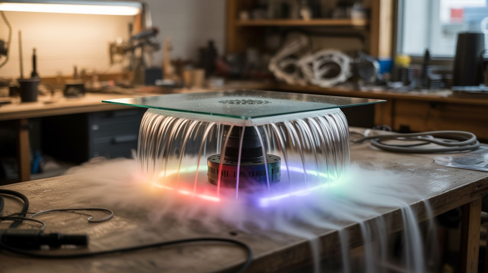

# #086 — Fog Waterfall Table

  

> Mist maker under a glass table. Small openings at the edges. Cold fog cascades over the sides like a waterfall. LED strips create colored fog falls.

## Ratings

     

## 🧪 What Is It?

Ultrasonic mist is denser than air — it sinks and flows like a liquid. Build a table with a glass or acrylic top that has a shallow hidden water reservoir underneath. Place ultrasonic mist makers in the reservoir. The mist rises, hits the glass surface, spreads out, and escapes through narrow gaps or channels at the table edges. As the dense fog exits, gravity pulls it downward over the edges — creating continuous, silent fog waterfalls cascading from every side of the table. Mount LED strips along the edge channels and the fog glows in whatever color you choose. The effect is mesmerizing, especially in a dim room. It looks like the table is melting, dissolving, or existing in a different dimension.

<strong>🧰 Ingredients</strong>

- [ ] Glass or clear acrylic panel — sized for your table top *(glass shop or hardware store)*
- [ ] Table frame — build from wood, metal, or repurpose an existing table *(hardware store or thrift store)*
- [ ] Shallow waterproof tray — to hold water under the glass top *(plastic storage container, baking pan)*
- [ ] 2-3 ultrasonic mist maker modules — more modules = more fog *(~$5-8 each, electronics supplier)*
- [ ] RGB LED strip — waterproof, for edge lighting *(~$8, electronics supplier)*
- [ ] Small PC fans (40mm or 80mm) — to gently push fog toward edges *(e-waste bin)*
- [ ] Silicone sealant — for waterproofing the reservoir *(hardware store)*
- [ ] Water level sensor or float switch — to prevent running dry *(~$3, electronics supplier)*

## 🔨 Build Steps

1. **Design the table structure.** The table needs a hidden reservoir beneath the glass top. Design the frame with a recessed area that holds a shallow waterproof tray (1-2 inches deep). The glass or acrylic top sits above the reservoir with a 1/2-1 inch gap at the edges for fog to escape.
2. **Build or modify the table frame.** Construct a table frame from wood or metal with a flat interior shelf to support the water tray. The frame edges should be slightly higher than the glass surface to create edge channels — narrow gaps where fog accumulates before cascading over.
3. **Install the water reservoir.** Place the waterproof tray in the recessed area. Seal any gaps with silicone to prevent leaks. Add a drain plug at one end for easy water changes. The tray should be level — uneven water depth affects mist production.
4. **Mount the mist makers.** Place 2-3 ultrasonic mist maker modules in the water tray, evenly distributed. Secure them with suction cups or waterproof adhesive. Wire the driver boards and route cables neatly out of the reservoir.
5. **Install fog distribution fans.** Mount small PC fans horizontally inside the reservoir, aimed to push fog outward toward the table edges. Without fans, the fog tends to concentrate directly above the mist makers. Gentle airflow distributes it evenly to all edges.
6. **Install the glass top.** Place the glass or acrylic panel on the frame. It should rest on spacers that create a uniform gap around all edges — this is where the fog exits. The gap should be about 1/2 inch — wide enough for fog to flow but narrow enough to maintain a sheet-like cascade effect.
7. **Add LED strips.** Mount RGB LED strips along the inner edges of the frame, pointing outward or downward through the fog exit gaps. The fog catches and scatters the light as it cascades, creating glowing waterfalls. Use an LED controller to set colors or cycle through effects.
8. **Add water management.** Install a float switch connected to the mist maker power — if the water level drops too low, the switch cuts power to prevent dry running. Alternatively, use a water reservoir with an auto-fill line from a bottle (gravity-fed, like a pet water dispenser).
9. **Test and tune.** Fill the reservoir, power on the mist makers, fans, and LEDs. Adjust fan speed to control fog flow rate. Adjust edge gap width if fog is too thin (wider gap) or escaping too fast (narrower gap). Dim room lighting to maximize the visual effect.

## ⚠️ Safety Notes

- Water and electricity are close together in this build. Ensure all electrical connections are above the water line or properly waterproofed. Use low-voltage components (12V) in and around the water tray. A short circuit in water is a fire and shock hazard.
- The continuous mist raises humidity around the table and creates wet surfaces below the fog waterfalls. Place the table on a waterproof floor surface (tile, not hardwood) or place towels/trays beneath to catch condensation. Wet floors are a slipping hazard.
- Refill with distilled water when possible. Tap water mineral deposits build up on the ultrasonic discs and reduce performance. Clean the discs periodically with white vinegar.

## 🔗 See Also

- [Ultrasonic Fog Machine](084-ultrasonic-fog-machine.md)
- [Nebula Lamp](087-nebula-lamp.md)
