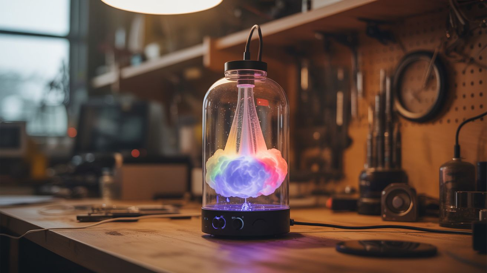

# #087 — Nebula Lamp

  

> Trap ultrasonic mist inside a glass enclosure. Color it with LEDs. Add a fan for turbulence. A captured cloud. A nebula in a jar. Add a speaker and it pulses to music.

## Ratings

     

## 🧪 What Is It?

Take a large, clear glass enclosure — a vase, jar, dome, or custom acrylic box. Put an ultrasonic mist maker in a water reservoir at the base. The mist fills the enclosure, trapped inside like a captured cloud. Add RGB LEDs and the cloud glows in any color — deep purple looks like a nebula, fiery orange looks volcanic, shifting colors look magical. Add a small fan and the cloud churns with turbulent motion, constantly reshaping itself. The piece de resistance: add a small speaker or bass transducer connected to music, and the sound vibrations create pulsing, rhythmic patterns in the mist that dance in sync with the beat. It's a living light sculpture that responds to music.

<strong>🧰 Ingredients</strong>

- [ ] Large clear glass enclosure — fish bowl, glass dome, large jar, clear acrylic tube/box *(thrift store, craft store)*
- [ ] Ultrasonic mist maker module *(~$5-8, electronics supplier)*
- [ ] RGB LED strip or individual addressable LEDs *(~$5-8, electronics supplier)*
- [ ] Small fan (30-40mm PC fan) — for creating turbulence inside *(e-waste bin)*
- [ ] Water reservoir — small container that fits inside or beneath the enclosure *(kitchen)*
- [ ] LED controller — for color effects, or Arduino for custom patterns *(~$3-5, electronics supplier)*
- [ ] Optional: small speaker or bass shaker/transducer — for music-reactive mist *(e-waste bin or ~$5)*
- [ ] Optional: microphone module or audio input — for beat detection *(~$2, electronics supplier)*
- [ ] Silicone sealant — for waterproofing and sealing *(hardware store)*

## 🔨 Build Steps

1. **Choose the enclosure.** The enclosure should be clear glass or acrylic with an opening for access. Fish bowls, glass cloches/domes, large mason jars, or custom acrylic cylinders all work. The larger the enclosure, the more dramatic the cloud effect. A dome or sphere shape gives the most nebula-like appearance.
2. **Build the base.** Construct a base that holds a small water reservoir, hides the electronics, and supports the glass enclosure. The base can be wooden, 3D-printed, or made from a repurposed container. The water reservoir sits inside the base with the mist rising up into the glass enclosure above.
3. **Install the mist maker.** Place the ultrasonic mist maker module in the water reservoir. Ensure the water depth is correct for the module (usually 1-2 inches above the disc). Route the power cable out through the base.
4. **Install the LEDs.** Mount RGB LEDs around the inside perimeter of the base, pointing upward into the enclosure, or wrap a short LED strip around the outside base of the glass. The LEDs should illuminate the mist from below and/or the sides. Avoid mounting LEDs at eye level — you want to see the illuminated cloud, not the LEDs themselves.
5. **Install the turbulence fan.** Mount a small PC fan inside the enclosure, aimed to create swirling airflow. The fan should run at low speed — just enough to create slow, organic turbulence patterns in the mist, not blow it all to one side. A PWM-controlled fan lets you adjust the turbulence level.
6. **Seal the enclosure (mostly).** The enclosure needs to be mostly sealed to trap the mist, but needs a small vent to prevent pressure buildup and allow the mist to circulate. Leave a small gap (1/4 inch) or drill a few small holes near the top. Too much venting and the mist escapes; too little and it becomes stagnant.
7. **Add music reactivity (optional).** Mount a small speaker or bass shaker/transducer on the base or against the enclosure wall. Connect it to an audio source (phone, aux cable). The sound vibrations create visible pulses and waves in the mist. For LED sync, use an Arduino with a microphone module to detect beat frequency and flash LEDs in time.
8. **Program LED effects.** Using an Arduino or LED controller, program color effects: slow rainbow fade for ambient mood, music-reactive flashing for parties, single color for meditation vibes. Addressable LEDs (WS2812B) enable individual pixel control for the most complex effects.
9. **Fill, power on, and enjoy.** Add distilled water to the reservoir, power on the mist maker, LEDs, and fan. In about 30 seconds, the enclosure fills with a glowing, swirling cloud. Dim the room lights. Turn on music if you've added the speaker. Watch your nebula come alive.

## ⚠️ Safety Notes

- Electronics and water are in close proximity. Keep all high-voltage connections (if any) outside the water zone. Use only low-voltage (5V-12V) components near water. Seal wire entry points into the reservoir with silicone to prevent water wicking up cables.
- The mist is just water, but prolonged operation can raise humidity around the lamp. Place on a surface that tolerates moisture. If condensation forms on the outside of the glass, the room is quite humid — ventilate.
- Never run the ultrasonic disc without water. It overheats and destroys the piezoelectric element within seconds. Use a float switch or water level indicator to monitor the reservoir.

## 🔗 See Also

- [Ultrasonic Fog Machine](084-ultrasonic-fog-machine.md)
- [Fog Waterfall Table](086-fog-waterfall-table.md)

**References:**
- [Appliance Teardown Guide](../../reference/appliance-teardown-guide.md)
- [Technical Glossary](../../reference/glossary.md)
- [Electronics & Microcontrollers Guide](../../reference/electronics-and-microcontrollers.md)
