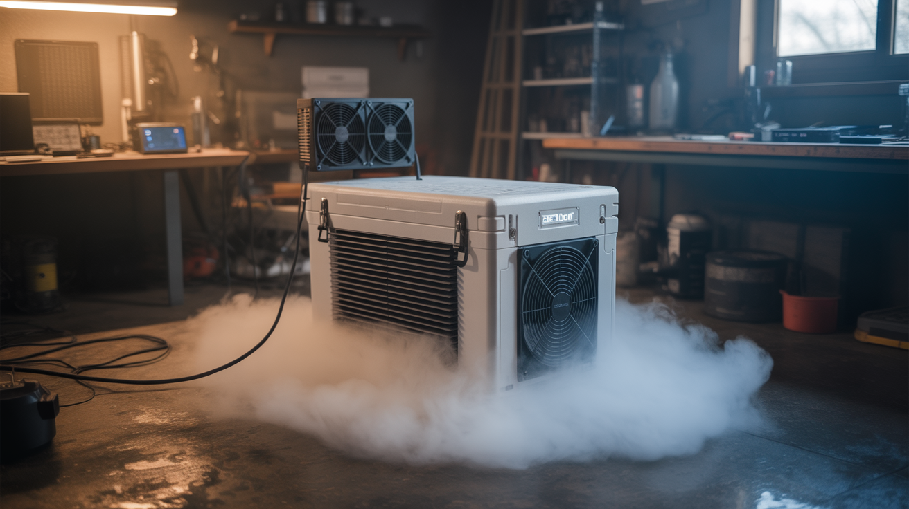

# #274 — Peltier Fog Chiller

  

> A thermoelectric cooler chills fog machine output so it crawls along the ground like a horror movie set. Dry ice vibes, no dry ice needed.

## Ratings

     

## 🧪 What Is It?

Normal fog machines heat glycol-based fluid until it vaporizes, then blast it out as a hot white cloud that rises and disperses within seconds. It looks fine. It looks like fog machine fog. Everyone has seen it at every Halloween party and school dance since 1997. What you actually want is low-lying fog — the kind that pours across the floor, clings to every surface, and makes your living room look like a gothic castle or a horror movie swamp. That effect traditionally requires dry ice (expensive, hard to store, sublimates away in hours) or a professional chiller unit (hundreds of dollars).

A Peltier fog chiller does the same thing for about twenty bucks in parts. Peltier modules (thermoelectric coolers, or TECs) are solid-state heat pumps: apply DC voltage and one side gets cold while the other gets hot. Stack a few of these in a insulated chamber with heatsinks and fans, run fog machine output through the cold chamber, and the fog drops in temperature from hot and buoyant to cold and heavy. Cold fog sinks. It pours out of the chiller output and flows along the floor like a slow-motion waterfall.

The effect is genuinely dramatic. Cold fog behaves like a fluid — it pools in low spots, flows around obstacles, cascades over table edges, and fills rooms from the floor up. Combined with colored LED uplighting, the result is indistinguishable from professional theatrical fog effects that cost thousands. Your total investment: a $25 fog machine from the party store, some Peltier modules from a dead mini-fridge or bought for a few dollars online, and an afternoon of assembly.

<strong>🧰 Ingredients</strong>

- [ ] 2-4 Peltier modules (TEC1-12706 or similar) — the thermoelectric coolers *(salvage from mini-fridge, portable cooler, or buy online $2-4 each)*
- [ ] 2-4 heatsinks with fans — one per Peltier module, mounted on the hot side *(salvage from old computers, CPU coolers, free)*
- [ ] Cold-side heat exchanger — aluminum plate, copper pipe coil, or salvaged heatsink *(scrap bin, $2-5)*
- [ ] Insulated chamber — small cooler, Styrofoam box, or custom box with foam insulation *(dollar store cooler $5, or scrap Styrofoam free)*
- [ ] 12V power supply — 10-20A depending on number of Peltier modules *(salvage from old PC PSU, free; or buy $10-15)*
- [ ] Dryer duct hose — 3-4 inch diameter, flexible aluminum, for input and output *(hardware store, $5-8)*
- [ ] Fog machine — basic glycol fog machine *(party store or online, $20-30)*
- [ ] Thermal paste — for Peltier-to-heatsink interfaces *(electronics shop, $3)*
- [ ] Duct tape or aluminum tape — for sealing connections *(junk drawer, $2)*

## 🔨 Build Steps

1. **Prepare the insulated chamber.** Cut the Styrofoam cooler or insulated box to create a fog path: an input hole on one side (sized to fit the dryer duct hose snugly) and an output hole on the opposite side. The fog will enter one side, pass over the cold surfaces inside, and exit the other side chilled. The chamber should be large enough to give the fog a few seconds of contact time with the cold surfaces — at least 12 inches of internal path length.

2. **Mount the Peltier modules.** Cut holes in the top of the chamber for the Peltier modules. Each module sits in its hole with the cold side facing down into the chamber interior and the hot side facing up into open air. Apply thermal paste to both sides of each module for good thermal contact. The cold side should press firmly against the cold-side heat exchanger inside the chamber.

3. **Install cold-side heat exchangers.** Inside the chamber, mount aluminum plates or heatsink fins to the cold side of each Peltier module. These increase the surface area the fog contacts as it flows through. More surface area means more heat transfer and colder fog output. Aluminum mesh, corrugated aluminum, or salvaged heatsink fins all work well. Secure them with thermal paste and mechanical fasteners.

4. **Install hot-side heatsinks and fans.** On top of the chamber (outside), mount a heatsink and fan on the hot side of each Peltier module. The hot side generates significant heat — without active cooling, the module overheats and loses efficiency or burns out. CPU coolers from old desktop computers are perfect for this. Apply thermal paste, clamp the heatsink firmly, and wire the fans for continuous operation.

5. **Wire the Peltier modules.** Connect all Peltier modules in parallel to the 12V power supply. Each TEC1-12706 draws about 5A at 12V, so two modules need 10A, four need 20A. A salvaged PC power supply on the 12V rail handles this easily. Add an inline switch. Wire the fans to the same 12V supply. Double-check polarity — reversed polarity means the cold and hot sides swap, and you will heat the fog instead of cooling it.

6. **Connect the fog input.** Attach a length of flexible dryer duct hose from the fog machine output nozzle to the chamber input hole. Seal the connection with aluminum tape or duct tape. The fog machine blasts hot fog through the hose into the chiller chamber. Ensure the hose is not kinked — the fog machine has limited pressure and cannot push through tight bends.

7. **Attach the output nozzle.** Connect another length of dryer duct hose to the chamber output hole. This is where the chilled fog exits. Point the output where you want the fog to go — along the floor, over a table edge, or into a room. The output hose can be shaped to direct the fog flow. A wider output (flared funnel) produces a broader, slower fog spread. A narrow output produces a more directed stream.

8. **Pre-cool the chamber.** Turn on the Peltier modules and fans 10-15 minutes before you need fog. The cold-side surfaces need time to reach operating temperature. You will feel frost forming on the cold-side heat exchangers inside the chamber — this is expected and confirms proper operation. The interior of the chamber should feel noticeably cold when you reach inside.

9. **Run the fog machine through the chiller.** Activate the fog machine and let it blast into the chiller input. Watch the output — the fog should emerge visibly denser, cooler, and heavier than normal fog machine output. It should immediately begin sinking toward the floor rather than rising and dispersing. If the fog is still rising, the chamber needs more cooling capacity (add modules), more contact time (lengthen the chamber), or more pre-cooling time.

10. **Optimize for best effect.** Darken the room and add colored LED strips at floor level pointing upward through the fog layer. The fog glows in whatever color you choose, pooling and flowing with visible currents. For maximum density, pulse the fog machine in bursts rather than continuous flow — this gives the chiller time to re-cool between blasts. Experiment with output nozzle position: aiming it at a table edge produces a fog waterfall effect; aiming it into a hallway produces a slow-motion fog flood.

## ⚠️ Safety Notes

- Peltier modules draw significant current. Use appropriately rated wiring and connectors. Undersized wires get hot and can melt insulation. Fuse the power supply output.
- The hot side of Peltier modules can exceed 80°C (176°F) under load. Do not touch the heatsinks during operation. Ensure adequate ventilation around the hot-side heatsinks.
- Fog machine fluid produces glycol-based vapor. Use in ventilated spaces. While generally safe for short-term exposure, prolonged operation in a sealed room can irritate eyes and lungs.
- Condensation forms on cold surfaces inside the chamber. Drain any collected water periodically. Ensure electrical connections inside the chamber are sealed or elevated above any water pooling.

## 🔗 See Also

- [Ultrasonic Fog Machine](084-ultrasonic-fog-machine.md)
- [Fog Waterfall Table](086-fog-waterfall-table.md)
- [Nebula Lamp](087-nebula-lamp.md)

**References:**

- [Appliance Teardown Guide](../../docs/reference/appliance-teardown-guide.md)
- [Electronics & Microcontrollers Guide](../../docs/reference/electronics-and-microcontrollers.md)
- [Technical Glossary](../../docs/reference/glossary.md)
