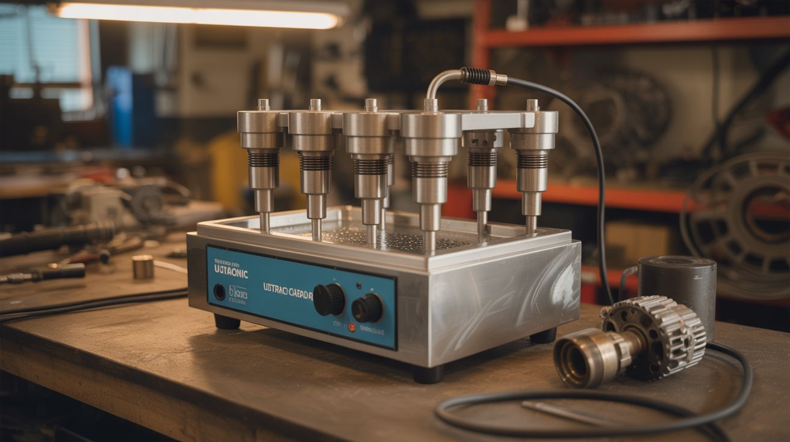

# #295 — Ultrasonic Parts Cleaner Pro

  

> Six transducers, a heated stainless tank, and enough cavitation to strip carbon off a carburetor. This is not your jeweler's ultrasonic bath.

## Ratings

     

## 🧪 What Is It?

Build #085 showed how to bond a single ultrasonic transducer to a pot and call it a
parts cleaner. It works — for earrings and small PCBs. But if you've ever tried to
clean a gunked-up motorcycle carburetor, a set of corroded gun parts, or a tray of
flux-caked circuit boards in a single-transducer setup, you know the limitations.
Uneven cavitation, dead zones in the corners, and weak cleaning power at the edges
where the ultrasonic field drops off. The fix isn't a bigger transducer — it's more
transducers, properly distributed across the tank floor.

This build scales up the concept to industrial-grade territory. You're bonding 3-6
ultrasonic transducers to the bottom of a stainless steel tank, driven by either
salvaged humidifier driver boards or a custom oscillator circuit (a 555 timer
driving a MOSFET works surprisingly well for this). The multiple transducers create
overlapping cavitation zones that cover the entire tank floor — no dead spots, no
weak edges. Add a heating element salvaged from a dead kettle or coffee maker,
controlled by a thermostat to keep the cleaning solution at the optimal 40-60°C
range, and you've got a machine that rivals commercial units costing $200-500.
The total parts cost is under $60 if you're salvaging aggressively.

The real magic is what this thing can clean. Carburetors with 20 years of varnished
fuel deposits come out looking like they just left the factory. Firearm bolts caked
with carbon fouling dissolve down to bare metal. Circuit boards shed flux residue
from every crevice a brush could never reach. Brass casings. Dental tools. Vintage
watch movements. Anything with tiny crevices, blind holes, or delicate surfaces that
would be damaged by scrubbing — ultrasonic cavitation gets in there without
physically touching anything. The microscopic vacuum bubbles form and implode
against every exposed surface equally, including the insides of passages, threads,
and channels that no tool could access. A heated cleaning solution with the right
chemistry (plain water and dish soap for general work, TSP for grease, vinegar
for tarnish, specialized solutions for specific contaminants) makes it even more
effective. Once you have one of these on your bench, you'll find excuses to
ultrasonically clean things that don't need cleaning.

<strong>🧰 Ingredients</strong>

- [ ] Ultrasonic transducers (3-6) — 40kHz cleaning transducers, salvaged from dead humidifiers or bought new *(e-waste bin or electronics supplier, ~$5-10 each)*
- [ ] Stainless steel container/tank — rectangular food pan, steam table insert, or stainless tray with flat bottom *(restaurant supply store or thrift store, ~$10-20)*
- [ ] Ultrasonic driver circuit board(s) — salvaged from humidifiers, or build your own with a 555 timer + MOSFET *(e-waste bin, ~$5-10 if purchased)*
- [ ] Heating element — salvaged from a dead electric kettle, coffee maker, or hot plate *(e-waste bin, free)*
- [ ] Temperature controller — simple thermostat or adjustable thermal switch, rated for 40-60°C *(electronics supplier, ~$5-8)*
- [ ] Drain valve — brass ball valve, 1/2" or 3/4" *(hardware store, ~$5)*
- [ ] High-strength epoxy — for bonding transducers to the tank bottom *(hardware store, ~$5)*
- [ ] Silicone sealant — high-temperature RTV silicone for sealing the drain fitting and heater pass-through *(hardware store, ~$5)*
- [ ] Power supply — 24-48V DC for ultrasonic drivers, depending on transducer specs *(old laptop charger, PC PSU, or purchased, ~$10)*
- [ ] Wire — 16-18 AWG for power runs, 22 AWG for signal *(electronics supplier)*
- [ ] Wire rack or basket — to suspend parts above the tank floor *(kitchen or thrift store)*
- [ ] Toggle switches and indicator LEDs — separate switches for ultrasonics and heater *(electronics supplier, ~$3)*
- [ ] Enclosure for electronics — project box or fabricated panel to house driver boards and controls *(hardware store or electronics supplier, ~$5)*

## 🔨 Build Steps

1. **Select and prep the tank.** Your stainless steel container needs a flat bottom —
   the transducers bond to the underside and require full surface contact to transmit
   vibrations efficiently. Steam table inserts (1/2 or full size) are ideal: stainless,
   flat-bottomed, food-safe, and cheap from restaurant supply stores. A full-size insert
   gives you a 20" x 12" cleaning area — big enough for most carburetors and gun parts.
   Clean the outside bottom thoroughly with acetone or isopropyl alcohol. Any grease,
   scale, or oxidation weakens the epoxy bond. Sand lightly with 120-grit for extra
   adhesion if the surface is mirror-smooth.

2. **Plan the transducer layout.** Mark positions on the outside bottom of the tank with
   a permanent marker. Space the transducers evenly to create overlapping cavitation
   zones. For a full-size steam table insert, four transducers in a 2x2 grid with 5-6"
   spacing covers the entire floor. For a smaller pan, three in a triangle pattern works.
   For maximum coverage, six transducers in a 2x3 grid is overkill in the best possible
   way. The key is eliminating dead zones — areas where no transducer's cavitation
   reaches effectively. Overlap is better than gaps.

3. **Bond the transducers.** Mix high-strength epoxy (JB Weld or similar metal-bonding
   epoxy). Apply a thin, uniform layer to each transducer face — roughly the thickness
   of a playing card. Press firmly against the marked positions on the tank bottom and
   clamp with C-clamps or spring clamps. Wipe away any squeeze-out immediately. Let
   cure for a full 24 hours before handling. Do not rush this. The bond is the single
   most critical element of the entire build — air gaps, uneven adhesive thickness, or
   weak spots kill ultrasonic transmission. One poorly bonded transducer drags down the
   performance of the whole system.

4. **Install the drain valve.** Drill a hole near the bottom edge of one end wall, sized
   for your drain valve fitting (typically 1/2" or 3/4" NPT). Deburr the hole carefully —
   stainless steel leaves nasty sharp edges. Install the brass ball valve with stainless
   washers and rubber gaskets on both sides. Seal with high-temperature silicone around
   the threads. Let the silicone cure 24 hours before testing with water. The drain makes
   solution changes painless — dumping a 3-gallon tank of filthy cleaning fluid by lifting
   and tipping is a mess you only make once.

5. **Install the heating element.** Mount the salvaged heating element along one interior
   wall of the tank, near the bottom. Kettle heating elements typically have a flanged
   mount with a rubber gasket — drill the tank wall to match and seal with high-temp
   silicone and stainless hardware. If using a coffee maker heating plate, bond it to the
   outside bottom of the tank between transducers (don't let it overlap with transducer
   positions). Wire the heating element through the temperature controller so it cuts
   power at 60°C. This temperature ceiling isn't arbitrary — above 60°C, dissolved gas
   escapes the water and cavitation intensity actually drops. The sweet spot for most
   cleaning applications is 45-55°C.

6. **Build the driver circuit.** If you salvaged humidifier driver boards, wire each one
   to its corresponding transducer. But check the frequency — most humidifier drivers
   run at 1.7MHz (optimized for mist), while cleaning transducers run at 40kHz (optimized
   for cavitation). If there's a mismatch, the humidifier driver won't produce useful
   cleaning cavitation. Build a simple 40kHz oscillator instead: a 555 timer configured
   for 40kHz square wave output, driving an IRF540 or similar power MOSFET, with the
   transducer as the load. Add a small inductor (100-470uH) in series to smooth the
   drive waveform. One 555+MOSFET circuit per transducer gives independent control, or
   wire one beefy driver circuit to all transducers in parallel if they're frequency-matched.

7. **Wire the control panel.** Mount toggle switches, indicator LEDs, and the temperature
   controller readout on a project box or panel attached to one end of the tank. Separate
   switches for ultrasonics and heater — you'll want to pre-heat the solution before
   turning on the ultrasonics, and sometimes you want heat without cavitation (for
   soaking heavily contaminated parts before the ultrasonic cycle). Include a power
   indicator LED and a "heater active" LED so you always know what's running. A simple
   timer switch for the ultrasonics is a nice addition — set it for 10 minutes and walk
   away instead of babysitting the process.

8. **Build a parts basket.** Bend stainless steel wire or repurpose a kitchen cooling rack
   to make a basket that suspends parts 1-2" above the tank floor. Parts resting directly
   on the bottom dampen the transducers and don't get cleaned on their contact surfaces.
   The basket should lift in and out easily — you'll be loading and unloading it constantly.
   For small parts like screws, springs, and brass casings, use a stainless mesh strainer
   or tea ball so nothing falls to the bottom. For circuit boards, build a rack with slots
   that holds boards vertically — maximum surface exposure.

9. **Test with the aluminum foil method.** Fill the tank with warm water and a few drops
   of dish soap. Power on all transducers. Suspend a piece of standard aluminum foil in
   the water for 60 seconds. Remove and inspect. You should see a uniform pattern of tiny
   pits and holes across the entire foil surface — this is cavitation damage, and it
   confirms the transducers are working and the cavitation field is even. Uneven pitting
   (heavy in one area, none in another) means dead zones — reposition transducers or
   check bonds. No pitting at all means a fundamental bonding failure or driver issue.
   Go back to step 3.

10. **Run a real cleaning test.** Grab the dirtiest carburetor, nastiest circuit board, or
    most tarnished piece of brass you can find. Submerge it in the basket, set the
    temperature to 50°C, and run the ultrasonics for 10 minutes. Pull it out and prepare
    to be unreasonably impressed. For heavily soiled parts, a 20-30 minute cycle with a
    degreasing solution handles what hours of manual scrubbing couldn't touch. Take
    before-and-after photos — you'll want them.

11. **Dial in cleaning solutions.** Plain water with a few drops of dish soap handles most
    general cleaning. For heavy grease and carbon: add a tablespoon of TSP (trisodium
    phosphate) per gallon. For tarnished brass and copper: a splash of white vinegar. For
    circuit boards: distilled water only — soap residue on a PCB is worse than flux
    residue. For gun parts: dedicated ultrasonic firearms cleaning solution (the carbon
    fouling requires specific chemistry). Label your solutions and keep notes on what
    works for what. You'll develop recipes for different jobs over time.

12. **Build a lid.** Cut a piece of sheet metal, acrylic, or plywood to fit over the tank
    opening. A lid serves three purposes: it contains the high-pitched whine from the
    transducers (which is genuinely annoying after 10 minutes), it reduces solution
    evaporation (saving you from constant top-offs during long cleaning cycles), and it
    prevents fumes from reaching your face when using aggressive cleaning solutions.
    A simple friction-fit lid works fine. Add a handle.

## ⚠️ Safety Notes

- The heating element runs on mains voltage (120/240V AC). Keep all mains wiring
  properly insulated, grounded, and well away from water splash zones. Use a GFCI
  outlet. A short circuit in a tank full of conductive cleaning solution is a
  serious electrocution hazard — this is not theoretical.
- Do not put your hands in the tank while the ultrasonics are running. Brief contact
  is harmless, but prolonged exposure to cavitation (more than a few seconds) causes
  subcutaneous tissue damage — tiny blood vessels burst under the skin. It doesn't
  hurt immediately, which is exactly what makes it dangerous. Use the basket or tongs.
- Some cleaning solutions produce irritating or toxic fumes when agitated
  ultrasonically. TSP, commercial degreasers, and acidic solutions all off-gas more
  aggressively under cavitation than they would sitting still. Work in a ventilated
  area or outdoors. Never use volatile solvents (acetone, gasoline, alcohol) in an
  ultrasonic bath — the cavitation accelerates evaporation and can create explosive
  vapor concentrations in seconds.
- Drain and replace the cleaning solution regularly. Used solution contains dissolved
  contaminants — lead from old solder, heavy metals from brass, carbon particles
  from engine parts. Dispose of contaminated solutions properly, not down the sink
  drain. Your local hazardous waste facility handles this.
- Ultrasonic transducers are loud. The 40kHz fundamental is above human hearing, but
  subharmonics and mechanical resonances produce an audible high-pitched whine that
  ranges from annoying to painful depending on the enclosure acoustics. Prolonged
  exposure is genuinely harmful. Wear hearing protection for long cleaning sessions,
  or build the lid described in step 12.
- Don't clean soft gemstones (opals, pearls, emeralds), coated lenses, or anything
  with loose glued joints. Cavitation shakes things apart. Test on non-precious items
  first. Grandmother's ring can wait until you've confirmed the power level is
  appropriate.

## 🔗 See Also

- [Ultrasonic Parts Cleaner](085-ultrasonic-parts-cleaner.md)
- [Ultrasonic Fog Machine](084-ultrasonic-fog-machine.md)
- [Fog Waterfall Table](086-fog-waterfall-table.md)
- [Nebula Lamp](087-nebula-lamp.md)

**References:**
- [Appliance Teardown Guide](../../reference/appliance-teardown-guide.md)
- [Technical Glossary](../../reference/glossary.md)
