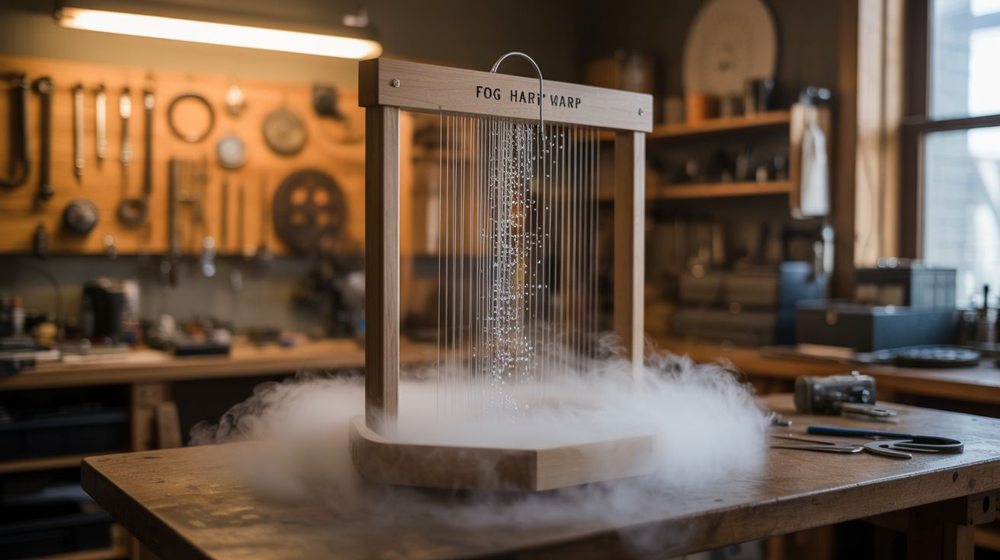

# #296 — Fog Harp Water Collector

  

> Make fog. Catch fog. Harvest water from thin air. It's beautiful, educational, and slightly more useful than you'd expect.

## Ratings

     

## 🧪 What Is It?

In arid coastal regions around the world — the Atacama Desert in Chile, the Atlas
Mountains of Morocco, the highlands of East Africa — communities harvest drinking
water from fog. They stretch large mesh nets across hilltops, perpendicular to
prevailing winds. Fog blows through the mesh, tiny water droplets collide with the
fibers, coalesce into larger drops, and drip down into collection troughs. No pumps,
no electricity, no moving parts. A single large fog net can collect hundreds of liters
per day in favorable conditions. It's one of the most elegant low-tech solutions to
water scarcity ever devised, and most people have never heard of it.

This build creates a tabletop proof-of-concept that demonstrates the same physics.
An ultrasonic mist maker module (salvaged from a dead humidifier) generates artificial
fog inside an enclosed chamber. A small fan pushes the fog horizontally across an
array of tightly strung vertical wires or strings — the "harp." As the fog passes
through the harp, water droplets collide with the wire surfaces, bead up, and gravity
pulls them down into a collection tray below. The collected water is visible and
measurable. You're literally pulling water out of a cloud that you made.

The visual effect is genuinely stunning, especially with LED backlighting. You can see
the fog rolling through the chamber as a thick white mass, watch it visibly thin out
as it passes through the harp (the wires are stripping moisture from the air in real
time), and track individual droplets forming and running down the strings like dew on
a spider web. It's a science demonstration, an art piece, and a conversation starter
about atmospheric water harvesting technology. Schools, maker spaces, and science
fairs eat this stuff up. And the water you collect is real — if you used clean
components and distilled water in the reservoir, it's drinkable. You probably won't
survive on it (10-50ml per hour isn't going to replace your faucet), but as a
demonstration of the principle, it's hard to beat.

<strong>🧰 Ingredients</strong>

- [ ] Ultrasonic mist maker module — salvaged from a dead humidifier, or standalone disc module *(e-waste bin or electronics supplier, ~$5-8)*
- [ ] Water reservoir — shallow container for the mist maker to sit in *(plastic food container, ~$2)*
- [ ] Vertical wire array material — thin stainless steel wire (28-30 gauge), monofilament fishing line, or nylon thread *(hardware store or tackle shop, ~$5)*
- [ ] Collection tray — shallow tray or channel positioned below the wire array to catch drips *(plastic tray, baking sheet, or 3D-printed channel, ~$3)*
- [ ] Enclosed chamber — clear acrylic box, large glass aquarium, or built from acrylic sheet *(craft store, pet store, or plastics supplier, ~$15-25)*
- [ ] Fan — small PC fan (40-80mm) for pushing fog across the harp *(e-waste bin, free)*
- [ ] LED strip — white or cool blue for backlighting the fog and harp *(electronics supplier, ~$5)*
- [ ] Wire frame for harp — small wooden or acrylic frame to hold the vertical strings taut *(scrap wood or acrylic, ~$3)*
- [ ] Power supply — 12V DC for fan and LEDs, plus whatever the mist maker needs (usually 24V) *(old chargers or wall adapters)*
- [ ] Wire and connectors — for wiring components *(electronics supplier, ~$3)*
- [ ] Silicone sealant — for waterproofing joints in the chamber *(hardware store, ~$5)*
- [ ] Optional: graduated cylinder or small measuring cup — for quantifying water output *(kitchen or science supplier)*
- [ ] Optional: second harp frame — for testing double-harp collection efficiency *(scrap materials)*

## 🔨 Build Steps

1. **Build or source the chamber.** You need a clear enclosed space roughly 18-24" long,
   8-12" wide, and 10-12" tall. A 10-gallon glass aquarium is perfect and costs $10-15
   at a pet store or thrift shop. Alternatively, build a box from 1/4" clear acrylic
   sheet glued with acrylic cement (Weld-On #4 or similar). The chamber needs to be
   transparent so you can see the fog, the harp, and the condensation process — that's
   the whole point of the build. Leave one end or the top partially open or removable
   for access and airflow management.

2. **Design the internal layout.** The chamber has three zones arranged left to right:
   the fog generation zone (mist maker and reservoir on one end), the collection zone
   (wire harp and collection tray in the middle), and the exhaust zone (where
   dehumidified air exits on the other end). The fan sits between the fog zone and the
   harp, pushing fog horizontally through the wires. Sketch this out before building —
   the spacing between zones affects performance. The fog needs 4-6" of travel between
   the mist maker and the harp to develop into a uniform cloud, rather than arriving
   as a concentrated jet.

3. **Install the water reservoir.** Place a shallow container (1-2" deep) at one end of
   the chamber. This holds the water supply for the mist maker. The container should be
   easy to refill — either make it removable or route a fill tube through the chamber
   wall sealed with silicone. Fill with distilled water for the cleanest results and
   longest mist maker disc life. Tap water works but leaves mineral buildup on the disc
   within a few days of continuous use.

4. **Mount the mist maker.** Place the ultrasonic mist maker module in the reservoir.
   Most standalone modules include a float that keeps the disc at the correct depth
   (1-2" below the surface). Connect the driver board and route the power cable out
   through a sealed hole in the chamber wall. Power it on briefly to confirm mist
   production — you should see a dense plume of white fog rising from the water
   surface. If the mist is weak or nonexistent, check the water depth. Too shallow
   and the disc cavitates air. Too deep and the mist can't break the surface.

5. **Build the fog harp frame.** Construct a rectangular frame from thin wood strips
   (1/4" x 1/2" craft sticks work well), acrylic strips, or stiff wire. The frame
   should be roughly the same height and width as the chamber interior cross-section,
   with a small gap around all edges for airflow. The frame needs a top bar and a
   bottom bar, with the vertical collection wires strung between them under slight
   tension. Think of it like a tiny loom or a musical instrument frame.

6. **String the harp.** Cut lengths of your chosen wire or line material to span from
   the top bar to the bottom bar, plus enough extra to wrap and secure at each end.
   Space the wires 3-5mm apart — close enough to intercept fog droplets as they drift
   through, but not so close that they create a wall that blocks airflow entirely. For
   a 10" wide frame, that's roughly 50-80 vertical wires. Stainless steel wire works
   best because the metal surface is hydrophilic — it attracts water and encourages
   droplet formation. Fishing line works but collects less efficiently because the
   plastic surface is more hydrophobic. Tie or wrap each wire around small nails,
   screws, or notches cut into the top and bottom bars. Tension matters — loose
   wires sag and touch each other, reducing effective collection area and creating
   paths for water to drip off prematurely.

7. **Install the harp in the chamber.** Position the harp frame vertically in the
   middle zone of the chamber, perpendicular to the airflow direction. The bottom of
   the harp should have a 1/2-1" gap between its lower bar and the collection tray
   beneath it, so water drops fall freely into the tray rather than wicking along the
   frame. Secure the harp in place with small clips, brackets, or dabs of hot glue
   on the chamber walls. It needs to stay vertical and stable.

8. **Install the collection tray.** Place a shallow tray or channel directly below the
   harp. The tray catches water that drips down the wires and off the bottom bar of
   the frame. Angle the tray slightly (2-3 degrees) so collected water flows to one
   end — either to a visible measuring point inside the chamber, or through a drain
   hole leading to an external collection container. Even a slight tilt is enough for
   water to find its way. A clear tray lets you see the water accumulating, which is
   half the fun.

9. **Mount the fan.** Position the PC fan between the mist maker reservoir and the harp,
   aimed to push fog horizontally through the wire array. The fan speed is critical:
   too fast and fog blows past the wires without enough contact time for condensation,
   too slow and fog settles out of the air before reaching the harp. Start at medium
   speed and adjust up or down based on results. A PWM-controlled fan is ideal for
   fine-tuning. You'll know you've found the sweet spot when you can see a clear
   density difference — thick fog on the input side, noticeably thinner air on the
   output side.

10. **Install backlighting.** Mount an LED strip on the chamber wall behind the harp
    (on the exhaust side), facing back toward the fog generation zone. This backlights
    the fog so you can clearly see the density difference on each side of the harp —
    thick white fog entering, thinner translucent air exiting. The light also makes
    individual water droplets on the wires sparkle and glint visibly, which is the
    money shot for photos and demonstrations. Cool white or pale blue LEDs work best
    for contrast. Warm yellow or red LEDs wash out the fog visibility.

11. **Seal and tune.** Seal gaps in the chamber walls with silicone, but leave a small
    exhaust opening (1-2 square inches) on the far end opposite the mist maker, so air
    circulates rather than pressurizing. The chamber should be enclosed enough to
    contain the fog path but not airtight — trapped air pressure reduces mist output.
    Power on all components and watch the system run. Within a few minutes, you should
    see water droplets forming on the harp wires, growing, and dripping into the
    collection tray. If the wires stay dry, the fog is too thin (increase mist output
    or reduce fan speed) or the wires are too hydrophobic (try a different material).

12. **Measure and experiment.** Let the system run for 30-60 minutes and measure the
    collected water with a graduated cylinder. A well-tuned setup typically collects
    10-50ml per hour, depending on mist output, harp wire count, wire material, and
    fan speed. Now the real fun starts: experiment with variables. Try different wire
    materials (stainless steel vs. copper vs. nylon vs. cotton thread). Vary the
    spacing (2mm vs. 5mm vs. 10mm). Adjust fan speed across the full range. Add a
    second harp in series behind the first to capture more of the remaining fog.
    Document your results — this is genuine experimental science, and the data is
    interesting enough to present at a science fair or publish on a maker blog.

13. **Optimize wire surface treatment (optional).** In academic fog harvesting research,
    surface treatment of the collection fibers matters enormously. Slightly roughened
    wires collect more than smooth ones because the microscopic texture provides
    nucleation sites for droplets. Try lightly sanding metal wires with 400-grit
    sandpaper. Dipping nylon lines in a dilute surfactant (a drop of dish soap in a
    cup of water) makes them temporarily hydrophilic. Copper wire develops a natural
    oxide patina that improves collection over time. Compare collection rates with
    treated vs. untreated wires side by side — the differences are measurable and
    sometimes dramatic.

14. **Scale up for outdoor use (optional).** The tabletop version proves the concept.
    If you want to actually harvest meaningful water, build a larger outdoor version.
    Replace the artificial fog with natural fog (if you live in a foggy area) and
    scale the harp to 3-6 feet wide. A large outdoor fog harp with stainless steel
    wires can collect several liters per night in coastal fog conditions. No
    electricity needed — just wind, fog, and gravity.

## ⚠️ Safety Notes

- This is one of the safest builds in the entire collection. Low voltage, no heat,
  no chemicals, no moving parts except a small fan. The primary hazard is water
  spilling from the reservoir if the chamber gets knocked over — keep electronics
  above the water line and on the dry side of the chamber.

- If you plan to measure and taste the collected water, use distilled water in the
  reservoir and ensure all chamber materials are food-safe and clean. Avoid copper
  or galvanized wire for the harp if you plan to consume the water — copper
  leaches into water, and galvanized wire releases zinc. Use stainless steel or
  food-grade nylon. Even then, treat this as a demonstration, not a water
  purification system.

- The ultrasonic mist maker must stay submerged during operation. Running the disc
  dry burns out the piezoelectric element within seconds and can overheat the driver
  board. Monitor the reservoir water level and refill as needed — the mist maker
  consumes water faster than you'd expect, especially at full output.

- Increased humidity inside the chamber causes condensation on any electronics
  mounted internally. Keep driver boards, fan power connectors, and LED wiring
  connections outside the chamber or sealed against moisture ingress. Low-voltage
  components tolerate brief condensation exposure, but corrosion is a long-term
  concern if this runs for days at a time.

- If building the outdoor scaled-up version, secure the frame against wind loads.
  A 6-foot wire array acts like a sail in high winds. Anchor it properly or it
  becomes a very educational projectile.

## 🔗 See Also

- [Ultrasonic Fog Machine](084-ultrasonic-fog-machine.md)
- [Nebula Lamp](087-nebula-lamp.md)
- [Mist Cooling System](297-mist-cooling-system.md)
- [Fog Waterfall Table](086-fog-waterfall-table.md)
