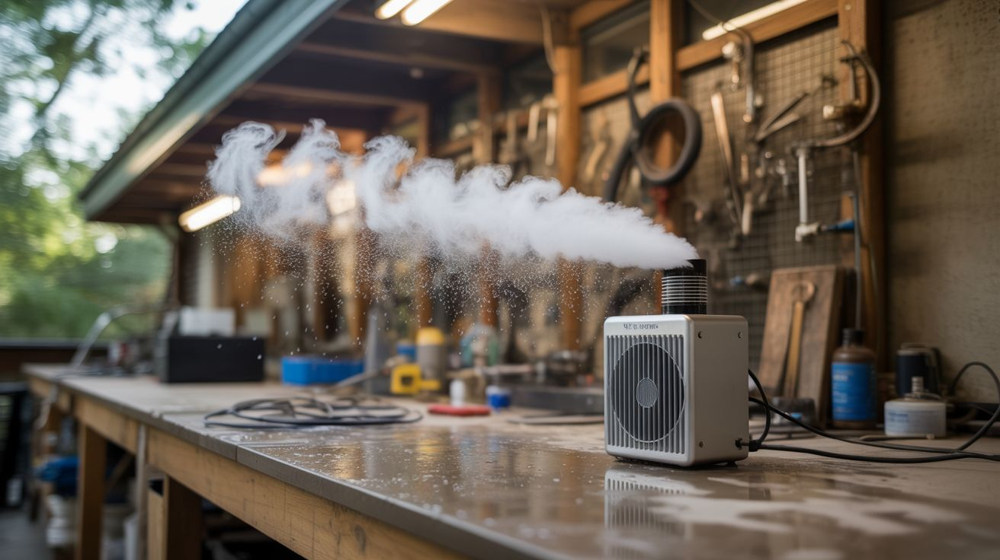

# #297 — Mist Cooling System

  

> Blow ultrasonic mist across a patio and drop the temperature 15 degrees. No wet surfaces. No plumbing. Just dead humidifiers and physics.

## Ratings

| Jaw Drop Rating | Brain Melt Level | Wallet Damage | Spicy Level | Clout Potential | Time to Build |
|---|---|---|---|---|---|
| ⭐⭐⭐ | ⭐⭐ | ⭐⭐ | ⭐ | ⭐⭐⭐ | ⭐⭐ |

## What Is It?

You've seen those misting systems at outdoor restaurants — pressurized water lines
with tiny nozzles spraying a fine mist into the air above the tables. The mist
evaporates, absorbs heat energy from the surrounding air, and the temperature drops
10-20°F in the immediate area. Evaporative cooling. Same reason you feel cold
stepping out of a pool on a breezy day. Those commercial systems cost $200-1000+
installed and require plumbing connections, high-pressure pumps, and specialized
nozzles that clog constantly with mineral deposits.

Ultrasonic mist discs produce an even finer mist than pressure nozzles — droplets
in the 1-5 micron range versus 10-50 microns from mechanical nozzles. Smaller
droplets have more surface area per unit volume, so they evaporate faster. Faster
evaporation means faster cooling and — here's the important part — virtually zero
surface wetting. The mist from an ultrasonic disc disappears into the air within a
few feet of the source. No puddles on the patio. No dripping on the furniture. No
wet chairs or slippery floor tiles. Just invisible evaporative cooling that you feel
but can't see. Mount 4-6 salvaged ultrasonic mist discs in a weatherproof housing
with a fan, aim it at your outdoor area, and you've built a commercial-grade mist
cooling system from dead humidifiers and a bucket.

The catch — and you should know this before you build: evaporative cooling works best
in dry heat. In arid climates (the American Southwest, inland Australia, the
Mediterranean), this setup is absurdly effective. A 110°F day at 15% humidity becomes
a 92°F day in the mist zone. In humid climates (Southeast US, coastal tropics), the
air is already saturated with moisture and physically cannot absorb much more, so
the cooling effect ranges from minimal to nonexistent. If your summer humidity
regularly exceeds 60%, this build will disappoint you. Below 40% humidity, it's
magic. Between 40-60%, noticeable but not dramatic. Check your local climate data
before building — this is thermodynamics, not something you can hack around with
more transducers.

## Ingredients

- [ ] Ultrasonic mist maker modules (4-6 discs) — salvaged from dead humidifiers, or standalone modules *(e-waste bin, free, or electronics supplier, ~$5-8 each)*
- [ ] Water reservoir/bucket — 3-5 gallon bucket or plastic storage container with lid *(hardware store, ~$5)*
- [ ] Fan — large PC fan (120mm+), small box fan, or inline duct blower for pushing mist *(e-waste bin or hardware store, ~$5-15)*
- [ ] PVC pipe housing — 3-4" diameter PVC pipe and fittings for the mist output duct *(hardware store, ~$10)*
- [ ] Float valve — to maintain water level in the reservoir automatically *(hardware store or irrigation supplier, ~$5-8)*
- [ ] 48V power supply — most ultrasonic modules running multiple discs need 48V DC *(electronics supplier or salvaged server PSU, ~$15-20)*
- [ ] Weatherproof enclosure — plastic project box or waterproof container for electronics *(hardware store, ~$8)*
- [ ] Tubing — 1/4" supply line from water source to the float valve *(hardware store, ~$5)*
- [ ] Wire — 16-18 AWG, silicone-insulated preferred for outdoor and wet environments *(electronics supplier, ~$5)*
- [ ] Zip ties and mounting hardware — for securing pipes, fan, and enclosure to structure *(hardware store, ~$3)*
- [ ] Toggle switch and power indicator LED — for on/off control *(electronics supplier, ~$2)*
- [ ] Optional: timer or smart plug — to run the system on a schedule during peak heat *(~$10)*
- [ ] Optional: DHT22 humidity sensor + microcontroller — to auto-disable when humidity is too high *(electronics supplier, ~$8)*

## Build Steps

1. **Assess your climate first.** Before buying or salvaging a single part, look up your
   city's average relative humidity for July and August. This determines whether the
   build is worth your time. Below 30% average humidity: this will be your favorite
   summer possession. 30-50%: solid performance, noticeable cooling in the mist zone.
   50-60%: marginal benefit that may or may not justify the effort. Above 60%: skip
   this build entirely and use these humidifier parts for the Fog Harp (#296) or the
   Parts Cleaner Pro (#295) instead. Physics doesn't negotiate.

2. **Prepare the water reservoir.** A standard 5-gallon bucket with a snap-on lid is
   the ideal reservoir — cheap, sturdy, opaque (inhibits algae growth), and the right
   capacity for several hours of runtime. Cut a hole in the lid large enough to mount
   the mist maker discs and pass wiring through. The lid keeps debris, insects, and
   direct sunlight out of the water while reducing unwanted evaporation from the open
   surface. You want evaporation happening in the air over your patio, not from the
   bucket. Drill a second hole in the lid or upper sidewall for the float valve inlet.

3. **Mount the mist maker discs.** Arrange 4-6 ultrasonic mist maker modules on a
   mounting plate — a circle of acrylic, a plastic cutting board trimmed to fit, or
   directly on the bucket lid. The discs need to float at the correct depth, about
   1-2" below the water surface. Most standalone modules come with built-in floats
   that handle this automatically. If you're salvaging bare discs from humidifiers,
   build a foam float ring for each one (closed-cell craft foam works) or mount them
   to a plate suspended at the correct depth by adjustable standoffs threaded through
   the lid. Wire all modules in parallel to the shared power supply.

4. **Install the float valve.** Mount a standard toilet float valve or irrigation float
   valve inside the reservoir near the rim. Connect it to a water supply line — a
   garden hose via a 1/4" adapter, or a gravity-fed line from a larger storage tank
   mounted above the reservoir. The float valve automatically refills the bucket as
   the mist makers consume water, maintaining a constant level without any attention
   from you. This isn't optional — 4-6 running discs consume 1-2 liters per hour. On
   a hot day, an unattended bucket runs dry in 3-4 hours, killing every disc in it.
   The float valve is cheap insurance against dead transducers.

5. **Build the mist output duct.** The mist needs to travel from the bucket up and out
   to the target area. Build a duct from 3-4" diameter PVC pipe: a vertical section
   exits the bucket lid, a 90-degree elbow turns it horizontal, and a straight run
   aims the mist where you want it. The fan mounts at the bucket end of the duct,
   pushing air through and carrying the mist with it. Keep the duct run as short as
   practical — 2-4 feet of horizontal pipe is typical. Longer runs mean more
   condensation inside the pipe and less mist reaching the target. Drill 2-3 small
   drain holes (1/8") at the bottom of any low points in the PVC run so condensation
   drains back to the bucket instead of pooling and blocking airflow.

6. **Install the fan.** Mount the fan at the entrance of the PVC duct, between the
   bucket lid and the first elbow. A 120mm PC fan provides enough airflow for a gentle
   mist breeze across a small patio seating area. For larger coverage (15+ foot throw),
   use a small inline duct fan or a repurposed bathroom exhaust fan — they move
   significantly more air. The fan speed directly controls the throw distance: higher
   speed pushes mist farther but disperses it more, lower speed keeps the mist
   concentrated but limits the range. If your fan supports PWM speed control, wire up
   a potentiometer so you can dial in the sweet spot from wherever you're sitting.

7. **Wire the power system.** Most ultrasonic mist modules run on 24V or 48V DC. With
   4-6 modules wired in parallel, a 48V server power supply handles the total current
   draw with comfortable headroom. Server PSUs are built for continuous heavy loads —
   they're overbuilt for this application, which is exactly what you want outdoors.
   Power the fan separately on 12V — either a small buck converter stepping down
   from the 48V rail, or just a dedicated 12V wall adapter. Route both supplies through
   the main toggle switch. House all electrical connections and splices inside the
   weatherproof enclosure, mounted above the bucket waterline.

8. **Weatherproof everything.** This system lives outdoors, potentially running through
   summer rainstorms and getting hit with sprinklers. Use silicone-insulated wire for
   all runs. Seal every enclosure penetration (cable entry points, mounting screws)
   with silicone caulk or proper cable glands. Mount the electronics enclosure above
   the reservoir — never beside or below it. Gravity is the cheapest and most reliable
   waterproofing method ever invented. Use stainless steel screws and hardware for
   anything that stays outside permanently. Galvanized steel eventually rusts.
   Plain steel rusts immediately.

9. **Position and aim.** Place the reservoir upwind of your seating area if there's a
   consistent prevailing breeze, or rely on the fan to direct the mist. Aim the PVC
   output duct above head height — 7-8 feet off the ground — angled slightly downward.
   The ultrasonic mist drifts down as it evaporates, creating a curtain of cooled air
   that settles over the seating zone. Don't aim directly at people — a face full of
   concentrated ultrasonic mist is unpleasant and unnecessary. The cooling happens as
   the mist evaporates into the ambient air, not when the droplets hit your skin.
   Mount the duct exit on a fence post, patio beam, or a purpose-built PVC stand.

10. **Test and measure.** Power on and observe. You should see a visible white plume of
    mist exiting the duct, extending 2-3 feet before it evaporates and becomes
    invisible. If the mist is visible for more than 4-5 feet, either the humidity is
    too high for effective evaporative cooling, or you're producing more mist than the
    air can absorb — reduce the number of active discs. If the mist vanishes immediately
    at the duct exit, conditions are ideal and you can run all discs at maximum output.
    Place a thermometer in the center of the target zone and another one 20 feet away in
    direct sun as a control. You should see a 10-20°F difference in dry conditions.
    Even a 10°F drop turns an unbearable patio into a pleasant one.

11. **Add automated control (optional).** A timer or smart plug set to run the system only
    during peak heat (noon to 6pm) saves water and electricity. For the ultimate setup,
    add a DHT22 temperature and humidity sensor connected to an ESP32 or Arduino that
    monitors ambient conditions and shuts off the mist makers when humidity exceeds
    50-55%. Above that threshold, evaporative cooling becomes thermodynamically
    ineffective and you're just pumping moisture into already-humid air for no benefit.
    The microcontroller can also display real-time temperature and humidity on a small
    OLED screen — useful data for tuning the system and showing off to visitors.

12. **Maintain the system.** Mineral buildup is the mortal enemy of ultrasonic discs.
    Tap water contains dissolved calcium and magnesium that deposit on the disc surface
    as a hard scale, progressively reducing mist output until the disc stops working
    entirely. Use distilled water if practical — it extends disc life dramatically.
    If using tap water (which is realistic for a system that consumes 1-2 liters per
    hour), clean the discs weekly by soaking in white vinegar for 30 minutes and
    gently scrubbing with a soft toothbrush. Replace discs when they stop producing
    mist even after thorough cleaning — the piezoelectric element wears out after
    roughly 3000-5000 hours of use, which is one to two full summers of daily
    operation. Drain and scrub the reservoir monthly to prevent algae growth. A
    splash of hydrogen peroxide (one tablespoon per gallon) in the water inhibits
    algae without affecting misting performance or corroding the discs.

## Safety Notes

- The 48V power supply delivers enough current to be dangerous. While 48V DC won't
  stop your heart under normal conditions, 48V across wet skin pushes enough current
  to cause painful burns and muscle contraction. Treat all high-current DC connections
  with the same respect you'd give mains wiring. Use a GFCI outlet for the AC supply
  side. Keep all DC wiring connections inside the sealed enclosure, well above the
  water line.
- Never run ultrasonic discs without water. A dry disc destroys its piezoelectric
  element within seconds and overheats the driver circuit — which is a fire risk when
  mounted near a plastic bucket in direct sun surrounded by dry outdoor materials.
  The float valve is your first line of defense. Check it weekly to make sure it's
  functioning. A stuck float valve means a dry reservoir means dead discs and a
  potential fire.
- Ultrasonic mist is just water, but breathing concentrated mist at close range for
  extended periods isn't great for your lungs. Aim the output above and away from
  where people sit, not into anyone's breathing zone. The mist should be fully
  evaporated (invisible) before it descends to face height. If you can see the mist
  where people are sitting, the output is aimed too low or too close.
- Legionella bacteria can colonize warm, stagnant water — this is a real and
  documented concern for any misting system, commercial or DIY. The ultrasonic
  mist carries whatever is in the water, including bacteria, directly into the air
  people breathe. Change the reservoir water every 48 hours if not using continuous
  float-valve flow. Adding hydrogen peroxide (1 tablespoon per gallon) inhibits
  bacterial growth. Do not use bleach — chlorine gas is toxic and chlorine corrodes
  the ultrasonic discs.
- The assembled system — bucket, PVC duct, wires, enclosure — is functional but not
  exactly a design award winner. If appearances matter (HOA, significant other, basic
  self-respect), paint the PVC to match your outdoor furniture, hide the bucket behind
  a planter box or decorative screen, or build a housing from weathered wood slats or
  lattice. Function first, but camouflage is free and prevents questions from
  neighbors.

## See Also

- [Ultrasonic Fog Machine](084-ultrasonic-fog-machine.md)
- [Fog Harp Water Collector](296-fog-harp-water-collector.md)
- [Fog Waterfall Table](086-fog-waterfall-table.md)
- [Nebula Lamp](087-nebula-lamp.md)
