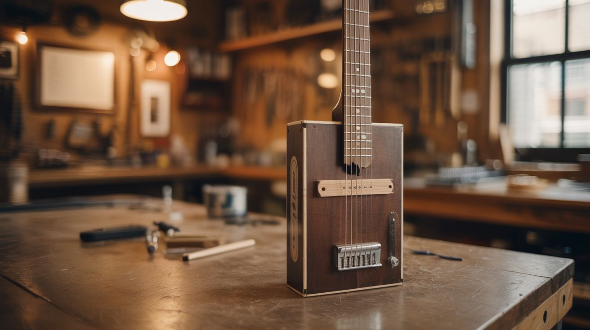

# #235 — Cigar Box Guitar

  

> A cigar box, a broom handle, and some wire walk into a bar — and actually play a set.

## Ratings

| Jaw Drop Rating | Brain Melt Level | Wallet Damage | Spicy Level | Clout Potential | Time to Build |
|---|---|---|---|---|---|
| ⭐⭐⭐⭐ | ⭐⭐ | ⭐ | ⭐ | ⭐⭐⭐⭐ | ⭐⭐ |

## What Is It?

A cigar box guitar is a 3-string slide guitar built from a wooden cigar box (the resonating body), a hardwood stick or broom handle (the neck), and steel wire or actual guitar strings. Bolt frets let you play in a specific key, and a piezo pickup under the lid turns it into an electric instrument you can plug into any amp.

This is not a toy. Cigar box guitars are a legitimate American folk tradition dating back to the Civil War, and modern players like Seasick Steve have recorded entire albums on them. The tonal quality of a well-built cigar box guitar is genuinely distinctive — raw, buzzy, and full of character that a $2,000 Martin can't replicate. Three strings means simpler chord shapes and a lower barrier to entry for beginners, but the instrument has enough range for experienced players to shred on.

The build takes an afternoon and costs almost nothing if you scrounge the parts.

## Ingredients

- [ ] Wooden cigar box with a hinged lid *(source: cigar shop — most give empties away free)*
- [ ] Hardwood stick, broom handle, or 1x2 poplar board, ~36 inches long *(source: hardware store or shed, ~$3)*
- [ ] 3 guitar strings — .017, .025, .036 gauge or similar *(source: music store or online, ~$3 for a set)*
- [ ] 3 eye bolts with nuts for tuning pegs *(source: hardware store, ~$2)*
- [ ] 6 small bolts or fret wire for frets *(source: hardware store, ~$2)*
- [ ] Piezo buzzer/disc for pickup *(source: electronics supplier or salvaged smoke detector, ~$1)*
- [ ] 1/4" mono audio jack *(source: electronics supplier, ~$1)*
- [ ] Small piece of hardwood or bone for the nut and bridge *(source: scrap bin or hardware store)*
- [ ] Wood screws, wood glue *(source: hardware store)*

## Build Steps

1. **Prepare the neck.** Cut or plane your hardwood stick to roughly 1.5" wide and 0.75" thick, about 36" long. Sand it smooth. One end will extend through the cigar box as the neck; the other end is the headstock where the tuning pegs go.

2. **Cut the box for the neck.** Mark and cut rectangular slots on two opposite ends of the cigar box so the neck stick passes straight through. The neck should sit snugly inside with its top surface flush with (or slightly above) the top of the box lid. Glue and/or screw the neck in place from inside the box.

3. **Install the tuning pegs.** Drill three evenly spaced holes in the headstock end of the neck. Thread the eye bolts through and secure with nuts on the back side. These are your tuning pegs — you'll wrap the strings around the eye bolt loops and turn them to tune.

4. **Set the nut and bridge.** Cut a small piece of hardwood or bone for the nut (near the headstock end, where the neck meets the box) and the bridge (on the box lid, near the tail end). File three evenly spaced grooves in each to hold the strings. The bridge height determines the action — start at about 3/8" and adjust from there.

5. **Install the frets.** Using a fret calculator (plenty of free ones online — input your scale length from nut to bridge), mark fret positions on the neck. Drill small holes and insert bolts perpendicular to the neck at each fret position. Snip the bolt heads so they protrude about 1/16" above the neck surface. File smooth.

6. **String it up.** Thread each string through a small hole or screw at the tail end of the box, run it over the bridge and nut, and wrap it around the corresponding eye bolt. Tune to an open G (GDG) or open D (DAD) tuning — both are traditional for 3-string instruments.

7. **Install the piezo pickup.** Hot-glue a piezo disc to the underside of the cigar box lid, roughly under where the bridge sits. Solder the piezo leads to a 1/4" mono jack mounted through a hole in the side of the box. Plug into any guitar amp and you're electric.

8. **Set up and play.** Adjust the bridge height for comfortable action. If strings buzz, raise the bridge slightly. Grab a slide (glass bottle neck, socket wrench, or copper pipe) and play it like a slide guitar, or fret normally using your bolt frets.

## Safety Notes

- **Drilling through the cigar box requires care.** The thin wood splits easily. Use a sharp bit, go slow, and back it with scrap wood. Pre-drill all screw holes.
- **String tension is real.** Guitar strings under tension can snap and whip. Wear safety glasses when stringing up for the first time. Tune up slowly.

## See Also

- [Tin Can Banjo](238-tin-can-banjo.md) — same concept, different resonator, different sound
- [Bucket Drum Kit](237-bucket-drum-kit.md) — another junkyard percussion/string instrument with electronic pickup
