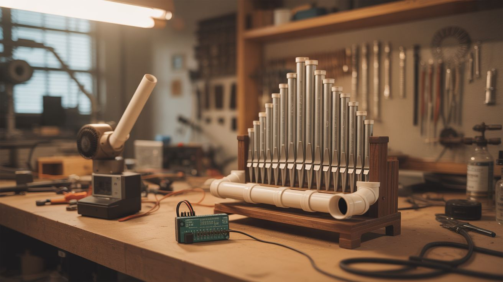

# #236 — PVC Pipe Organ

  

> A leaf blower, some plumbing pipe, and an Arduino walk into a cathedral — and bring the house down.

## Ratings

     

## 🧪 What Is It?

A self-playing pipe organ made from PVC plumbing pipe, powered by a leaf blower as the air supply, with Arduino-controlled solenoid valves that open and close each pipe on command. Load up a MIDI file, hit play, and your garage becomes a concert hall.

Real pipe organs work by forcing air through tuned pipes — the pitch depends on the pipe's length and diameter. PVC pipe works surprisingly well as a substitute for the traditional tin or wood pipes. By cutting pipes to specific lengths (calculated from the speed of sound), you can build a chromatic scale across one or two octaves. The leaf blower provides constant air pressure to a manifold, and each pipe gets its own solenoid valve. The Arduino reads MIDI data and triggers the valves, playing the pipes in sequence.

The sound is breathy and warm — more pan flute than cathedral organ — but it's unmistakably a pipe instrument playing real melodies. And the visual of a PVC plumbing rack playing Bach is worth the build alone.

<strong>🧰 Ingredients</strong>

- [ ] PVC pipe, 1" or 1.5" diameter, ~30 feet total *(source: hardware store, ~$15)*
- [ ] PVC tee fittings and caps to match pipe diameter, ~15 *(source: hardware store, ~$10)*
- [ ] Leaf blower (electric preferred for steady airflow) *(source: garage or thrift store, $10-$25)*
- [ ] 12V solenoid valves, one per pipe — 8-13 depending on scale *(source: electronics supplier, ~$3 each)*
- [ ] Arduino Uno or Mega *(source: electronics supplier, ~$10)*
- [ ] MOSFET driver board or individual MOSFETs + flyback diodes for each solenoid *(source: electronics supplier, ~$8)*
- [ ] 12V power supply for solenoids, at least 5A *(source: old laptop charger or ATX PSU, free-$5)*
- [ ] Flexible tubing or PVC manifold to distribute air *(source: hardware store, ~$5)*
- [ ] Plywood or lumber for the frame *(source: scrap pile or hardware store, ~$10)*
- [ ] Zip ties, hose clamps, PVC cement *(source: hardware store)*

## 🔨 Build Steps

1. **Calculate pipe lengths.** The fundamental frequency of an open pipe is f = v / (2L), where v is the speed of sound (~343 m/s at room temperature) and L is the pipe length. For middle C (261.6 Hz), you need a pipe about 65.6 cm long. Calculate lengths for one or two octaves of a C major scale (or chromatic scale if you're building 13 pipes). Cut each pipe to length with a hacksaw or miter saw.

2. **Build the air manifold.** Construct a sealed PVC manifold — essentially a long horizontal pipe with tee fittings branching upward for each note pipe. The leaf blower connects to one end of the manifold. Use PVC cement on all manifold joints to make them airtight.

3. **Install solenoid valves.** Mount one solenoid valve between each manifold tee and its corresponding note pipe. When the valve is closed, no air reaches the pipe. When the Arduino triggers it open, air rushes through and the pipe sounds. Use short sections of flexible tubing if needed to connect the solenoids inline.

4. **Build the frame.** Construct a wooden frame to hold everything upright. The pipes should stand vertically above the manifold, arranged shortest to longest like a traditional organ rank. Secure pipes with zip ties or pipe clamps to the frame.

5. **Wire the solenoids.** Each solenoid connects to a MOSFET on the driver board, which is controlled by an Arduino digital pin. Wire a flyback diode across each solenoid (cathode to positive) to protect the MOSFETs from voltage spikes when the solenoids de-energize. Connect the MOSFET gates to Arduino pins, solenoid power to the 12V supply.

6. **Program the Arduino.** Write or download a MIDI-to-pin sketch. The Arduino reads MIDI note-on/note-off messages (via serial from a computer, or from an SD card MIDI file reader) and maps each note number to the corresponding solenoid pin. When a note plays, the pin goes HIGH, the MOSFET switches on, the solenoid opens, and the pipe sounds.

7. **Connect the leaf blower.** Attach the leaf blower output to the manifold intake using a reducer fitting or duct tape over flexible tubing. The blower needs to provide steady pressure — electric blowers are better than gas for this because they maintain constant RPM. You may need to add a pressure regulator or bleed valve if the blower is too powerful (pipes will overblast and sound harsh).

8. **Tune the pipes.** Turn on the blower and test each pipe individually. If a pipe is slightly sharp, extend it with a sliding collar or add a small cap. If flat, trim a tiny amount off the end. Use a tuner app on your phone. PVC pipes are less temperature-sensitive than metal but will still drift slightly with ambient temperature.

9. **Load a song and play.** Feed a MIDI file to the Arduino and let it rip. Start with something simple — "Ode to Joy" or "Mary Had a Little Lamb" — to verify all pipes trigger correctly. Then load up a Bach fugue and watch people's jaws hit the floor.

## ⚠️ Safety Notes

> [!WARNING]
> **Leaf blower noise.** The blower itself is loud (80-100 dB). Wear hearing protection during extended testing. Consider building an enclosure or baffle around the blower to reduce noise without restricting airflow.

- **PVC dust when cutting.** Cutting PVC generates fine plastic dust. Wear a dust mask and cut outdoors or in a well-ventilated area. Deburr all cut ends.
- **12V solenoid wiring.** While 12V won't kill you, shorted solenoid wiring can overheat and melt insulation. Use appropriate wire gauge (18 AWG minimum) and fuse the main 12V line.

## 🔗 See Also

- [Bottle Xylophone](241-bottle-xylophone/) — another self-playing MIDI instrument, percussive instead of wind
- [Plasma Speaker](../sound-and-music/008-plasma-speaker/) — if you want your music source to be even more dramatic

