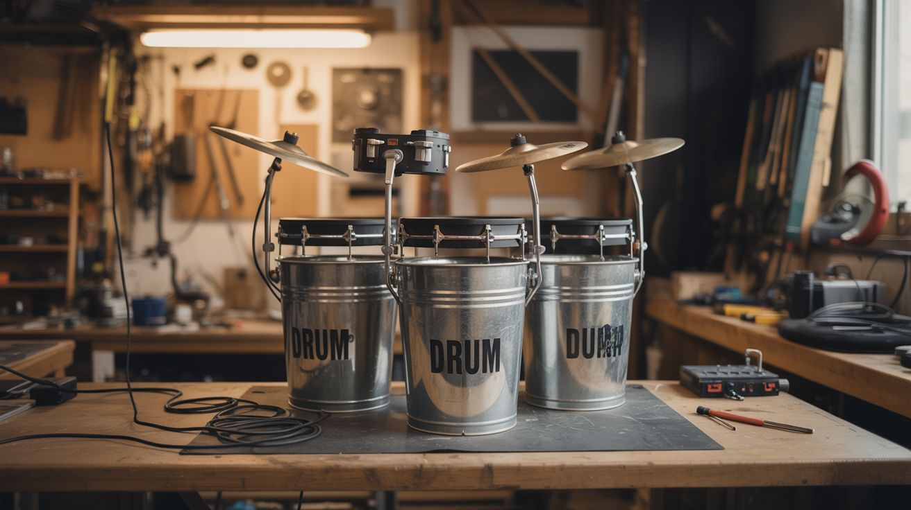

# #237 — Bucket Drum Kit

  

> Street performer buckets meet electronic drums — plug your five-gallon kit into any DAW and lay down beats.

## Ratings

     

## 🧪 What Is It?

A full drum kit made from 5-gallon buckets fitted with piezo pickups, wired through an Arduino that converts each hit into a MIDI note. You get the raw acoustic thump of bucket drumming with the ability to trigger any drum sample in your computer — kick, snare, hi-hat, toms, cowbell, whatever you map it to.

Street bucket drummers already sound incredible. The problem is they're limited to the sound of plastic. By adding piezo transducers (which generate voltage when struck or vibrated) and converting those signals to MIDI, you bridge the gap between street percussion and a professional electronic drum kit. The Arduino reads the piezo voltages, filters out crosstalk and double-triggers, and sends MIDI note-on messages over USB to your computer or a standalone sampler module.

Total cost is under $15 if you scrounge the buckets. A commercial electronic drum kit with similar MIDI capability runs $300-$800.

<strong>🧰 Ingredients</strong>

- [ ] 5-gallon plastic buckets, 4-5 of them *(source: hardware store, restaurants, or dumpsters — free to $3 each)*
- [ ] Piezo discs, one per bucket *(source: electronics supplier or salvaged buzzers, ~$0.50 each)*
- [ ] Arduino Uno or Nano *(source: electronics supplier, ~$5-$10)*
- [ ] 1M ohm resistors, one per piezo *(source: electronics supplier, ~$1 for a pack)*
- [ ] Zener diodes (5.1V), one per piezo *(source: electronics supplier, ~$1 for a pack)*
- [ ] USB cable for Arduino *(source: junk drawer, free)*
- [ ] Foam or rubber drum pad material for heads (optional) *(source: yoga mat or mouse pads, free-$5)*
- [ ] Hot glue, wire, solder *(source: workshop supplies)*
- [ ] Scrap lumber for mounting frame (optional) *(source: scrap pile, free)*

## 🔨 Build Steps

1. **Prepare the buckets.** Clean and dry each bucket. If you want a quieter acoustic sound (so the MIDI samples dominate), cut circles of yoga mat or rubber and glue them to the bucket bottoms as dampening pads. You'll be hitting the bottoms, not the open tops.

2. **Mount the piezo pickups.** Hot-glue one piezo disc to the inside bottom of each bucket, centered. The piezo needs firm contact with the striking surface. Run the two wires from each piezo out through a small hole drilled in the bucket side, near the bottom.

3. **Build the signal conditioning circuit.** For each piezo, wire a 1M ohm resistor across the two leads (this bleeds off charge and prevents the Arduino analog input from floating). Add a 5.1V Zener diode across the leads (cathode to positive) to clamp the voltage and protect the Arduino's analog input — a hard hit on a piezo can generate 20V+.

4. **Connect to Arduino.** Wire each piezo's positive lead to a separate Arduino analog input (A0-A4). Wire all grounds together to Arduino GND. Each channel now feeds a 0-5V signal proportional to hit intensity.

5. **Program the Arduino.** Write a sketch that continuously reads each analog input. When a reading exceeds a threshold (say, 50 out of 1023), register a hit. Apply a short dead time (~30ms) after each trigger to prevent double-triggering from the piezo's ringing. Map each channel to a different MIDI note number (e.g., A0 = note 36 = kick, A1 = note 38 = snare). Send MIDI note-on messages over USB serial.

6. **Set up MIDI on your computer.** Install a serial-to-MIDI bridge (like Hairless MIDI or the Arduino MIDIUSB library if using a Leonardo/Micro). Route the MIDI to a DAW (GarageBand, Reaper, Ableton) or a standalone drum sampler. Select a drum kit patch.

7. **Arrange the kit.** Set the buckets up in a comfortable playing position — one inverted as a kick (hit with foot pedal or foot), two at seated height as snare/tom, one elevated as a floor tom. Use scrap lumber to build a simple frame if needed, or just stack and brace them.

8. **Calibrate and play.** Adjust the threshold values in your Arduino code for each bucket — you want soft hits to register without ghost triggers from vibration crosstalk. Playing near a triggered bucket can cause sympathetic vibration in adjacent ones, so increase dead time or raise thresholds if you get false hits.

## ⚠️ Safety Notes

> [!WARNING]
> **Piezo voltages.** A hard strike on a piezo disc can generate 20V+ peaks. The Zener diodes protect the Arduino, but don't skip them — unprotected analog inputs will fry.
- **Bucket edges.** Cut bucket rims can be sharp. Sand or tape any cut edges to avoid slicing your hands while playing.

## 🔗 See Also

- [Cigar Box Guitar](235-cigar-box-guitar.md) — another junkyard instrument with piezo pickup for electronic output
- [Steel Tongue Drum](239-steel-tongue-drum.md) — a more melodic percussion build from salvaged metal

**References:**
- [Electronics & Microcontrollers Guide](../../reference/electronics-and-microcontrollers.md)
