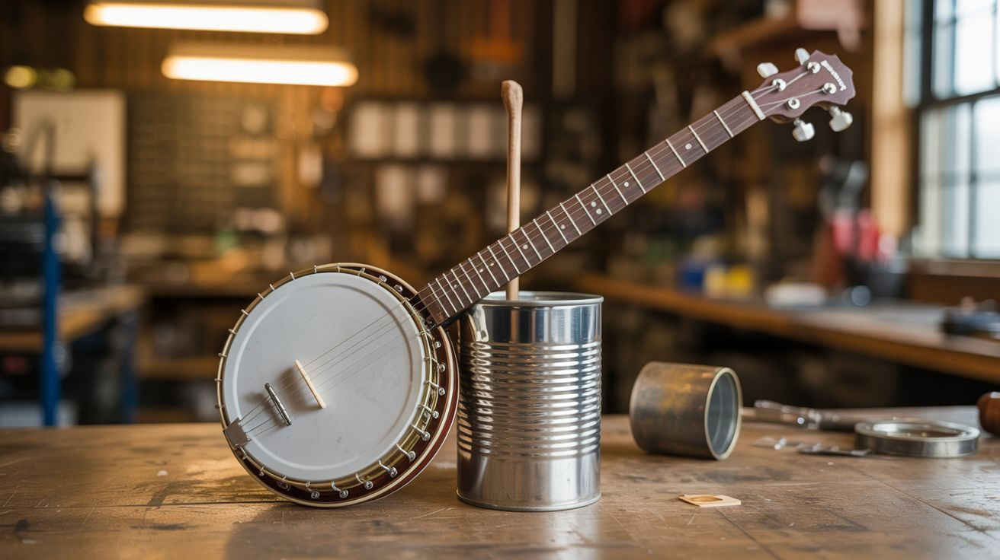

# #238 — Tin Can Banjo

  

> A coffee can, a stick, and some strings — the most American instrument you can build for under five bucks.

## Ratings

     

## 🧪 What Is It?

A playable banjo built from a large tin can as the resonator body, a wooden neck, and three or four strings. The metal can acts like a drum head and back plate combined, giving the instrument a bright, punchy, surprisingly loud tone that cuts through a room.

Traditional banjos use a stretched membrane (skin or plastic) over a round frame, but a tin can achieves a similar effect because the flat metal bottom vibrates sympathetically with the strings. Larger cans (like big coffee cans or cookie tins) produce more volume and better low-end. The metallic timbre is distinctive — tinnier and more aggressive than a standard banjo, which actually works well for old-time, blues, and punk-folk styles.

The build is simpler than the cigar box guitar because the can provides a ready-made resonating chamber with no cutting required. You can go from raw materials to playing your first song in about two hours.

<strong>🧰 Ingredients</strong>

- [ ] Large tin can — big coffee can, cookie tin, or #10 commercial food can *(source: kitchen recycling or restaurant, free)*
- [ ] Hardwood board or dowel, ~30 inches long, 1.5" wide *(source: hardware store or scrap pile, ~$3)*
- [ ] 3-4 guitar or banjo strings *(source: music store or online, ~$3)*
- [ ] Small bolts or eye bolts for tuning pegs, 3-4 *(source: hardware store, ~$2)*
- [ ] Small piece of hardwood for the bridge and nut *(source: scrap bin, free)*
- [ ] 2 small bolts for the tailpiece/string anchor *(source: hardware store, ~$1)*
- [ ] Wood screws *(source: hardware store)*

## 🔨 Build Steps

1. **Select and prepare the can.** Choose the largest tin can you can find — a #10 restaurant can or large coffee tin works best. Clean it thoroughly and remove any paper labels. If the can has a rolled rim, leave it — it adds structural rigidity. If using a can with one open end, you'll mount the neck across the open top.

2. **Cut neck slots in the can.** Mark two small rectangular slots on opposite sides of the can, near the top, sized to fit your neck piece snugly. Cut with a Dremel, tin snips, or a jigsaw with a metal blade. The neck should pass straight through the can with the playing surface roughly flush with the can's open top.

3. **Install the neck.** Slide the neck through both slots. It should fit tightly. Drill through the can wall and neck on each side and secure with wood screws or small bolts. The neck needs to be rock-solid — any flex will make the instrument unplayable.

4. **Add the tuning pegs.** Drill evenly spaced holes in the headstock end of the neck (the end extending past the can). Insert eye bolts and secure with nuts. Three pegs for three strings, four if you want a fuller sound.

5. **Set the nut and bridge.** Cut a small piece of hardwood for the nut, positioned where the neck exits the can on the headstock side. Cut another piece for the bridge, placed on the can bottom (or across the open top) on the tail side. File string grooves in both. The bridge should sit directly on the metal surface so vibrations transfer into the can.

6. **Attach the string anchor.** Drive a bolt or screw into the tail end of the neck (past the bridge) to serve as a string anchor point. Alternatively, drill small holes in the can bottom and thread the strings through with knots or washers to hold them.

7. **String and tune.** Thread each string from the anchor, over the bridge, along the neck, over the nut, and wrap around its tuning peg. Tune to an open tuning — open G (gDG) or open D (dAD) works well for three strings. Tighten slowly and evenly.

8. **Play it.** The tin can banjo responds well to both picking and strumming. It's naturally loud — the metal resonator projects sound aggressively. For even more volume, experiment with bridge placement on the can to find the sweet spot where the metal vibrates most freely.

## ⚠️ Safety Notes

> [!WARNING]
> **Tin can edges are razor sharp.** File or sand all cut edges on the can smooth. Cover cut edges with tape or silicone if they're near your hands during play.
- **String tension.** The can walls are thinner than a wooden body and can deform under high string tension. Use lighter gauge strings and don't over-tighten. If the can starts to buckle, release tension and reinforce the neck mounting points.

## 🔗 See Also

- [Cigar Box Guitar](235-cigar-box-guitar.md) — wooden box version with more low-end, similar build process
- [Garden Hose Didgeridoo](240-garden-hose-didgeridoo.md) — another instrument built from a single household item
