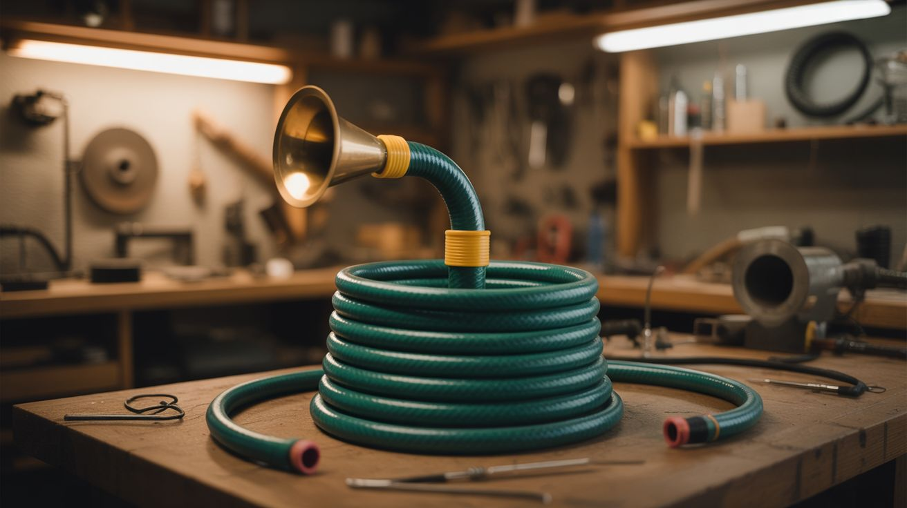

# #240 — Garden Hose Didgeridoo

  

> A coiled garden hose with a funnel bell and PVC mouthpiece. Longer hose means deeper drone. It sounds absolutely ridiculous and absolutely awesome at the same time.

## Ratings

| Jaw Drop Rating | Brain Melt Level | Wallet Damage | Spicy Level | Clout Potential | Time to Build |
|---|---|---|---|---|---|
| ⭐⭐⭐ | ⭐ | ⭐ | ⭐ | ⭐⭐⭐ | ⭐ |

## What Is It?

A didgeridoo is one of the oldest instruments on earth — Aboriginal Australians have been playing them for over 1,500 years. The physics are simple: it's a tube. You buzz your lips into one end, and the tube amplifies and resonates that buzz into a deep, rich drone. The frequency of the drone depends almost entirely on the length of the tube. A traditional didgeridoo is 3-5 feet of hollowed eucalyptus trunk. Your version is going to be 10-50 feet of garden hose coiled up like a sleeping snake, and it's going to sound absurdly deep.

Here's the physics that makes this fun. The fundamental resonant frequency of a tube is inversely proportional to its length. A 4-foot tube (traditional didge) produces a note around 70 Hz — a low C. A 25-foot garden hose produces a fundamental around 11 Hz — below the range of human hearing. You can't hear the fundamental anymore, but you absolutely feel it in your chest, and the harmonics (multiples of the fundamental) are audible and eerie. The sound is somewhere between a foghorn, a didgeridoo, and a whale call. It's unlike anything you've heard from a musical instrument.

The build takes about 15 minutes. Cut a short length of PVC pipe for a comfortable mouthpiece, jam it into one end of the hose, and stick a plastic funnel into the other end as a bell. Coil the hose so it's manageable (otherwise you're playing a 50-foot-long straight instrument, which is impractical in most living rooms). The funnel isn't strictly necessary — it just helps project the sound outward instead of straight down into the floor. Experiment with hose length by cutting it shorter in increments. Each cut raises the pitch. At 10 feet, you get a usable drone note. At 50 feet, you get something that sounds like the earth is humming.

## Ingredients

- [ ] Garden hose — standard 5/8" diameter, any length from 10 to 50 feet *(shed or garage, free; hardware store, ~$8)*
- [ ] PVC pipe — 1" diameter, 6-inch length for the mouthpiece *(hardware store, ~$2)*
- [ ] Plastic funnel — wide mouth, 6-8 inch diameter for the bell *(dollar store or kitchen, ~$2)*
- [ ] Duct tape — for securing connections *(existing)*
- [ ] Hose clamps — for securing funnel and mouthpiece if desired *(hardware store, ~$2)*
- [ ] Beeswax or paraffin wax — for a comfortable lip seal on the mouthpiece (optional) *(craft store, ~$3)*

## Build Steps

1. **Choose your hose length.** The longer the hose, the deeper the drone. A 10-foot hose gives a note around ~28 Hz (very low A). A 25-foot hose gets you down to ~11 Hz (subsonic fundamental with audible harmonics). Start with whatever hose you have and experiment. You can always cut it shorter but you can't make it longer.

2. **Build the mouthpiece.** Cut a 6-inch length of 1" PVC pipe. Sand the edges smooth — your lips will be on this for extended periods, so no sharp edges or burrs. If you have beeswax, soften it and form a ring around the mouthpiece end to create a comfortable lip seal, similar to how real didgeridoo mouthpieces are shaped. The mouthpiece should fit snugly into one end of the garden hose.

3. **Attach the mouthpiece.** Push the PVC mouthpiece into one end of the garden hose. If the fit is loose, wrap duct tape around the PVC until it's snug. If the hose is larger than the PVC, use a hose clamp to cinch the hose tight around the pipe. The seal needs to be airtight — any air leaks kill your drone.

4. **Attach the bell.** Push the narrow end of the funnel into the other end of the hose. Again, duct tape or a hose clamp for a secure fit. The funnel acts as a bell, similar to a trumpet bell — it improves sound radiation by providing an impedance match between the tube and the open air. Without the funnel, the sound is noticeably quieter and more muffled.

5. **Coil the hose.** Coil the hose into a manageable spiral or figure-eight shape. Zip-tie or duct tape the coils together so you're not wrestling an unruly snake while trying to play. Keep the mouthpiece end and bell end pointing in convenient directions — mouthpiece toward your face, bell pointing outward.

6. **Learn the lip buzz.** Place your lips loosely against the mouthpiece opening and blow while buzzing your lips — like making a motorboat sound. Relax your lips and jaw. The tube will "lock on" to a resonant frequency and amplify the buzz into a sustained drone. It takes a few minutes to find the sweet spot. Once you lock in, the drone is effortless and you can sustain it for as long as you have air.

7. **Experiment with techniques.** Traditional didgeridoo playing uses circular breathing — inhaling through your nose while maintaining air pressure from your cheeks. This lets you sustain an infinite drone. Vocalizing (humming, grunting, saying syllables) while droning creates overtones and rhythmic patterns. With a garden hose didge, the long tube creates unusual delay and reverb effects that you don't get with a traditional instrument.

## Safety Notes

- Garden hoses may contain residual water, dirt, or algae. Flush the hose thoroughly with clean water before putting your mouth on it. Older hoses may contain lead in the fittings — if the hose is very old, use a modern lead-free hose or at minimum flush extensively.
- Playing any wind instrument (including this one) for extended periods can cause lightheadedness from hyperventilation or breath control. Take breaks.
- The extremely low frequencies produced by a very long hose can cause nausea or disorientation in some people at high volumes. This is unusual with a garden hose (the volume is limited) but worth knowing if you somehow amplify it.

## See Also

- [PVC Pipe Organ](236-pvc-pipe-organ.md)
- [Cigar Box Guitar](235-cigar-box-guitar.md)

**References:**
- [Appliance Teardown Guide](../../reference/appliance-teardown-guide.md)
- [Technical Glossary](../../reference/glossary.md)
