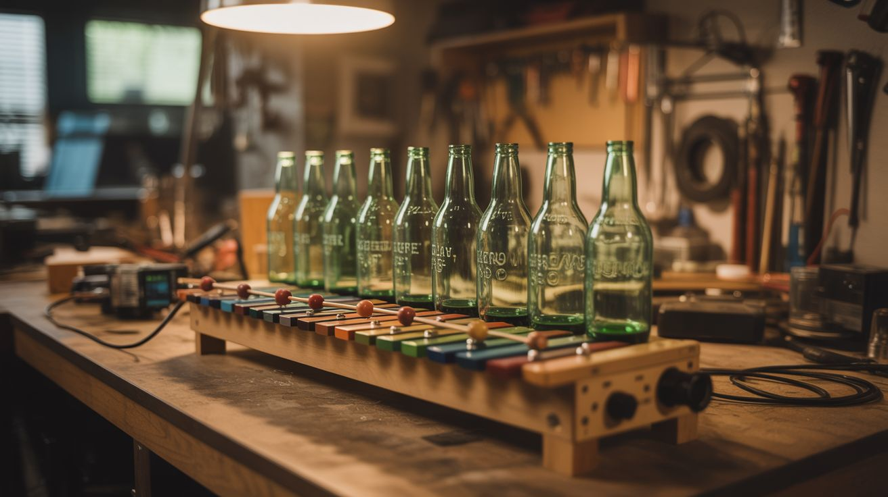

# #241 — Beer Bottle Xylophone

  

> Glass bottles filled to precise water levels create tuned musical notes. Add an Arduino and solenoid mallets and the thing plays itself. Your recycling bin just became a concert hall.

## Ratings

     

## 🧪 What Is It?

You've probably tapped a glass with a spoon at a dinner party and noticed it rings at a specific pitch. Fill the glass with different amounts of water and the pitch changes. This is the basis for one of the oldest instruments in existence — Benjamin Franklin built a version (the glass armonica) in 1761 that Mozart and Beethoven both composed music for. You're building the junkyard version: a row of identical glass bottles tuned to specific notes by adding precise amounts of water, mounted on a frame, and optionally automated with Arduino-controlled solenoid hammers that turn it into a self-playing music box.

The physics is straightforward. When you strike a glass bottle, the glass wall vibrates. The resonant frequency depends on the mass of the glass-plus-water system — more water means more mass, which means slower vibration, which means a lower pitch. An empty bottle rings at its highest natural frequency. Fill it to the brim and it barely rings at all (too much damping). The sweet spot is somewhere in between, and by carefully adjusting water levels, you can tune each bottle to a specific note on the musical scale. Eight bottles gives you a full octave. Twelve gives you a chromatic scale. Twenty-four gives you two octaves and serious musical capability.

The automated version is where this gets genuinely impressive. Mount small solenoid actuators (the kind that do the clicking in pinball machines or door locks) above each bottle, attach wooden or rubber-tipped striker rods to the solenoid plungers, and wire them to an Arduino through a MOSFET driver board. Write a program that fires the solenoids in sequence and the bottles play melodies, chords, and rhythms entirely on their own. Load MIDI files and translate note data to solenoid triggers — suddenly your bottle rack is playing Bach. The contrast between the cobbled-together appearance and the musical precision is what makes this build unforgettable.

<strong>🧰 Ingredients</strong>

- [ ] Glass bottles — identical size and shape, 8-24 count (beer bottles, wine bottles, or soda bottles) *(recycling bin, free)*
- [ ] Water — for tuning *(free)*
- [ ] Food coloring — different color per bottle looks fantastic (optional) *(grocery store, ~$3)*
- [ ] Wood frame — 1x2 lumber for the bottle rack *(hardware store, ~$5)*
- [ ] Chromatic tuner app — phone app for precise tuning *(free)*
- [ ] Arduino Uno or Nano — for the automated version *(~$5-15)*
- [ ] Push-pull solenoids — small 5V or 12V, one per bottle *(online, ~$2-3 each)*
- [ ] MOSFET driver board or ULN2803 Darlington array — to drive solenoids from Arduino *(~$3)*
- [ ] 12V power supply — for the solenoids *(old laptop charger or wall wart, free-$5)*
- [ ] Wooden dowels — 1/4" diameter, for striker tips *(craft store, ~$2)*
- [ ] Rubber grommets or hot glue — for striker tip dampening *(~$2)*
- [ ] Zip ties and screws — for mounting *(existing)*

## 🔨 Build Steps

1. **Collect and clean the bottles.** You need identical bottles — same brand, same size, same glass thickness. Beer bottles from a single case are ideal. Soak off labels, clean thoroughly, and inspect for chips or cracks (damaged bottles don't ring true). Line them up in a row on a flat surface.

2. **Tune the scale.** Start with the note you want as your lowest pitch — fill a bottle with water to about 80% full. Tap it with a wooden spoon or pencil and check the pitch on a chromatic tuner app. Adjust water level until you hit your target note. Repeat for each bottle, working up the scale. For a C major scale, tune to C-D-E-F-G-A-B-C. Use a syringe or eyedropper for fine adjustments — small water changes make significant pitch differences.

3. **Add color (optional).** Add a different food coloring to each bottle for a rainbow effect. This is purely aesthetic but massively increases the visual appeal. The colored water levels also serve as a visual tuning reference — if someone bumps a bottle and spills some water, you can refill to the same color line.

4. **Build the bottle rack.** Construct a simple wooden frame that holds the bottles upright in a row, evenly spaced. Use 1x2 lumber for the base rail with drilled holes or U-shaped cutouts that hold each bottle neck. The bottles should be stable but not clamped tight — they need to vibrate freely. Space them about 3 inches apart for comfortable manual playing or solenoid clearance.

5. **Build the strikers (manual version).** Cut wooden dowels into 8-inch lengths. Glue a small rubber grommet or ball of hot glue onto one end of each dowel for a softer, more resonant strike. Hard strikes produce a sharp "tink" — softer tips produce a rounder, more musical tone that sustains longer.

6. **Build the solenoid strikers (automated version).** Mount each solenoid above its corresponding bottle on a cross-beam attached to the rack frame. Glue or screw a striker dowel (with rubber tip) to each solenoid plunger so the tip rests about 5mm above the bottle when the solenoid is de-energized. When the solenoid fires, the plunger extends and the striker taps the bottle. Adjust mounting height so the strike is firm but not violent.

7. **Wire the electronics.** Connect each solenoid to a channel on the MOSFET driver board or ULN2803. Connect the driver inputs to Arduino digital pins. Power the solenoids from the 12V supply (not the Arduino — the Arduino can't source enough current). Connect a flyback diode across each solenoid to protect the driver from back-EMF when the solenoid releases.

8. **Program and play.** Write an Arduino sketch that fires each solenoid by setting its pin HIGH for 50ms then LOW. Map each pin to a note name. Code a simple melody by firing notes in sequence with timing delays. For advanced use, parse MIDI files on a connected computer and send serial commands to the Arduino — each MIDI note-on event triggers the corresponding solenoid. The bottles play the melody. Load up "Fur Elise" and watch people's jaws drop.

## ⚠️ Safety Notes

- Glass bottles can break if struck too hard. Solenoid force should be calibrated to produce a clean ring without cracking the glass. Test with expendable bottles first. Wear safety glasses during testing.
- If a bottle cracks during play, stop immediately. Cracked glass has sharp edges and the water will spill onto the electronics below.
- The solenoids draw significant current — a bank of 12 solenoids firing simultaneously can pull 10+ amps. Ensure your power supply is rated accordingly and fuse the circuit.
- Water and electronics don't mix. Mount the solenoids and wiring above the bottles, not beside or below. If a bottle tips, you don't want water flooding the electronics.

## 🔗 See Also

- [PVC Pipe Organ](236-pvc-pipe-organ/)
- [Steel Tongue Drum](239-steel-tongue-drum/)

